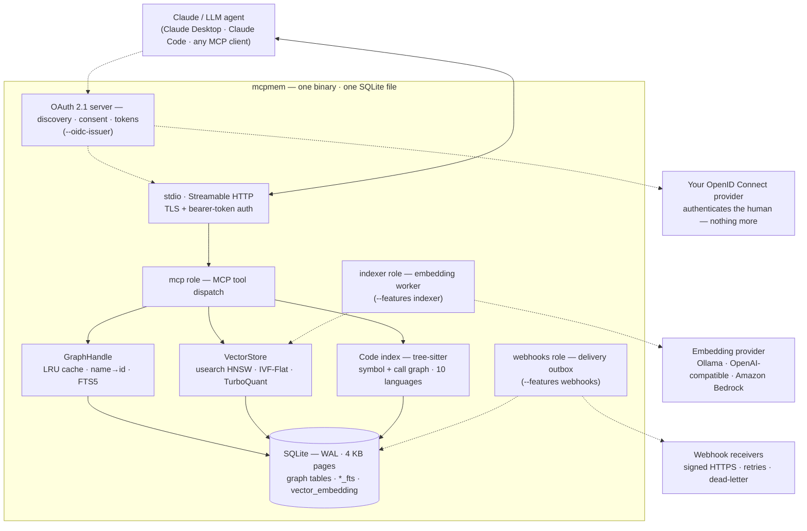

# mcpmem

**Persistent memory, a knowledge graph, code intelligence, and semantic search for LLM agents — in a single ~Rust binary backed by one embedded SQLite file.**

[](https://crates.io/crates/mcpmem)
[](LICENSE)
[](https://modelcontextprotocol.io)

`mcpmem` is a [Model Context Protocol](https://modelcontextprotocol.io) server that gives
your agent a long-term brain. It remembers **entities, relations, and observations** in a
queryable **knowledge graph**, indexes your **codebase** with tree-sitter, and serves
**vector / hybrid semantic search** — all from one file, with no database to run, no service to
deploy, and no telemetry.

Drop it into Claude Desktop, Claude Code, or any MCP client and your agent stops forgetting.

---

## Why mcpmem

- 🧠 **Real memory, not a scratchpad.** A typed knowledge graph — entities, directed relations,
  and free-form observations — with FTS5 full-text search and graph traversal (paths, neighbors,
  subgraphs, centrality). Survives restarts; portable as a single file.
- ⚡ **Fast and embedded.** Pure Rust on SQLite in WAL mode. Sub-microsecond cache hits,
  microsecond reads, batched writes. No external services, no network round-trips, no daemons.
- 🔎 **Semantic + hybrid search.** Bring your own embeddings; the server indexes them in a
  [usearch](https://github.com/unum-cloud/usearch) **HNSW** (or IVF-Flat) index and fuses vector
  similarity with full-text relevance and graph centrality — RAG retrieval, more-like-this,
  recommendations, and MMR diversification included.
- 🗺️ **Code intelligence built in.** Point it at a repo and it parses **11 languages** with
  tree-sitter into a searchable symbol + call graph — then optionally embed symbols for
  meaning-based code search. A live, incremental, token-cheap map of your codebase.
- 🔌 **MCP-native and safe by default.** Speaks MCP `2025-11-25` over **stdio** and
  **Streamable HTTP** (with bearer-token auth and TLS). Tools are **opt-in by category**, so the
  server only ever exposes what you turn on.
- 🔐 **Its own OAuth 2.1 authorization server.** `--oidc-issuer` turns it on. A remote
  connector — Claude's custom connectors, ChatGPT's — discovers this server, registers itself,
  and sends its human to your OpenID Connect provider. The human approves a subset of scopes on
  a consent page, and the connector then calls tools under a token this server issued. The
  provider authenticates the human and nothing more.

---



## Installation

```sh
cargo install mcpmem
```

That installs the `mcpmem` binary with the default features, `code` and `oauth`.

### Build features

The binary is modular. A feature that you do not compile is absent: its code is not linked, and
the runtime role that needs it refuses to start.

| Feature | Default | What it adds | Extra dependencies |
|---|---|---|---|
| `code` | **on** | tree-sitter parsing for 11 languages and the `code_*` tools | 12 tree-sitter grammars, `ignore`, `blake3`, `notify` |
| `oauth` | **on** | the OAuth 2.1 authorization server and the upstream OpenID Connect leg | `reqwest`, `url` |
| `indexer` | off | the `indexer` role — a durable embedding worker with Ollama and OpenAI-compatible providers | `mcpmem-indexer`, `reqwest` |
| `bedrock` | off | Amazon Titan Text Embeddings V2 as a third provider. Implies `indexer` | `aws-config`, `aws-sdk-bedrockruntime` |
| `webhooks` | off | the `webhooks` role and the delivery outbox. Read the limitation below first | `mcpmem-webhook` |

Recipes — identical in Bash and fish:

```sh
cargo install mcpmem                                     # default: code + oauth
cargo install mcpmem --features indexer                  # adds the embedding worker
cargo install mcpmem --features indexer,webhooks
cargo install mcpmem --features bedrock                  # implies indexer
cargo install mcpmem --features indexer,webhooks,bedrock # everything on
cargo install mcpmem --no-default-features               # lean graph-only binary
cargo install mcpmem --no-default-features --features oauth
```

A `--no-default-features` build carries no tree-sitter grammars and no HTTP client, and it
**refuses `--oidc-issuer` at startup** rather than serve half an authorization server. Add
`--features oauth` back when a lean build still needs the OAuth endpoints. CI asserts that the
graph-only build links neither an HTTP client nor an AWS client.

`--features indexer,webhooks,bedrock` is every feature this crate has: `code` and `oauth` are
already on by default, and `bedrock` pulls `indexer` with it. CI compiles and lints that whole
set on every push.

Prebuilt binaries are attached to every GitHub release, one per target:
`x86_64-unknown-linux-gnu`, `aarch64-unknown-linux-gnu`, `aarch64-apple-darwin`
and `x86_64-apple-darwin`. Download the one for your platform and unpack it —
no compilation:

```sh
curl -fL -o mcpmem.tar.gz \
  "https://github.com/abankowski/mcpmem/releases/latest/download/mcpmem-v1.0.2-aarch64-apple-darwin.tar.gz"
tar -xzf mcpmem.tar.gz && sudo mv mcpmem /usr/local/bin/
```

`cargo install mcpmem` stays an option. It always recompiles from crates.io,
which ships source only, and the options above tell it which features to build
in.

To build from a clone instead of crates.io:

```sh
git clone https://github.com/abankowski/mcpmem && cd mcpmem
cargo build --release --features indexer   # one extra feature
cargo build --release --all-features       # everything on
# the binary lands in target/release/mcpmem
```

## Runtime roles

One process runs the MCP server, a background worker, or any compiled combination. `--role`
takes a comma-separated list and may be repeated. Without the flag the process runs `mcp`
alone, which is what every earlier version did.

| Role | Cargo feature | What it runs |
|---|---|---|
| `mcp` | always compiled | the stdio or HTTP MCP transport |
| `indexer` | `indexer` | the embedding worker: polls the index-job queue every 250 ms, then republishes the vector snapshot |
| `webhooks` | `webhooks` | the delivery outbox poller |

```sh
mcpmem                                   # the mcp role alone
mcpmem --role mcp,indexer                # server and worker in one process
mcpmem --role indexer                    # a worker-only process beside a separate server
```

Both deployment shapes use the same binary. There is no separate worker executable, and a
worker-only process still opens the graph and the vector store.

A wrong selection fails at startup. None of these is a silent no-op:

| Mistake | Message |
|---|---|
| the role's feature is not compiled | `Invalid params: runtime role 'indexer' was selected but its Cargo feature is not compiled` |
| a repeated role | `Invalid params: runtime role 'mcp' was selected more than once` |
| an empty list | `Invalid params: at least one runtime role is required` |
| an empty element, as in `--role mcp,,indexer` | `Invalid params: runtime role names cannot be empty` |
| an unknown name | `Invalid params: unknown runtime role 'foo'` |

**The first role to settle ends the process.** The supervisor stops every other role as soon as
one returns or fails, so a dead worker never leaves a half-running server. A failed indexer poll
therefore takes a co-hosted MCP transport down with it. Run the process under something that
restarts it: systemd `Restart=on-failure`, or a container restart policy.

### Configuring the embedding worker

The provider comes from the environment, or from the `[indexer]` section of the configuration
file. The server reads both once at startup. An environment variable wins field by field, so a
variable overrides only the key it names. `--role` selects the worker; these settings tell it
which model service to call.

| Setting | Provider kind | Notes |
|---|---|---|
| `MCP_MEMORY_OLLAMA_URL`, or `[indexer] ollama-url` | `ollama` | posts to `<url>/api/embed`. A URL carrying credentials is rejected |
| `MCP_MEMORY_OPENAI_URL` and `MCP_MEMORY_OPENAI_API_KEY`, or `[indexer] openai-url` and `[indexer] openai-api-key-file` | `openai`, `openai-compatible` | both must be set together, or startup fails |
| the standard AWS region and credential chain | `bedrock` | needs the `bedrock` feature. Titan Text Embeddings V2 only, with 256, 512 or 1024 dimensions |

Every provider request carries a 10-second deadline.

```fish
# fish
set -x MCP_MEMORY_OLLAMA_URL http://127.0.0.1:11434
mcpmem --role mcp,indexer --enable-all
```

```bash
# Bash
export MCP_MEMORY_OLLAMA_URL=http://127.0.0.1:11434
mcpmem --role mcp,indexer --enable-all
```

### Turning automatic embedding on

Name a provider, a model and a dimension, and the server embeds entity text by itself:

```toml
[indexer]
ollama-url = "http://127.0.0.1:11434"
provider = "ollama"
model = "nomic-embed-text"
dimensions = 768
# normalization = "l2"     # the default
# metric = "cosine"        # the default
```

Those three keys are the **vector-space contract**: the profile the store serves. On startup the
server compares them against the profile already in the database, by fingerprint, so an unchanged
file is a no-op. A change to any of the five starts a rebuild, which re-embeds every live entity.

> **A profile ends legacy compatibility.** Once the store serves one, `vector_upsert_embedding`
> and `vector_batch_upsert` are refused with `direct_vector_writes_disabled`. That is the point —
> the server now owns the vectors — but a client that pushes its own embeddings breaks at that
> moment. Adopt a profile deliberately, not by accident.

Without those three keys the store stays in legacy compatibility: the worker starts, polls every
250 ms and finds nothing, and you keep supplying vectors yourself. That is the correct setup for
a deployment whose client already computes embeddings.

### Webhook delivery

The `webhooks` role delivers graph change events over HTTPS. Configure it in `[webhooks]`:

```toml
[server]
roles = ["mcp", "indexer", "webhooks"]

[webhooks]
# The only hostnames the worker will deliver to. Empty (the default) refuses
# every endpoint.
allowlist = ["hooks.example.com"]

# One signing key file per secret_ref. Read once at startup.
[webhooks.secrets]
"my-consumer" = "/etc/mcpmem/webhook-key"
```

Then register a subscription through the MCP tool `webhook_add_subscription` (an `endpoint`,
an allowlisted `https` hostname, and a `secretRef` from the section above). Delivery is signed
with `X-Memory-Signature` over `<timestamp>.<body>`, retried with backoff, and dead-lettered
after eight attempts. The full contract is in [`crates/mcpmem-webhook/README.md`](crates/mcpmem-webhook/README.md).

> **Fail closed by default.** With no `[webhooks]` section, the role runs as an empty worker:
> nothing is delivered, no error is raised. An allowlisted host and a signing key are what make
> it act.

#### What the worker will and will not deliver to

The endpoint policy is DNS-verified before **every** delivery:

| Rule | Why |
|---|---|
| `https` on port 443 only | TLS is the transport, no exceptions |
| hostname, never an IP literal | the hostname is what the allowlist matches |
| the hostname must resolve to a **public** address | private, loopback, link-local, multicast and unspecified addresses are refused |
| no credentials and no fragment in the URL | nothing to leak into logs |

So Node-RED on `:1880` and n8n on `:5678` are unreachable directly: put a TLS
reverse proxy (Caddy, nginx, Traefik) or a tunnel in front of them, and put
the proxy's public hostname in the `allowlist`.

#### Receiver recipe: Node-RED

1. **Expose Node-RED over HTTPS.** Behind Caddy, one Caddyfile line does it
   for a domain pointing at the machine:

   ```
   hooks.example.com  {
       reverse_proxy localhost:1880
   }
   ```

   The `/mcpmem` path on that domain is the endpoint.

2. **mcpmem side.** The example at the top of this section already matches:
   `allowlist = ["hooks.example.com"]`, one key file. Install
   `webhook-add-subscription` from the MCP client once, with
   `endpoint = "https://hooks.example.com/mcpmem"`,
   `secretRef = "my-consumer"`.

3. **The Node-RED flow.** One **HTTP in** node (`POST`, URL `/mcpmem`) and
   one **function** node that verifies the signature before the flow
   continues:

   ```js
   const crypto = global.get('crypto') || require('crypto');
   const timestamp = msg.headers['x-memory-timestamp'];
   const received  = msg.headers['x-memory-signature'];
   // The MAC covers the raw body. `msg.req.body` is that raw string; a flow
   // that instead reads `msg.payload` may already hold a parsed object, and
   // HMAC over a re-serialized JSON object will NOT match.
   const body = msg.req.body;

   const expected = crypto
     .createHmac('sha256', process.env.WEBHOOK_KEY)
     .update(timestamp + '.' + body)
     .digest('hex');

   if (received !== expected) {
     throw new Error('bad signature');
   }
   msg.payload = JSON.parse(body); // the event envelope
   return msg;
   ```

   Set `WEBHOOK_KEY` to the contents of your key file (or use a function-global
   read of it). A browser-simulated POST without the header now fails closed.

#### Receiver recipe: n8n

1. **Expose n8n over HTTPS.** Same idea as Node-RED — domain + reverse proxy
   (n8n listens on `:5678`):

   ```
   hooks.example.com  {
       reverse_proxy localhost:5678
   }
   ```

   Register the webhook URL in n8n as `POST https://hooks.example.com` and
   enable **Respond: using Respond to Webhook** if you want a 200 to the
   worker (the worker only needs a non-2xx to retry; the default response is
   fine).

2. **mcpmem side.** Identical to the Node-RED recipe: same allowlist, any
   `secretRef`. Point `webhook_add_subscription` at
   `https://hooks.example.com` (n8n folds the path into its own URL space).

3. **Verify the signature in the flow.** After the **Webhook** trigger, add
   a **Code node**:

   ```js
   const crypto = require('crypto');
   const headers = $input.all()[0].body.headers; // n8n exposes raw headers here
   // The MAC covers the raw request body as a string. n8n keeps it at
   // body.body in raw form; a flow that reads a parsed object instead will
   // never produce a matching signature.
   const body = $input.all()[0].body.body;

   const expected = crypto
     .createHmac('sha256', 'exact-webhook-key-contents')
     .update(headers['x-memory-timestamp'] + '.' + body)
     .digest('hex');

   if (headers['x-memory-signature'] !== expected) {
     throw new Error('bad signature');
   }
   return $input.all()[0];
   ```

   Paste your key file's contents where the example says. A retry from the
   worker carries a fresh timestamp, so the signature check is replay-safe on
   its own; `Idempotency-Key` (the event id) is available if you want
   cross-node deduplication too.

Both recipes make the same three decisions: get a public HTTPS URL, name it
in `allowlist`, and treat every unsigned POST as invalid.

## Quick start

```sh
# Knowledge-graph memory (read + write)
mcpmem --transport stdio --enable-graph-read --enable-graph-write

# Memory + semantic vector search
mcpmem --transport stdio --enable-graph-read --enable-graph-write \
  --enable-vectors --embedding-dims 384

# Everything on — memory + vectors + code intelligence
mcpmem --transport stdio --enable-all
```

### Use it from Claude Desktop / Claude Code

```json
{
  "mcpServers": {
    "memory": {
      "command": "mcpmem",
      "args": ["--enable-all"]
    }
  }
}
```

That's it — your agent now has persistent memory and can index code. Trim `--enable-all` to just
the categories you want (see below).

## Tools are opt-in by category

**Nothing is exposed until you enable its category.** Disabled tools are hidden from `tools/list`
and rejected from `tools/call` as if they never existed — least privilege by default.

| Flag | Category | Tools |
|------|----------|-------|
| `--enable-graph-read` | **graph-read** | `read_graph`, `search_nodes`, `open_nodes`, `get_entity`, `graph_stats`, `search_relations`, `find_path`/`find_all_paths`, `get_neighbors`, `describe_entity`, `list_entity_types`, `list_relation_types`, `suggest_taxonomy`, `export_graph`, `extract_subgraph`, `batch_get_entities`, `entity_exists`, `degree` |
| `--enable-graph-write` | **graph-write** | `create_entities`, `create_relations`, `add_observations`, `delete_entities`, `delete_observations`, `delete_relations`, `upsert_entities`, `merge_entities`, `rename_entity`, `compact` |
| `--enable-vectors` | **vectors** | `vector_*` + `hybrid_search` (usearch HNSW or IVF-Flat) |
| `--enable-code` | **code** | `code_index`, `code_outline`, `code_search`, `code_get_symbol`, `code_watch`, `code_embed`, `code_semantic_search` |
| `--enable-all` | *(all)* | Every category. Overrides the individual flags. |

On a server that carries credentials the list is filtered a second time, **per
caller**: the static bearer token holds `--static-bearer-scopes` (every enabled
category by default), and an issued OAuth token holds exactly the scopes the
human approved. A category the server enables can still be invisible to one
caller — see [Authentication](#authentication) and
[`docs/runbooks/oauth-deployment.md`](docs/runbooks/oauth-deployment.md).

The database path is resolved in order:

1. `--memory-file` / `-f` flag
2. `MEMORY_FILE_PATH` environment variable
3. Default: `memory.mcpmem` in the working directory

The same SQLite file works with or without `--enable-vectors`, so you can populate the graph
plain and later serve it with vectors enabled.

### Soft taxonomy validation

A write that names an entity type or relation type the server does not know
yet always succeeds. The server never refuses an unknown type; instead the
write response gains a `taxonomySuggestions` object on every result whose
authored type is new. Suggestions are advisory only — nothing enforces them.

```json
"taxonomySuggestions": {
  "similarTypes": [ { "name": "person", "score": 0.9 } ],
  "exampleEntities": [ { "name": "alice", "entityType": "person" } ],
  "exampleRelations": [ { "from": "alice", "relationType": "works_at", "to": "acme" } ]
}
```

- `similarTypes` always lists `{ "name", "score" }` pairs from the offline
  string engine. With the semantic tier enabled the list is sorted
  semantically first, then filled by the offline engine.
- `exampleEntities` (objects with `name` and `entityType`) and
  `exampleRelations` (objects with `from`, `relationType` and `to`) are
  present on the semantic tier only; without it the object holds just
  `similarTypes`.

The offline tier always runs: it compares the authored name against existing
type names in the same graph. The semantic tier is additive: it requires
`--enable-vectors`, a build with the `indexer` Cargo feature, and a serving
`[indexer]` profile (see [Configuring the embedding worker](#configuring-the-embedding-worker)).
With those in place, the indexer worker also embeds taxonomy subjects (type
names and relation triples) and the suggestion engine matches against the
serving snapshot.

`suggest_taxonomy` exposes the same engine as a standalone tool (category
`graph-read`). It takes `query` (required), an optional `kind`
(`entityType`, `relationType`, `entity` or `relation`; default
`entityType`), and an optional `topK` (1..100; default 10). The response
shape matches `taxonomySuggestions` above.

### Observation format (1.0)

MCP observation writes use objects: `{ "body": "…", "occurredAtUs": 1780000000000000 }`.
`occurredAtUs` is optional; the server always returns `createdAtUs` and
`originEntityName` (both explicitly `null` when unknown). Search and embeddings index only
`body`.

`--legacy-observations` is a deprecated 1.x MCP-only compatibility adapter for clients that
still send and receive string arrays. It is disabled by default, requires the `mcp` runtime
role, and will be removed in 2.0.0. It does not change stored data or the web UI.

### Transports

| Transport | Flag | Description |
|-----------|------|-------------|
| stdio | `--transport stdio` | Newline-delimited JSON-RPC over stdin/stdout (default; for Claude Desktop / Claude Code) |
| http | `--transport http --bind 0.0.0.0:8080` | MCP Streamable HTTP (POST/GET `/mcp`, SSE) |

The stdio transport dispatches up to `--stdio-concurrency` requests in parallel (default 8), so
clients that pipeline requests get concurrent execution; responses are correlated by JSON-RPC id
and may arrive in completion order. Set `--stdio-concurrency 1` for strict request/response
ordering (e.g. when pipelining order-dependent writes without awaiting each response).

### Authentication

The `http` transport accepts an optional bearer token (stdio is never authenticated). Set it with
`--auth-token`, `--auth-token-file` (trimmed; an empty file is rejected), or the
`MCP_MEMORY_AUTH_TOKEN` environment variable.

```sh
mcpmem --enable-all --transport http --bind 0.0.0.0:8080 --auth-token "s3cr3t"
```

On HTTP the token is sent as `Authorization: Bearer <token>`; comparison is constant-time.
Binding a non-loopback address **without** a token exposes the entire graph to the network.

By default the token grants every enabled tool category. Narrow it with
`--static-bearer-scopes`, a comma-separated list of category slugs
(`graph-read`, `graph-write`, `vectors`, `code`); a call to a tool outside the
list is refused. The list also gates the built-in graph viewer, with or without
a token: omit `graph-read` and `/ui/graph`, `/ui/search`, `/ui/node` and
`/ui/expand` answer 403, so the viewer loads and stays empty.

```sh
mcpmem --enable-all --transport http --auth-token "s3cr3t" \
  --static-bearer-scopes graph-read,vectors
```

### OAuth 2.1 (remote connectors)

`--oidc-issuer` makes `mcpmem` its own **OAuth 2.1 authorization server**, so a
remote MCP connector — Claude's custom connectors, ChatGPT's — can discover it,
register itself, send its human to your OpenID Connect provider, take consent
for a subset of scopes, and call tools under an issued token. `mcpmem` mints
its own opaque tokens and stores only their digests; the provider authenticates
the human and nothing more.

A build without the `oauth` feature **refuses `--oidc-issuer` at startup**: it
serves no authorization, consent or token endpoint, and half an authorization
server is worse than none. The feature is on by default.

For one worked setup from nothing, see
[Setting it up with Google](#setting-it-up-with-google) below.

The shortest configuration that works:

```sh
mcpmem --enable-all --transport http --bind 0.0.0.0:8443 \
  --public-url https://mem.example.com \
  --oidc-issuer https://accounts.example.com \
  --oidc-client-id mcpmem-prod \
  --principals-file ./principals.json \
  --tls-cert ./cert.pem --tls-key ./key.pem
```

Register the redirect URI `https://mem.example.com/oauth/callback` at the
provider, and list the humans who may authorize — identity is `iss` plus `sub`,
and their `scopes` is the ceiling a connector may be granted:

```json
[{ "name": "adam", "iss": "https://accounts.example.com",
   "sub": "109876543210987654321", "scopes": ["graph-read", "graph-write"] }]
```

Behind a proxy that ends TLS, pass `--oauth-trust-forwarded-proto` instead of
`--tls-cert`/`--tls-key`. That flag also decides which address the per-peer
request limits count, so the proxy must **set** `X-Forwarded-For` rather than
append to a client-supplied one, **and the process must be bound where only the
proxy can reach it** (`--bind 127.0.0.1:8080`). Anyone who can open a socket to
it directly chooses their own bucket, and every limit is then bypassable.

**The static bearer token above still works, unchanged.** A server may run both:
a request carrying an issued OAuth token is resolved as that token, and anything
else falls back to the static token.

The graph viewer takes **either** credential in the `Authorization` header. On
an OAuth server, opening `/ui` runs the same login as the admin UI: the viewer
is a reserved PKCE client of this server's own AS, so the first 401 redirects
it through the consent flow and it keeps the resulting access token in
`sessionStorage` — no token to paste. On a no-OAuth server, the static token
routes below apply: open
`https://mem.example.com/ui#token=<access token>`, and the viewer keeps the
token client-side and sends it as a header. The fragment never reaches the
server, so the token stays out of the proxy log. The `?token=` query fallback on
the data endpoints takes the static token alone — an OAuth token in a URL is
refused.

#### Setting it up with Google

Six steps, from nothing to a working connector. `https://mem.example.com` stands
for your own `--public-url` throughout.

**1. Create the OAuth client at Google.** In the Google Cloud console, open
**APIs and Services → Credentials → Create credentials → OAuth client ID**, and
choose the application type **Web application**. *Starting point, not checked
against the console:* Google moved this area into the Google Auth Platform. The
labels may differ from the ones above. The result is the same pair of values:
one client ID that ends `.apps.googleusercontent.com`, and one client secret.

A Google web application client is confidential. Google's own documentation
states that a web server application needs a secret, and that PKCE does not
stand in for one. So `--oidc-client-secret-file` is not optional here, although
`mcpmem` leaves it optional for a public client elsewhere. The file is trimmed,
so a trailing newline is harmless.

```sh
# Identical in Bash and fish.
printf '%s' 'GOCSPX-your-secret' > ./google-client-secret
chmod 600 ./google-client-secret
```

**2. Register the exact redirect URI.** Add one authorized redirect URI to the
same client:

```
https://mem.example.com/oauth/callback
```

That is `{public_url}/oauth/callback`, byte for byte. Google needs `https` and
compares the value exactly. A trailing slash is a different URI, and the login
then fails with `redirect_uri_mismatch`.

**3. Find a subject identifier.** Google's issuer is
`https://accounts.google.com`. `mcpmem` reads the authorization endpoint, the
token endpoint and the key set from its discovery document on the first login.
Check that document first:

```sh
# Identical in Bash and fish.
curl -fsS https://accounts.google.com/.well-known/openid-configuration \
  | jq '{issuer, code_challenge_methods_supported, scopes_supported}'
```

It prints `https://accounts.google.com`, a list that holds `S256`, and a scope
list that holds `openid` and `email`. `S256` is the only challenge method this
server offers, and `openid email` is the scope pair it asks Google for.

Identity is `iss` plus `sub`, never the email address: Google lets a human
change the address, so `mcpmem` keeps it as display text only. Google's `sub` is
a numeric string.

The way that always works is one refused login. Put a placeholder entry in the
principals file, start the server with the command line of step 5, and add the
connector as step 6 describes. Sign in at Google once. `mcpmem` writes its log
to standard error, so read that:

```
2026-09-11T09:12:44.512744Z  WARN mcpmem::oauth_routes: an upstream login was refused reason=no principal is registered for https://accounts.google.com 109876543210987654321
```

The number in that line is the `sub`. *Starting point, not checked against the
console:* a Google Workspace administrator can also read a numeric unique ID for
each user in the admin console, and that ID is reported to be the same value.
This document does not confirm it.

**4. Write the principals file.** One entry per human. `scopes` is the ceiling:
the consent page offers the intersection of what the connector asked for and
what the entry holds.

```json
[
  {
    "name": "adam",
    "iss": "https://accounts.google.com",
    "sub": "109876543210987654321",
    "label": "Adam Bankowski",
    "scopes": ["graph-read", "graph-write"]
  }
]
```

`iss` must equal `https://accounts.google.com`. `mcpmem` trims each field and
then compares the pair as plain strings. An empty file, an unknown scope, or a
duplicate `iss` and `sub` pair stops the server at startup.

**5. The command line.**

```sh
# Identical in Bash and fish.
mcpmem --enable-graph-read --enable-graph-write \
  --transport http --bind 0.0.0.0:8443 \
  --public-url https://mem.example.com \
  --oidc-issuer https://accounts.google.com \
  --oidc-client-id 1234567890-abc123.apps.googleusercontent.com \
  --oidc-client-secret-file ./google-client-secret \
  --principals-file ./principals.json \
  --tls-cert ./cert.pem --tls-key ./key.pem
```

`--oidc-issuer` needs `--transport http`, `--public-url`, `--oidc-client-id`,
`--principals-file`, and TLS. It also needs the `mcp` runtime role, which is the
default. Each missing one is its own startup refusal. An OAuth flag without
`--oidc-issuer` is refused too, rather than ignored. Only the categories you
enable are advertised, so the `--enable-*` flags decide which scopes exist at
all.

**6. Add the connector in Claude.** Settings → Connectors → **Add custom
connector**, with the URL `https://mem.example.com/mcp`. Claude reads the two
discovery documents, registers itself at `POST /oauth/register`, and opens the
Google login. After Google answers, `mcpmem` serves its own consent page, which
names the client, the human, and one checkbox per offered scope. Approving sends
Claude back to `https://claude.ai/api/mcp/auth_callback` with a code, which it
exchanges for a token.

`claude.ai` and `chatgpt.com` are the default hosts allowed to serve a client
identifier metadata document, so neither needs a `--cimd-allowed-domain` flag.

#### The admin UI

An operator can manage principals in a browser at
[`https://mem.example.com/ui/admin`](https://mem.example.com/ui/admin). The page
is its own OAuth client: it runs a PKCE login against this server's
authorization server — the reserved `mcpmem-admin-ui` client, registered at
startup — and asks for the **`admin` scope**, so it needs no connector and no
active MCP session. **The first admin is a built-in**: put `admin` in the
`scopes` of one principals-file entry, and that human is the way in. Every
principal an admin then adds, edits or removes lives in SQLite, never in the
JSON file.

**How a sign-in looks.** Opening `/ui/admin` with no saved token asks this
server's authorization server to log you in, and that redirects you to the
upstream provider named by `[oauth]` — the same Google (or other IdP) login
the connector flow above uses. After the provider signs you in, `mcpmem`
serves its own consent page naming the client (`mcpmem admin UI`), the human,
and the `admin` scope; approving it stores the access token in the browser's
`sessionStorage` and renders the page. The sign-in drops to a refusal before
that when your principals-file entry holds no `admin` (the consent page
reports you hold none of the requested scopes), and outright when you are not
on the principals list at all — which is where the approval waitlist below can
record you as pending instead.

The page lists all principals together — built-ins and runtime rows — and
offers edit, add and remove for the runtime ones. Removing a runtime principal
revokes its live token families immediately — an already-minted access token
is refused from the moment of deletion, not after its one-hour TTL — and every
refresh and new login is refused from that moment.

The graph viewer signs in the same way: `/ui` is a reserved PKCE client too
(`mcpmem-graph-ui`, asking for the `graph-read` scope alone), so an OAuth
server serves both pages with one login. Both shells carry the same topbar,
linking Graph and Administration each way.

**Built-ins are immutable, server-side.** An entry from the principals file
cannot be edited, removed, or shadowed: a runtime row whose `iss` and `sub`
collide with a built-in key is refused with `409`. A stale runtime row under a
built-in key stays listed, marked **masked by built-in**, with its edit and
remove controls hidden — the JSON entry wins the collision, so the masked row
can never affect logins.

**The approval waitlist.** With `approval-waitlist` on, a refused login is
recorded instead of only refused, and the admin page can promote the entry
(**Approve**) or discard it (**Dismiss**). Approving creates a runtime
principal in the same step, starting with the scopes the admin picks; the
`default-new-principal-scopes` list arrives pre-checked. The list stays
bounded: an entry expires 24 hours after its first attempt — a retry refreshes
the name and last-seen time but not the clock — and it holds at most 25
entries, evicting the least-recently-seen first.

The three keys, all under `[oauth]`:

| Key | Default | Meaning |
|---|---|---|
| `approval-waitlist` | `false` | Record a refused login for later approval instead of refusing outright |
| `approval-waitlist-ttl-seconds` | `86400` | How long an entry lives, from first attempt. `0` disables the TTL sweep; the 25-entry cap always applies |
| `default-new-principal-scopes` | `["graph-read"]` | Scopes a promoted entry starts with; the Approve dialog offers these pre-checked |

**Revocation matches by display name.** The token rows store the principal's
`name`, so removing a principal revokes every family under that name. The v1
limitation: a principal renamed, then deleted, leaves the families under the
old name alive until they expire — an access token lives at most one hour, a
rotating refresh family at most 30 days. Renaming or rescoping a principal
changes only future grants; a granted scope is the grant's own value, by
design.

Deployment, connector setup, revocation, and what each refusal means:
[`docs/runbooks/oauth-deployment.md`](docs/runbooks/oauth-deployment.md).

### TLS (HTTPS)

The `http` transport can be served over TLS (rustls, `ring` provider). Provide a PEM certificate
chain and private key via `--tls-cert` / `--tls-key` (both required together, or startup is
refused); the `MCP_TLS_CERT` / `MCP_TLS_KEY` environment variables are accepted as fallbacks.

```sh
mcpmem --enable-all --transport http --bind 0.0.0.0:8080 \
  --tls-cert ./cert.pem --tls-key ./key.pem
```

### Web UI (graph viewer)

The `http` transport serves a **Neo4j-Browser-style knowledge-graph viewer** — open
[`http://<bind>/ui`](http://127.0.0.1:8080/ui) in any browser to explore the graph interactively:

- A **force-directed** layout with pan / zoom (scroll or the on-canvas ＋ / − / ⤢ controls) and
  drag-to-pin nodes.
- **Captioned circular nodes** coloured by entity type (the Neo4j categorical palette), a live
  **legend**, and curved multi-edges with **relationship-type labels + arrowheads**.
- **Double-click a node to expand its relationships** — incremental graph traversal that pulls the
  node's neighbourhood from the server and merges it into the view (start small, expand outward).
- **Paginated browse + full-text search.** Page through the graph with Prev / Next, or search all
  entities (FTS5, prefix / search-as-you-type) — both paginated, so large graphs stay responsive.
- A **node inspector** (type, observations, relationships — click a relationship to jump), plus
  **Isolate** / **Dismiss** actions, a label filter, and Esc-to-deselect.

It is served as static assets — `index.html`, `graph.css`, `graph.js` and the
shared `nav.css` topbar stylesheet (the administration SPA shares the bar) —
with **no external dependencies** (no CDNs, no telemetry; everything renders
locally on a `<canvas>`). The viewer is a distinct browser front-end: it talks
only to the `/ui/*` HTTP routes below and adds **no MCP tools** and no stdio
behaviour.

| Route | Purpose |
|-------|---------|
| `GET /ui` | The viewer page (app shell + `/ui/nav.css` + `/ui/graph.css` + `/ui/graph.js`; carries no graph data, so it needs no auth). |
| `GET /ui/nav.css` | The shared site-navigation stylesheet, linked by both browser shells. |
| `GET /ui/graph` | A page of the graph: `{ entities, relations, entityTypes, stats, page }`. Entities carry `obsCount` (not the observation bodies — those are lazy-loaded). Query params: `entityType` (filter), `offset`, `limit` (≤ 1,000), `token`. |
| `GET /ui/search` | A page of FTS5 matches (matched nodes only): same shape as `/ui/graph`. Query params: `q` (prefix-matched), `entityType`, `offset`, `limit` (≤ 1,000), `token`. |
| `GET /ui/node` | One entity with its observation **bodies**, lazy-loaded by the inspector on select. Query params: `name` (required), `token`. |
| `GET /ui/expand` | One node's neighbourhood `{ entities, relations }` for double-click traversal. Query params: `name` (required), `depth` (1–3), `direction` (`outgoing`/`incoming`/`both`), `token`. |

Every data response carries a `page` cursor — `{ offset, limit, returned, hasMore }` — that drives
the Prev / Next controls without a second round-trip. The list endpoints omit observation bodies
(they ship only `obsCount`) to keep payloads small; the inspector fetches the bodies for the one
selected node via `/ui/node`. Responses are gzip/brotli-compressed when the client advertises it,
and the canvas uses a **Barnes-Hut** (O(_n_ log _n_)) force layout with viewport culling so large
pages and hub expansions stay at interactive frame rates.

The viewer reads the graph, so `/ui/graph`, `/ui/search`, `/ui/node`, and `/ui/expand` require
**`--enable-graph-read`** (or `--enable-all`); without it they return `403` and the page says so.
They honor the same credential
as the MCP endpoints: with OAuth on, the viewer fetches its own access token
through the login flow when the server's 401 challenge names the authorization
server; otherwise pass a token as `Authorization: Bearer <token>`, as a
`?token=` query parameter, or open `http://<bind>/ui#token=<token>` — the
`#`-fragment stays client-side (never sent to the server or written to logs)
and the page forwards it as a header.

```sh
mcpmem --enable-graph-read --transport http --bind 127.0.0.1:8080
# then open http://127.0.0.1:8080/ui in a browser
```

## Code intelligence (`--enable-code`)

Point the server at a source tree and it parses it with **tree-sitter** into a persistent,
searchable **code map** — symbols, signatures, and a call graph — turning the memory server into a
token-cheap navigator for terminal coding agents (Claude Code, opencode, codex, …). Because
symbols are ordinary graph entities, every graph tool (`search_nodes`, `extract_subgraph`,
`get_neighbors`, `find_path`, and `hybrid_search`) works on code for free.

- **What it stores.** Functions, classes, methods, modules, and constants become entities named
  `relpath::symbol` with type `code:<kind>`. Metadata (file, line range, signature, first doc
  line, language) lives in observations. Edges: `defines` (file→symbol) and `calls`/`references`
  (caller→callee). Bodies are **not** stored by default — only signatures and line ranges, so an
  agent reads the exact lines on demand (far fewer tokens than grep-then-read-whole-file).
- **Semantic code search.** Pass `code_index {"snippets": true}` to also store each symbol's
  bounded body text; embed those with your model via `code_embed`, then `code_semantic_search`
  does ANN (usearch **HNSW**) lookup to find code *by meaning*. Embeddings live in the same
  per-project database, keyed by symbol id; dimension defaults to **768** (`--code-embedding-dims`).
- **Incremental & live.** Each file's content hash is stored, so re-indexing only re-parses what
  changed. `code_watch` keeps the map fresh automatically, re-indexing on save (debounced).
- **Honest edges.** A `calls` edge is created only when the callee name resolves to exactly one
  definition; ambiguous references are dropped rather than recorded as false edges. Call edges are
  most complete after indexing the whole repo root in one pass.
- **Project isolation.** Each project is a dedicated, independent database — index many repos
  without collisions.
- **11 languages.** Rust, Python, JavaScript, TypeScript/TSX, Go, Java, C, C++, Ruby, PHP, Scala. Header
  files are indexed alongside sources. The walk honors `.gitignore` and skips
  `target`/`node_modules`/`dist`/`build` and oversized files.

| Tool | Purpose |
| --- | --- |
| `code_index` | Parse a file/dir into the graph (incremental; `force` to re-parse all, `snippets` to store bodies). |
| `code_outline` | List the symbols defined in one file (kind, lines, signature). |
| `code_search` | Full-text search over symbols → compact location rows (filter by `kind`/`lang`). |
| `code_get_symbol` | A symbol's metadata plus its callers and callees. |
| `code_watch` | Index a directory and re-index changed files on save (debounced). |
| `code_embed` | Attach client-computed embeddings to indexed symbols (batch). |
| `code_semantic_search` | ANN (HNSW) search over embedded symbols by a query vector. |

```bash
mcpmem --enable-code --transport stdio
# then, over MCP:  code_index {"path": "src", "project": "my-repo"}
```

## Semantic & hybrid search (`--enable-vectors`)

Layer a vector store on top of the knowledge graph. Each embedding attaches to an existing entity
by name, is indexed in an in-memory ANN index, and persists as a blob in SQLite — rebuilt on
startup.

- **Bring your own embeddings.** `vector_search_entities`, `vector_mmr_search` and the vector half
  of `hybrid_search` never call an embedding model. Compute the vector on the client and pass it
  in, at `--embedding-dims` length. No tool turns query text into a vector.
- **One tool embeds on the server.** `semantic_search` takes query text alone and embeds it with
  the model named by the serving index profile — the same model that embedded the stored
  entities — then returns the nearest entities. It exists only when the process was built with
  the `indexer` feature **and** the store serves an index profile (`[indexer]` with `provider`,
  `model`, `dimensions`) **and** a provider of that kind is configured. Missing any of those,
  the tool is hidden from `tools/list` while the other vector tools remain visible.
- **Two tools need no vector from you.** `vector_search_by_entity` and `vector_recommend` build
  the query from vectors already in the store, so a chat client can call them directly.
- **Semantic search** — `vector_search_entities` returns nearest entities by cosine similarity
  (configurable), optionally filtered by type.
- **More-like-this & recommendations** — `vector_search_by_entity` finds entities similar to a
  given one; `vector_recommend` builds a query from positive (minus negative) examples.
- **MMR diversification** — `vector_mmr_search` balances relevance against novelty (Maximal
  Marginal Relevance), suppressing near-duplicate hits during RAG context selection.
- **Batch ingestion** — `vector_batch_upsert` upserts up to 1,024 embeddings per call with
  per-item error reporting.
- **Hybrid search** — `hybrid_search` runs vector and FTS5 search in parallel, fuses them with
  Reciprocal Rank Fusion, and optionally boosts by graph centrality.

### The vector tools are missing from `tools/list`

The Indexer **role** is not what exposes these tools. `--role indexer` starts
the embedding worker; the tools appear only when the **category** is enabled
(`--enable-vectors` or `--enable-all`), in the startup log line `Tool
categories enabled: …`. And on a server that carries credentials, the list is
filtered **per caller** — a static bearer token holds
`--static-bearer-scopes`, and an issued OAuth token holds exactly the scopes
the human approved, never more. A principal whose `scopes` entry lacks
`vectors` sees none of them, whatever the server enables, and a token never
gains a scope after issue: refresh keeps the original grant's set, so the
connector must authorize again. `semantic_search` needs a serving profile on
top of the other gates (above). The deployed-connector case, with the checks:
[`docs/runbooks/oauth-deployment.md`](docs/runbooks/oauth-deployment.md#8-the-connector-sees-fewer-tools-than-the-server-enables).

### HNSW vs IVF-Flat vs TurboQuant

| Backend | When to use | Notes |
|---|---|---|
| `hnsw` *(default)* | Best recall/latency for most workloads | usearch graph index; `f16`/`bf16`/`i8` quantization |
| `ivf` | Large, batch-ingested, periodically-rebuilt corpora | k-means partitioned; cheaper to build, lighter memory. **Exact until trained**, so results are always correct |
| `turbo` | Memory-bound corpora; online ingestion | [TurboQuant](https://arxiv.org/abs/2504.19874) (Google Research): data-oblivious quantization to `--tq-bits` bits/coordinate (~8× smaller than `f32` at 4 bits) with **unbiased** inner-product estimates and near-optimal distortion. Zero training/indexing time; brute-force scan over compact codes. Requires `--embedding-dims` 384–1536 |

The IVF index trains automatically when a populated database is opened; after a large batch
ingestion into a fresh database, call `vector_reindex` to keep recall high (no-op for HNSW and
TurboQuant — the latter is data-oblivious, so there is never anything to train).

### Tuning

All require `--enable-vectors`:

| Flag | Default | Meaning |
|---|---|---|
| `--embedding-dims` | `384` | Vector dimension; all embeddings must match |
| `--vec-index` | `hnsw` | ANN backend: `hnsw`, `ivf`, or `turbo` |
| `--vec-metric` | `cos` | Distance metric: `cos`, `ip` (dot product), or `l2sq` |
| `--vec-quantization` | `f32` | HNSW scalar storage: `f32`, `f16`, `bf16`, or `i8` |
| `--vec-connectivity` | `16` | HNSW graph degree `M` (higher = better recall, more memory) |
| `--vec-expansion-add` | `200` | HNSW `efConstruction` (higher = better quality, slower inserts) |
| `--vec-expansion-search` | `50` | HNSW `efSearch` (higher = better recall, slower queries) |
| `--ivf-nlist` | `256` | IVF number of Voronoi cells / centroids |
| `--ivf-nprobe` | `8` | IVF cells probed per query (higher = better recall, slower) |
| `--tq-bits` | `4` | TurboQuant bits per coordinate, 1–8 (higher = better recall, more memory). TurboQuant requires `--embedding-dims` in 384–1536 |

```sh
# HNSW with half-precision storage
mcpmem --enable-vectors --transport http --bind 0.0.0.0:8080 \
  --embedding-dims 768 --vec-metric cos --vec-quantization f16 \
  --vec-connectivity 32 --vec-expansion-search 128

# IVF-Flat for a large corpus
mcpmem --enable-vectors --embedding-dims 768 \
  --vec-index ivf --ivf-nlist 1024 --ivf-nprobe 16

# TurboQuant: ~8x memory reduction with unbiased inner-product scoring
mcpmem --enable-vectors --embedding-dims 768 \
  --vec-index turbo --tq-bits 4
```

## Configuration reference

With this many switches a long command line stops being readable, so every setting that is not a
secret is also a key in a TOML file.

```sh
mcpmem --config /etc/mcpmem/mcpmem.toml
```

[`mcpmem.example.toml`](mcpmem.example.toml) in the repository root lists every key, all commented
out. A key in `[server]`, `[storage]`, `[tools]` or `[vectors]` shows its default. A key in
`[security]`, `[oauth]` or `[indexer]` has no default, so it shows an example value instead. Copy
the file and uncomment what you need.

- **Precedence, highest first:** a command-line flag, then an environment variable where the
  setting reads one, then the file, then the built-in default. A flag wins even when you pass it
  the same value as the default.
- **A boolean in the file is one-way.** Every `--enable-*` flag and
  `--oauth-trust-forwarded-proto` is a presence flag with no `--no-` counterpart, so the command
  line can turn one on but cannot turn one off. A file that sets `[tools] all = true` is
  therefore authoritative. Treat a file reachable through `MCP_MEMORY_CONFIG` as trusted input.
- **`MCP_MEMORY_CONFIG`** names the file when `--config` does not. There is no implicit search
  path, so a stray `mcpmem.toml` in the working directory can never change a deployment.
- **A named file that does not exist is a startup error**, and so is an unknown key or section.
  A typo fails loudly instead of being ignored.
- **The file never holds a secret.** It names the file that holds one — `auth-token-file`,
  `client-secret-file`, `openai-api-key-file` — so the config stays safe to commit.
- **Sections map to the tables below:** `[server]`, `[storage]`, `[tools]`, `[vectors]`,
  `[security]`, `[oauth]`, `[indexer]`. A key drops the prefix that its section already implies.
  The four prefixes are `--enable-`, `--vec-`, `--oidc-` and `--oauth-`. A repeatable flag becomes
  a plural key. So `--enable-graph-read` is `[tools] graph-read`, `--vec-index` is
  `[vectors] index`, `--role` is `[server] roles`, and `--cimd-allowed-domain` is
  `[oauth] cimd-allowed-domains`.

```toml
[server]
memory-file = "/var/lib/mcpmem/memory.mcpmem"
transport = "http"
bind = "0.0.0.0:8080"
roles = ["mcp", "indexer"]

[tools]
graph-read = true
graph-write = true
vectors = true

[vectors]
embedding-dims = 768
index = "hnsw"

[indexer]
ollama-url = "http://127.0.0.1:11434"
```

A `[indexer]` section on a build without the `indexer` Cargo feature is ignored with a warning
rather than an error, so one file can serve several deployments.

### Process and storage

| Flag | Default | Meaning |
|---|---|---|
| `-f`, `--memory-file` | `MEMORY_FILE_PATH`, else a local file | Path to the SQLite database |
| `-t`, `--transport` | `stdio` | `stdio` or `http` |
| `-b`, `--bind` | `127.0.0.1:8080` | Listen address for the `http` transport |
| `-l`, `--log-level` | `info` | Tracing filter |
| `--role` | `mcp` | Roles to start in this process. See [Runtime roles](#runtime-roles) |
| `--legacy-observations` | off | The deprecated string-observation adapter. Removed in 2.0.0 |
| `--mmap-size` | `67108864` | SQLite mmap size in bytes |
| `--page-size` | `4096` | SQLite page size. Applies to a fresh database only |
| `--cache-size-mb` | `32` | SQLite page cache, in MiB |
| `--busy-timeout-ms` | `5000` | SQLite busy timeout |
| `--wal-flush-ms` | `500` | Interval of the background passive WAL checkpoint. `0` disables it |
| `--lru-cache-size` | `10000` | Entity-metadata cache capacity |
| `--stdio-concurrency` | `8` | Requests dispatched at once on stdio. Set `1` for strict ordering |
| `--read-pool-size` | `4` | Read-only SQLite connections. `0` auto-scales to the CPU count |
| `--durability` | `MCP_MEMORY_DURABILITY`, else `async` | SQLite synchronous mode: `async` or `sync`. See [Durability](#durability) |
| `--config` | `MCP_MEMORY_CONFIG` | TOML configuration file |

### Tool categories

| Flag | Default | Meaning |
|---|---|---|
| `--enable-all` | off | Every category. Overrides the four flags below |
| `--enable-graph-read` | off | Read-only graph tools |
| `--enable-graph-write` | off | Graph mutation tools |
| `--enable-vectors` | off | `vector_*` and `hybrid_search`. The `--vec-*` flags need this |
| `--enable-code` | off | The `code_*` tools. Needs the `code` build feature |

### Vector index

| Flag | Default | Meaning |
|---|---|---|
| `--embedding-dims` | `384` | Entity vector length. `turbo` accepts 384 to 1536 only |
| `--code-embedding-dims` | `768` | Code vector length, for `code_embed` and `code_semantic_search` |
| `--vec-index` | `hnsw` | `hnsw`, `ivf` or `turbo` |
| `--vec-metric` | `cos` | `cos`, `ip` or `l2sq` |
| `--vec-quantization` | `f32` | Scalar quantization of the stored vectors |
| `--vec-connectivity` | `16` | HNSW graph degree `M` |
| `--vec-expansion-add` | `200` | HNSW `efConstruction` |
| `--vec-expansion-search` | `50` | HNSW `efSearch` |
| `--ivf-nlist` | `256` | IVF centroids. Needs `--vec-index ivf` |
| `--ivf-nprobe` | `8` | IVF cells probed per query. Needs `--vec-index ivf` |
| `--tq-bits` | `4` | TurboQuant bits per coordinate, 1 to 8. Needs `--vec-index turbo` |

### Transport security and OAuth

| Flag | Environment fallback | Meaning |
|---|---|---|
| `--auth-token` | `MCP_MEMORY_AUTH_TOKEN` | Static bearer token for the `http` transport |
| `--auth-token-file` | — | File holding that token. An empty file is rejected |
| `--static-bearer-scopes` | — | Scopes granted to the static token. Defaults to every category |
| `--tls-cert` | `MCP_TLS_CERT` | PEM certificate chain for HTTPS |
| `--tls-key` | `MCP_TLS_KEY` | PEM private key matching the certificate |
| `--public-url` | — | Canonical HTTPS URL of this server. Needed with `--oidc-issuer` |
| `--oidc-issuer` | — | Upstream OpenID Connect issuer. Turns the authorization server on |
| `--oidc-client-id` | — | Client identifier at the upstream provider |
| `--oidc-client-secret-file` | — | File holding the upstream client secret. Omit for a public client |
| `--principals-file` | — | JSON file listing the humans allowed to authorize, and their scopes |
| `--approval-waitlist` | — | Record a refused login for later approval instead of refusing outright |
| `--approval-waitlist-ttl-seconds` | — | How long a waitlist entry lives, from first attempt. `0` disables the TTL sweep; the 25-entry cap always applies |
| `--default-new-principal-scope` | — | A scope a promoted entry starts with. Repeatable; defaults to `graph-read` |
| `--cimd-allowed-domain` | — | A host allowed to serve a client metadata document. Repeatable |
| `--oauth-trust-forwarded-proto` | — | A reverse proxy terminates TLS in front of this server |

### Embedding worker

| Variable | Meaning |
|---|---|
| `MCP_MEMORY_OLLAMA_URL` | Ollama base URL. The worker posts to `<url>/api/embed` |
| `MCP_MEMORY_OPENAI_URL` | OpenAI-compatible embeddings endpoint |
| `MCP_MEMORY_OPENAI_API_KEY` | Its API key. Must be set together with the URL |

These need the `indexer` build feature and the `indexer` role. See
[Configuring the embedding worker](#configuring-the-embedding-worker).

## MCP compliance

Implements [MCP](https://modelcontextprotocol.io) revision **`2025-11-25`** over JSON-RPC 2.0,
via stdio or HTTP.

| Area | Support |
|---|---|
| Transports | stdio, **Streamable HTTP** (POST/GET `/mcp`, SSE) |
| Protocol version | `2025-11-25`, negotiates down to `2025-06-18` / `2025-03-26` / `2024-11-05` |
| `initialize` | version negotiation + `instructions` |
| `tools/list`, `tools/call` | opt-in by category (`--enable-*`) |
| `CallToolResult` | `content[]` + `isError` |
| Auth | optional bearer token on HTTP (constant-time) |
| Capabilities | `tools` |

Tool failures are returned as `CallToolResult`s with `isError: true` (not as JSON-RPC protocol
errors) so the model can read the message and self-correct.

## Data model

```
Entity(name, entityType, observations[])   ──relationType──▶   Entity(...)
```

- **Entity** — a named node with a type (e.g. `person`, `company`, `project`) and its
  observations. Names are unique and case-sensitive.
- **Relation** — a directed edge `(from, to, relationType)`. Traversal is undirected (BFS/DFS
  follow both directions).
- **Observation** — a fact attached to an entity: a `body`, the server-owned `createdAtUs`,
  an optional caller-supplied `occurredAtUs`, and `originEntityName` when a merge copied it.
  See [Observation format (1.0)](#observation-format-10).
- **Embedding** *(`--enable-vectors`)* — a fixed-dimension `f32` vector attached to an entity, plus
  an optional model identifier.

Search uses FTS5 with `unicode61 remove_diacritics 2` tokenization. Names and observation bodies
live in separate external-content FTS5 tables (`name_fts`, `obs_fts`).

## Storage and speed

### SQLite (WAL mode)

| Table | Key | Purpose |
|---|---|---|
| `entity` | rowid | Primary storage; materialized `obs_count`/`out_deg`/`in_deg`; `name_hash` for O(1) routing |
| `observation` | `entity_id` (FK) | 1:N observations per entity |
| `relation` | composite indexes | Directed edges; covering indexes `rel_out`/`rel_in` for index-only scans. A fresh database also gets `UNIQUE INDEX relation_unique_triple`; a database from an older version may not have it |
| `name_fts` / `obs_fts` | `content_rowid` | External-content FTS5 over names / observation bodies |
| `type_dict` | name | Interned entity/relation types with live counts (RAM-loaded) |
| `graph_stat` | key | `WITHOUT ROWID` counters: entities, relations, observations, sequences |
| `vector_embedding` | `entity_id` | *(`--enable-vectors`)* `dims`, `blob`, `model`, `created_us` |

Key pragmas (defaults, all tunable): `page_size=4096`, `journal_mode=WAL`,
`auto_vacuum=INCREMENTAL`, `synchronous=NORMAL`, `cache_size=-50000` (~50 MB), `mmap_size=256 MB`,
`temp_store=MEMORY`, `busy_timeout=5000`. A background `wal_checkpoint(PASSIVE)` runs every
`--wal-flush-ms` to bound the async durability window.

### In-memory caches

| Cache | Purpose |
|---|---|
| Entity LRU (10,000) | Avoids deserializing hot entities (`EntityMeta`) |
| Name-hash map | O(1) name→ID resolution via 64-bit hash |
| Prepared-statement cache | Reuses compiled SQLite queries |
| ANN index *(vectors)* | In-memory HNSW or IVF-Flat, rebuilt from `vector_embedding` on startup |
| petgraph adjacency *(vectors)* | Directed graph cache for the hybrid-search centrality boost |

### Write batching

Mutations go through a layered write path that collapses transaction count from O(N) to O(1) per
`create_entities` / `create_relations` call: batch existence checks → batch commit → batch FTS
updates → cache invalidation.

### Durability

| Mode | Behavior | Data-loss window |
|---|---|---|
| `async` (default) | Flush to kernel page cache, background sync | Up to ~1 s on power failure |
| `sync` | fsync before every write | Zero |

Three ways set the mode: the flag `--durability sync`, the file key
`[storage] durability = "sync"`, and the environment variable `MCP_MEMORY_DURABILITY=sync`. The
flag and the file key reject an unknown value at startup. The environment variable only warns and
keeps `async`, because a typo there must not stop a restart.

A background task also runs every 5 minutes: WAL checkpoint (TRUNCATE), planner analysis
(`PRAGMA optimize`), and FTS optimization.

## Maintenance: relation integrity

`mcpmem-maintenance` is an offline operator command. It is a separate binary from the
server.

A database that older versions wrote can hold duplicate `(from, to, relationType)` rows.
It can also hold stale counters in `type_dict`, `entity.out_deg` and `entity.in_deg`. A
fresh database gets `UNIQUE INDEX relation_unique_triple` from the base schema. Server
startup never repairs an existing database. Server startup never deletes a row.

Audit first. The audit is read-only:

```sh
mcpmem-maintenance relation-audit --database <path> --format json
```

Repair second:

```sh
mcpmem-maintenance relation-repair --database <path> --backup <new-path> --confirm
```

The repair first makes a verified backup with the SQLite online backup API. It then keeps
the row with the lowest `(created_us, rowid)` for each triple. It then recomputes the
counters. It creates the unique index last.

The repair refuses to run without `--confirm`. It refuses without `--backup`. It refuses
when the backup path exists. It aborts when a relation row has a missing endpoint.

The repair does not detect a running server. Stop the server first. The repair takes the
writer lock, and the server holds its own cached state.

Read [`docs/runbooks/relation-integrity-repair.md`](docs/runbooks/relation-integrity-repair.md)
for the full procedure.

## Benchmarks

Measured end-to-end via the `bench` binary — 1,000 entities (5 observations each) + 999 relations
pre-populated, on a **MacBook Pro (Apple M1 Pro, 32 GB)**. Averages; run
`cargo run --release --bin bench` on your own hardware.

| Operation | Avg latency | Notes |
|---|---|---|
| `degree` (cache hit) | ~44 ns | Materialized column |
| `get_entity` (cache hit) | ~5.4 µs | LRU hit; no SQLite I/O |
| `search_relations` | ~6.3 µs | Covering index scan |
| `find_all_paths` (depth 5) | ~12 µs | Bounded DFS |
| `neighbors` (depth 1–2) | ~50 µs | Index-only covering scan |
| `search_nodes` (name match) | ~96 µs | FTS5 query + entity lookup |
| `find_path` (BFS) | ~453 µs | Worst case: full BFS |
| `read_graph` (all) | ~3.4 ms | Full dump |
| `create_relations` (999) | ~10 ms | Batch write + degree updates |
| `create_entities` (1000) | ~41 ms | Batch write + FTS index |

## Tools

### Knowledge-graph

**Write:** `create_entities`, `create_relations`, `add_observations`, `delete_entities`,
`delete_observations`, `delete_relations`, `upsert_entities`, `merge_entities`, `rename_entity`,
`compact`.

**Read:** `read_graph`, `search_nodes`, `open_nodes`, `batch_get_entities`, `get_entity`,
`entity_exists`, `graph_stats`, `search_relations`, `describe_entity`, `degree`, `find_path`,
`find_all_paths`, `extract_subgraph`, `get_neighbors`, `list_entity_types`, `list_relation_types`,
`suggest_taxonomy`, `export_graph`.

### Vector (`--enable-vectors`)

`vector_upsert_embedding`, `vector_batch_upsert`, `vector_get_embedding`, `vector_search_entities`,
`vector_search_by_entity`, `vector_recommend`, `vector_mmr_search`, `hybrid_search`,
`vector_delete_embedding`, `vector_reindex`, `vector_refresh_graph_cache`, `vector_store_stats`.

### Code (`--enable-code`)

`code_index`, `code_outline`, `code_search`, `code_get_symbol`, `code_watch`, `code_embed`,
`code_semantic_search`.

## Architecture

```
main.rs → MCPServer { kg, vs: Option<VectorStore> }
  ├── run_stdio()  — newline-delimited JSON-RPC over stdio
  └── run_http()   — MCP Streamable HTTP (axum, POST/GET /mcp)
        ├── GET /ui        — graph viewer shell + /ui/nav.css + /ui/graph.css + /ui/graph.js (static)
        ├── GET /ui/graph  — a paged view of the graph for the viewer (gated by graph-read)
        ├── GET /ui/search — paged FTS5 search for the viewer (gated)
        ├── GET /ui/expand — a node's neighbourhood for double-click traversal (gated)
        ├── oauth_routes::attach() — the authorization server (--oidc-issuer)
        │     ├── GET  /.well-known/oauth-protected-resource   — RFC 9728 (always)
        │     ├── GET  /.well-known/oauth-authorization-server — RFC 8414 (always)
        │     ├── POST /oauth/register  — RFC 7591 registration (always)
        │     ├── GET  /oauth/authorize — start a login         (feature = "oauth")
        │     ├── GET  /oauth/callback  — the provider answers  (feature = "oauth")
        │     ├── POST /oauth/consent   — the human decides     (feature = "oauth")
        │     ├── POST /oauth/token     — code + refresh grants (feature = "oauth")
        │     └── POST /oauth/revoke    — RFC 7009 revocation   (feature = "oauth")
        └── process_request()
              ├── "initialize"      → protocol version + capabilities
              ├── "tools/list"      → tool list (filtered by enabled categories)
              ├── "tools/call"      → dispatch to handler by name
              ├── "ping"            → null
              └── "notifications/…" → no reply
```

All transports share one transport-agnostic dispatch core (`dispatch_line()` /
`dispatch_http_body()`).

- **Concurrency.** `GraphHandle` uses a `parking_lot::Mutex` writer connection plus a read-only
  connection pool for concurrent reads under WAL. `VectorStore` uses `DashMap` for name↔ID and an
  `RwLock` over the petgraph cache; HNSW/IVF indexes are internally synchronized. Heavy dispatch
  (graph lock + optional fsync) is offloaded to `tokio::task::spawn_blocking` to keep the reactor
  responsive.
- **Authorization.** `--oidc-issuer` makes this process its own OAuth 2.1 authorization server.
  `src/oauth_routes.rs` attaches the routes above and owns the store lock;
  [`mcpmem-oauth`](crates/mcpmem-oauth/README.md) owns every decision behind them — client
  registration, the consent page, token issue, refresh, revocation, validation, the two
  discovery documents, and the per-peer limits. The MCP transport is the **resource server**:
  `src/http.rs` reads the `Authorization` header and resolves an issued OAuth token first, the
  static bearer token second. A refusal there carries a `WWW-Authenticate` challenge that names
  the protected-resource document, so a connector can find the authorization server from a 401
  or a 403. The upstream OpenID Connect provider **only authenticates the human**:
  `mcpmem_oauth::upstream` checks its identity token against the provider's key set, audience,
  expiry and nonce, and nothing else crosses that boundary. Registration, consent and token
  issue all belong to this server. Its tokens are opaque, and the four `oauth_*` tables from
  migration `0004_oauth.sql` hold their digests alone.

### Workspace crates

Each library crate has its own README with the detail for that layer.

| Crate | What it owns |
|---|---|
| [`mcpmem`](Cargo.toml) | The MCP server, the transports, the vector store, the code indexing, and the `mcpmem` and `mcpmem-maintenance` binaries |
| [`mcpmem-core`](crates/mcpmem-core/README.md) | The transactional SQLite graph, the schema bootstrap, the migrations, the change log and the relation repair |
| [`mcpmem-runtime`](crates/mcpmem-runtime/README.md) | The role enumeration, the role parser and the supervisor |
| [`mcpmem-indexer`](crates/mcpmem-indexer/README.md) | The durable embedding worker and its providers |
| [`mcpmem-webhook`](crates/mcpmem-webhook/README.md) | The durable webhook delivery worker |
| [`mcpmem-oauth`](crates/mcpmem-oauth/README.md) | The OAuth 2.1 authorization server: client registration, consent, the token lifecycle, the discovery documents and the upstream OpenID Connect leg |

### Limits

| Parameter | Limit |
|---|---|
| Max request body | 16 MB |
| Name max bytes | 1,024 |
| Observation max bytes | 65,536 |
| Max entities/relations/observations/names per request | 1,000 |
| Max search limit | 1,000 |
| Max neighbor depth | 16 |
| Max `find_all_paths` depth / results | 10 / 100 |
| Max embedding dimensions *(vectors)* | 4,096 |
| Max `topK` *(vectors)* | 100 |
| Max items per `vector_batch_upsert` | 1,024 |
| Max `POST /oauth/register` per minute per peer *(oauth)* | 20 |
| Max requests per minute per peer on the other five OAuth endpoints *(oauth)* | 60 |
| Client name / redirect URIs / URL bytes *(oauth)* | 256 / 8 / 2,048 |

## Development

```sh
cargo test                       # unit + integration tests
cargo clippy --all-targets       # lint
cargo build --release            # LTO + fat, opt-level 3
cargo run --release --bin bench  # standalone benchmark
```

The suite covers protocol handling, every tool handler, CRUD/search/path persistence,
concurrency, fuzzy invariant checks, both ANN backends end-to-end, the retrieval tools (batch
upsert, more-like-this, recommend, MMR), category gating, code indexing across all 11 languages,
HTTP bearer-token authentication, and the OAuth 2.1 server end to end — discovery, registration,
the upstream login, consent, the token grants, revocation and the startup refusals.

### Releases

A push to `main` never publishes to crates.io. Publishing happens only for a published
GitHub release, through `.github/workflows/release.yml`.

All five workspace crates share one version. A tag is `v` plus that version, and the
version is strict semver 2.0.0. `scripts/check-release-version.sh` enforces both, and CI
runs it on every push.

```sh
scripts/check-release-version.sh --registry v1.1.0   # tag, versions, crates.io
gh release create v1.1.0 --target main --notes-file CHANGES.md
```

The workflow re-runs the gate, requires a prerelease tag to carry a prerelease GitHub
release, requires the commit to be on `main`, runs the suite, and then publishes in
dependency order: `mcpmem-core`, then `mcpmem-runtime`, `mcpmem-indexer` and
`mcpmem-webhook`, then `mcpmem`.

A successful release then advances the version on `main`: a candidate advances its
counter (`1.0.0-rc.3` becomes `1.0.0-rc.4`), a stable release advances the patch
(`1.1.0` becomes `1.1.1`). `main` therefore always names the coming version, and the
usual release needs no manual bump. Patch is the smallest claim, so a release that
turns out to carry a feature moves forward to `1.2.0`, instead of a pre-announced
`1.2.0` having to move back. A minor, a major, or the stable release after a
candidate is a human decision: `scripts/set-version.sh 1.0.0`. See
[`docs/runbooks/release.md`](docs/runbooks/release.md).

## Relation to the original project

This project started from [`corporatepiyush/mcp-memory`](https://github.com/corporatepiyush/mcp-memory)
version 5.2.1. The license is Apache-2.0 and stays Apache-2.0. The fork has a separate
name, a separate crate, and a separate version line that starts at 1.0.0. The upstream
project keeps the crate name `mcp-memory`.

## License

Licensed under the [Apache License, Version 2.0](LICENSE). [`NOTICE`](NOTICE) records the
derivation from the original project, as the license requires.
