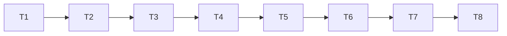

# Chunked Embeddings Implementation Plan

> **For agentic workers:** REQUIRED SUB-SKILL: Use superpowers:subagent-driven-development (recommended) or superpowers:executing-plans to implement this plan in wave order. Steps use checkbox (`- [ ]`) syntax for tracking.

**Goal:** One embedding vector per observation, one identity vector (name + type) per entity, and one vector per relation; searches filter by kind and type and return kind-marked owner rows.

**Architecture:** The indexer embeds each owner as several chunk vectors and commits them to `chunk_vector`. The serving snapshot holds chunk rows with owner and type metadata; search scans the snapshot, applies the optional kind/type predicate, and aggregates to owner (best chunk wins). Relations reuse the `taxonomy_relation` mirror as their revision fence. Client-supplied embeddings and the ANN layers disappear.

**Tech Stack:** Rust, rusqlite (SQLite STRICT), FTS5, provider traits in `mcpmem-indexer`. The serving path is exact snapshot scan, not ANN.

**Spec:** `docs/superpowers/specs/2026-09-13-chunked-embeddings-design.md`

## Global Constraints

- Migrations are numbered 0008 and 0009. Numbers 0001..0007 exist in `crates/mcpmem-core/src/events.rs:MIGRATIONS`.
- `representation_version` becomes `chunks-identity+obs+relation-v2` (src/config_file.rs:707).
- Entity identity chunk text is `name \n type`. Observation chunk text is the observation body. Relation chunk text is `fromName \n relationType \n toName`.
- Every chunk row carries `type_id` denormalized from its owner.
- The `taxonomy_relation` mirror is the relation owner identity and revision fence.
- `chunk_vector` is the only relation embedding store. The taxonomy kind-2 snapshot derives from it.
- Tool removals: `vector_upsert_embedding`, `vector_delete_embedding`, `vector_batch_upsert`, `vector_get_embedding`, `vector_recommend`, `vector_reindex`. `vector_search_by_entity` stays, on the identity chunk.
- The code-index subsystem keeps its own embeddings and HNSW. This plan does not touch `src/code_vec_registry.rs` behavior or the `--code-*` flags.
- Every task ends with the full suite green: `cargo test --workspace --all-targets -- --test-threads=1`, plus the feature-matrix tests in `.omp/AGENTS.md`.
- Commit messages name the tokens burned and the approximate cost, per `rule://git-and-prs`.

## Task Graph & Waves



| Wave | Tasks |
|---|---|
| 0 | 1 |
| 1 | 2 |
| 2 | 3 |
| 3 | 4 |
| 4 | 5 |
| 5 | 6 |
| 6 | 7 |
| 7 | 8 |

The chain is serial because `src/vector_store.rs` and `crates/mcpmem-core/src/jobs.rs` each need edits in several tasks: store in 3, 4, 5, 7; jobs in 2, 5, 6. Parallelism returns for the docs wave and for sub-task steps, but the tasks themselves own overlapping files and must run in order.

---

## Task 1: Schema 0008 and Chunk Types

**Depends on:** None

**Files:**
- Create: `crates/mcpmem-core/migrations/0009_chunked_embeddings.sql`
- Modify: `crates/mcpmem-core/src/events.rs` (register the migration, extend `MIGRATIONS`, extend the checksum inventory test)
- Modify: `crates/mcpmem-core/src/jobs.rs` (add `ChunkKind`, `OwnerKind`)
- Modify: `src/config_file.rs:700-712` (mint the v2 `representation_version`)
- Test: `tests/event_outbox.rs` (migration applies; new tables exist), `src/config_file.rs` (v2 mint test)

**Interfaces:**
- Consumes: nothing new.
- Produces:
  - `mcpmem_core::jobs::ChunkKind` enum with variants `Identity`, `Observation`, `Relation` and `pub fn as_str(&self) -> &str` returning `"identity"`, `"observation"`, `"relation"`.
  - `mcpmem_core::jobs::OwnerKind` enum with variants `Entity`, `Relation` and `pub fn as_str(&self) -> &str` returning `"entity"`, `"relation"`.
  - Table `chunk_vector` and `chunk_index_job` according to the DDL below.

- [ ] **Step 1: Write the failing migration-inventory test**

In `crates/mcpmem-core/src/events.rs`, change `pub const MIGRATIONS: [(i64, &str); 7]` to `[(i64, &str); 8]` and append:

```rust
    (
        8,
        include_str!("../migrations/0009_chunked_embeddings.sql"),
    ),
```

In the `migration_inventory` module, extend the expected vector in `every_migration_version_and_checksum_is_pinned` with a placeholder entry `(8, "CHANGEME".to_string())`. The test compiles now, so the vector type does not change.

- [ ] **Step 2: Create the migration file**

Create `crates/mcpmem-core/migrations/0009_chunked_embeddings.sql`:

```sql
CREATE TABLE chunk_vector (
    profile_id     TEXT    NOT NULL,
    kind           TEXT    NOT NULL CHECK (kind IN ('identity','observation','relation')),
    owner_kind     TEXT    NOT NULL CHECK (owner_kind IN ('entity','relation')),
    owner_id       INTEGER NOT NULL,
    chunk_index    INTEGER NOT NULL,
    type_id        INTEGER NOT NULL,
    owner_revision INTEGER NOT NULL,
    blob           BLOB    NOT NULL,
    created_at_us  INTEGER NOT NULL,
    source         TEXT    NOT NULL,
    PRIMARY KEY (profile_id, kind, owner_kind, owner_id, chunk_index)
) STRICT;

CREATE INDEX chunk_vector_owner ON chunk_vector(profile_id, owner_kind, owner_id);
CREATE INDEX chunk_vector_type ON chunk_vector(profile_id, type_id);

CREATE TABLE chunk_index_job (
    profile_id      TEXT    NOT NULL,
    owner_kind      TEXT    NOT NULL CHECK (owner_kind IN ('entity','relation')),
    owner_id        INTEGER NOT NULL,
    owner_revision  INTEGER NOT NULL,
    operation       TEXT    NOT NULL CHECK (operation IN ('upsert','delete')),
    state           TEXT    NOT NULL DEFAULT 'pending',
    lease_token     TEXT,
    lease_epoch     INTEGER NOT NULL DEFAULT 0,
    lease_until_us  INTEGER NOT NULL DEFAULT 0,
    next_attempt_us INTEGER NOT NULL DEFAULT 0,
    attempts        INTEGER NOT NULL DEFAULT 0,
    last_error      TEXT,
    PRIMARY KEY (profile_id, owner_kind, owner_id)
) STRICT;

CREATE INDEX chunk_index_job_due ON chunk_index_job(state, next_attempt_us, lease_until_us);
CREATE INDEX chunk_index_job_owner ON chunk_index_job(owner_kind, owner_id);
```

- [ ] **Step 3: Compute the checksum and pin it**

Run:

```bash
python3 -c "import hashlib;print(hashlib.sha256(open('crates/mcpmem-core/migrations/0009_chunked_embeddings.sql','rb').read()).hexdigest())"
```

Replace the `"CHANGEME"` placeholder in the inventory test with the printed hex string.

- [ ] **Step 4: Add the chunk enum types**

In `crates/mcpmem-core/src/jobs.rs`, next to the `Normalization` enum:

```rust
#[derive(Clone, Copy, Debug, Eq, PartialEq, Serialize, Deserialize)]
pub enum ChunkKind {
    Identity,
    Observation,
    Relation,
}

impl ChunkKind {
    pub const fn as_str(self) -> &'static str {
        match self {
            ChunkKind::Identity => "identity",
            ChunkKind::Observation => "observation",
            ChunkKind::Relation => "relation",
        }
    }
}

#[derive(Clone, Copy, Debug, Eq, PartialEq, Serialize, Deserialize)]
pub enum OwnerKind {
    Entity,
    Relation,
}

impl OwnerKind {
    pub const fn as_str(self) -> &'static str {
        match self {
            OwnerKind::Entity => "entity",
            OwnerKind::Relation => "relation",
        }
    }
}
```

- [ ] **Step 5: Add the migration-applies test**

In `tests/event_outbox.rs`, add beside the existing migration test:

```rust
#[test]
fn migration_0008_creates_chunk_tables() {
    let dir = tempfile::tempdir().unwrap();
    let path = dir.path().join("memory.db");
    let graph = setup(&path);
    let conn = graph.writer.lock();
    for table in ["chunk_vector", "chunk_index_job"] {
        let count: i64 = conn
            .query_row("SELECT COUNT(*) FROM sqlite_master WHERE type='table' AND name=?1", [table], |r| r.get(0))
            .unwrap();
        assert_eq!(count, 1, "table {table} must exist after migrate");
    }
    drop(conn);
}
```

Use the same `setup` helper the file already uses. Read the file's existing setup/open patterns first and mirror them.

- [ ] **Step 6: Mint the v2 representation version**

In `src/config_file.rs`, find the `ProfileSpec` mint with `representation_version` around line 707. Change the value from `"name+type+observations-v1"` to `"chunks-identity+obs+relation-v2".to_string()`.

- [ ] **Step 7: Run the suite and fix the v2 pin**

Run:

```bash
cargo test --workspace --all-targets -- --test-threads=1
```

Expected: the checksum inventory test passes; any config test that pinned `name+type+observations-v1` fails. Update those pins to the v2 string. Confirm the full migration test `startup_rejects_changed_migration_and_preserves_legacy_vector_rows` still passes: `vector_embedding` still exists at this point (0009 drops it).

- [ ] **Step 8: Commit**

```bash
git add crates/mcpmem-core/migrations/0009_chunked_embeddings.sql crates/mcpmem-core/src/events.rs crates/mcpmem-core/src/jobs.rs src/config_file.rs tests/event_outbox.rs
git commit -m "feat: schema 0009 for chunked embeddings

Adds chunk_vector and chunk_index_job and the ChunkKind/OwnerKind
types. Nothing consumes the tables yet.

Cost: ~15k tokens, est. $0.25."
```

---

## Task 2: Chunk Write Path

**Depends on:** 1

**Files:**
- Modify: `crates/mcpmem-indexer/src/provider.rs` (chunk text builder)
- Modify: `crates/mcpmem-indexer/src/lib.rs` (embed many texts, commit chunks, relation chunk text)
- Modify: `crates/mcpmem-core/src/jobs.rs` (`commit_chunks`, `claim_due` on `chunk_index_job`, delete-path delete)
- Modify: `crates/mcpmem-core/src/mutation.rs` (relation funnels enqueue chunk jobs instead of taxonomy kind-2 jobs)
- Test: `tests/indexer_worker.rs`, `tests/event_outbox.rs`, `crates/mcpmem-core/src/jobs.rs` tests

**Interfaces:**
- Consumes: `ChunkKind`, `OwnerKind` (Task 1), `chunk_vector`, `chunk_index_job` (Task 1).
- Produces:
  - `CanonicalDocument::chunks(&self) -> Vec<(ChunkKind, String)>` in `mcpmem-indexer`.
  - `pub(crate) fn relation_chunk_text(conn: &Connection, mirror_id: i64, expected_revision: i64) -> Result<Option<String>>` in `crates/mcpmem-indexer/src/lib.rs`.
  - `IndexJobRepository::commit_chunks(&self, job: &IndexJob, now_us: i64, chunks: Option<&[&(ChunkKind, &[f32])]>, source: &str) -> Result<bool>` in `mcpmem-core`.
  - `pub(crate) fn enqueue_chunk_change(conn: &Connection, owner_kind: OwnerKind, owner_id: i64, revision: i64, deleted: bool) -> Result<()>` in `mcpmem-core` jobs.rs.
  - `pub fn owner_revision(&self, conn: &Connection, owner_kind: OwnerKind, owner_id: i64) -> Result<Option<(i64, bool)>>` in `mcpmem-core` jobs.rs: entity reads `entity_revision`, relation reads `taxonomy_relation`.

- [ ] **Step 1: Write the failing chunk-text tests**

In `tests/indexer_worker.rs`, replace `worker_indexes_observation_bodies_without_metadata` with:

```rust
#[test]
fn canonical_document_splits_into_chunks() {
    let dir = tempfile::tempdir().unwrap();
    let database = dir.path().join("memory.db");
    let graph = setup(&database);
    let conn = graph.writer.lock();

    let Ok(Some(doc)) = mcpmem_indexer::canonical_document_for_tests(
        &conn, entity_id_of(&graph, "Ada"), revision_of(&graph, "Ada"),
    ) else {
        panic!("Ada must canonicalize");
    };
    let chunks = doc.chunks();
    assert_eq!(
        chunks,
        vec![
            (ChunkKind::Identity, "Ada\nPerson".to_string()),
            (ChunkKind::Observation, "first programmer".to_string()),
        ],
    );
    drop(conn);
}
```

If the file has no `canonical_document_for_tests` / `entity_id_of` helpers, add them as a `#[cfg(test)] pub fn` in `crates/mcpmem-indexer/src/lib.rs` using the existing `canonical_document` and a name lookup. `ChunkKind` imports from `mcpmem_core::jobs::ChunkKind`.

- [ ] **Step 2: Run it to verify it fails**

Run: `cargo test --test indexer_worker --features indexer -- --test-threads=1`
Expected: FAIL — `chunks` method does not exist.

- [ ] **Step 3: Implement chunk text building**

In `crates/mcpmem-indexer/src/provider.rs`, replace the `text()` method body region with:

```rust
    /// The chunk texts of this owner, in embedding order: identity first,
    /// then one per observation. The identity chunk carries name and type.
    pub fn chunks(&self) -> Vec<(mcpmem_core::jobs::ChunkKind, String)> {
        let mut out = Vec::with_capacity(1 + self.observations.len());
        out.push((
            mcpmem_core::jobs::ChunkKind::Identity,
            format!("{}\n{}", self.name, self.entity_type),
        ));
        for body in &self.observations {
            out.push((mcpmem_core::jobs::ChunkKind::Observation, body.clone()));
        }
        out
    }
```

Keep `text()` — its callers stay until Task 7. Add the test helper in `crates/mcpmem-indexer/src/lib.rs`:

```rust
#[cfg(test)]
pub fn canonical_document_for_tests(
    conn: &Connection,
    entity_id: i64,
    expected_revision: i64,
) -> Result<Option<CanonicalDocument>, rusqlite::Error> {
    canonical_document(conn, entity_id, expected_revision)
}
```

- [ ] **Step 4: Run it to verify it passes**

Run: `cargo test --test indexer_worker --features indexer -- --test-threads=1`
Expected: PASS.

- [ ] **Step 5: Write the failing relation-chunk-text test**

Add to `tests/indexer_worker.rs`:

```rust
#[test]
fn relation_chunk_text_is_the_formatted_triple() {
    let dir = tempfile::tempdir().unwrap();
    let database = dir.path().join("memory.db");
    let graph = setup(&database);
    // Reuse the taxonomy seeding: create ada, bob and the mirror for
    // ada -[knows]-> bob through the graph, then read the mirror id.
    graph.create_entities(&[entity("ada", "Person"), entity("bob", "Person")]).unwrap();
    graph.create_relations(&[relation("ada", "bob", "knows")]).unwrap();
    let conn = graph.writer.lock();
    let (mirror_id, revision): (i64, i64) = conn
        .query_row(
            "SELECT m.id, m.revision FROM taxonomy_relation m
             JOIN entity f ON f.id=m.from_id JOIN entity t ON t.id=m.to_id
             JOIN type_dict d ON d.id=m.type_id
             WHERE f.name='ada' AND t.name='bob' AND d.name='knows' AND d.kind=1",
            [],
            |r| Ok((r.get(0)?, r.get(1)?)),
        )
        .unwrap();
    let Ok(Some(text)) = mcpmem_indexer::relation_chunk_text(&conn, mirror_id, revision) else {
        panic!("the mirror must canonicalize");
    };
    assert_eq!(text, "ada\nknows\nbob");
    drop(conn);
}
```

Use the file's existing entity/relation constructor helpers; mirror their names.

- [ ] **Step 6: Run it to verify it fails**

Expected: FAIL — `relation_chunk_text` is not exported.

- [ ] **Step 7: Implement relation chunk text**

In `crates/mcpmem-indexer/src/lib.rs`:

```rust
/// The text of one relation chunk: the formatted triple. Fenced on the
/// taxonomy_relation mirror revision and the liveness of both endpoints.
pub fn relation_chunk_text(
    conn: &Connection,
    mirror_id: i64,
    expected_revision: i64,
) -> Result<Option<String>, rusqlite::Error> {
    let row: Option<(String, String, String, i64)> = conn.query_row(
        "SELECT f.name, d.name, t.name, m.revision FROM taxonomy_relation m
         JOIN entity f ON f.id=m.from_id
         JOIN entity t ON t.id=m.to_id
         JOIN type_dict d ON d.id=m.type_id
         WHERE m.id=?1 AND m.deleted=0 AND f.flags=0 AND t.flags=0",
        [mirror_id],
        |r| Ok((r.get(0)?, r.get(1)?, r.get(2)?, r.get(3)?)),
    ).optional()?;
    Ok(match row {
        Some((from_name, rtype, to_name, revision)) if revision == expected_revision =>
            Some(format!("{from_name}\n{rtype}\n{to_name}")),
        _ => None,
    })
}
```

- [ ] **Step 8: Run it to verify it passes**

Run: `cargo test --test indexer_worker --features indexer -- --test-threads=1`
Expected: PASS.

- [ ] **Step 9: Write the failing commit-chunks wrapper**

`commit_chunks` has no caller until the worker is rewritten in Step 10, so test the durable effect directly. In `tests/indexer_worker.rs`, add:

```rust
#[test]
fn commit_chunks_replaces_owner_rows_and_bumps_generation() {
    let dir = tempfile::tempdir().unwrap();
    let database = dir.path().join("memory.db");
    let graph = setup(&database);
    let profile = mcpmem_core::jobs::IndexProfile {
        id: uuid::Uuid::new_v4(),
        store_key: "default".into(),
        provider_kind: "fixed".into(),
        model: "unit".into(),
        dimensions: 2,
        representation_version: "chunks-identity+obs+relation-v2".into(),
        normalization: mcpmem_core::jobs::Normalization::None,
        distance_metric: mcpmem_core::jobs::DistanceMetric::Cosine,
        vector_encoding_version: "f32le-v1".into(),
    };
    let conn = graph.writer.lock();
    mcpmem_core::jobs::IndexProfileRegistry::new(&conn).begin_rebuild(&profile)?;
    let entity_id = entity_id_of(&graph, "Ada");
    let revision = revision_of(&graph, "Ada");
    let job = IndexJob {
        entity_id,
        profile_id: profile.id,
        operation: IndexOperation::Upsert,
        // owner_kind/owner_id express the same identity in the chunk world
        owner_kind: OwnerKind::Entity,
        owner_id: entity_id,
        owner_revision: revision,
        lease: Lease { token: Uuid::new_v4(), epoch: 1, until_us: 0 },
        attempts: 1,
    };
    let vectors: [&(ChunkKind, &[f32])] = &[
        (ChunkKind::Identity, &[0.5, 0.5]),
        (ChunkKind::Observation, &[0.1, 0.9]),
    ];
    let committed = IndexJobRepository::new(&conn).commit_chunks(&job, now_us(), Some(&vectors), "test")?;
    assert!(committed, "lease and revision are current");
    let rows: Vec<(String, i64, i64, i64)> = conn.query_map_into(
        "SELECT kind, owner_kind, owner_id, chunk_index FROM chunk_vector WHERE profile_id=?1 ORDER BY chunk_index",
        [profile.id.to_string()],
    )?;
    assert_eq!(rows.len(), 2, "one identity and one observation chunk");
    drop(conn);
}
```

The exact `IndexJob` field names may differ; read `crates/mcpmem-core/src/jobs.rs` `IndexJob` struct and adjust. The plan states the contract — the executor adapts the literal struct.

- [ ] **Step 10: Run it to verify it fails**

Run: `cargo test --test indexer_worker --features indexer -- --test-threads=1`
Expected: FAIL — `commit_chunks` and the new `IndexJob` fields do not exist.

- [ ] **Step 11: Generalize the job struct**

In `crates/mcpmem-core/src/jobs.rs`, extend `IndexJob`:

```rust
pub struct IndexJob {
    pub entity_id: i64,           // kept for the legacy path until Task 7
    pub profile_id: uuid::Uuid,
    pub operation: IndexOperation,
    pub owner_kind: OwnerKind,
    pub owner_id: i64,
    pub owner_revision: i64,
    pub lease: Lease,
    pub attempts: i64,
}
```

`claim_due` in `IndexJobRepository` switches its SELECT to `chunk_index_job` (same column values as today, plus `owner_kind`), and its lease UPDATE keys on `(profile_id, owner_kind, owner_id)`. The row identity PKey is `(profile_id, owner_kind, owner_id)`.

- [ ] **Step 12: Implement commit_chunks**

Add to `IndexJobRepository`:

```rust
    /// Fenced chunk commit: delete the owner's old chunk rows, insert the new
    /// ones, and advance the durable generation in one transaction. A delete
    /// operation passes `None` as the chunks and removes the rows.
    pub fn commit_chunks(
        &self,
        job: &IndexJob,
        now_us: i64,
        chunks: Option<&[&(ChunkKind, &[f32])]>,
        source: &str,
    ) -> Result<bool> {
        let tx = TxGuard::begin(self.conn)?;
        let current = self.conn.query_row(
            "SELECT owner_revision, state, lease_token, lease_epoch, lease_until_us
             FROM chunk_index_job WHERE profile_id=?1 AND owner_kind=?2 AND owner_id=?3",
            params![job.profile_id.to_string(), job.owner_kind.as_str(), job.owner_id],
            |r| Ok((
                r.get::<_, i64>(0),
                r.get::<_, String>(1),
                r.get::<_, Option<String>>(2),
                r.get::<_, i64>(3),
                r.get::<_, i64>(4),
            )),
        ).optional().map_err(sql_error)?;
        let Some((revision, state, token, epoch, until)) = current else {
            return Ok(false);
        };
        if revision != job.owner_revision
            || state != "leased"
            || token != Some(job.lease.token.to_string())
            || epoch != job.lease.epoch
            || until <= now_us
        {
            return Ok(false);
        }
        // The fence compares the job revision against the LIVE owner revision
        // (entity_revision or taxonomy_relation), so a stale job never lands.
        let Some((live_revision, live_deleted)) = owner_revision(self.conn, job.owner_kind, job.owner_id)? else {
            return Ok(false);
        };
        if live_revision != job.owner_revision {
            return Ok(false);
        }
        match job.operation {
            IndexOperation::Delete => {
                if !live_deleted {
                    return Ok(false);
                }
            }
            IndexOperation::Upsert => {
                if live_deleted {
                    return Ok(false);
                }
            }
        }
        self.conn.execute(
            "DELETE FROM chunk_vector WHERE profile_id=?1 AND owner_kind=?2 AND owner_id=?3",
            params![job.profile_id.to_string(), job.owner_kind.as_str(), job.owner_id],
        ).map_err(sql_error)?;
        if let Some(chunk_list) = chunks && let Some(mut vecs) = chunk_list {
            let type_id = owner_type_id(self.conn, job.owner_kind, job.owner_id)?;
            for (idx, (chunk_kind, vector)) in vecs.iter().enumerate() {
                self.conn.execute(
                    "INSERT INTO chunk_vector(profile_id,kind,owner_kind,owner_id,chunk_index,type_id,owner_revision,blob,created_at_us,source)
                     VALUES(?1,?2,?3,?4,?5,?6,?7,?8,?9,?10)",
                    params![
                        job.profile_id.to_string(),
                        chunk_kind.as_str(),
                        job.owner_kind.as_str(),
                        job.owner_id,
                        idx as i64,
                        type_id,
                        job.owner_revision,
                        vector.iter().flat_map(|x| x.to_le_bytes()).collect::<Vec<u8>>(),
                        now_us,
                        source,
                    ],
                )
                .map_err(sql_error)?;
            }
        }
        self.conn.execute(
            "UPDATE chunk_index_job SET state='done' WHERE profile_id=?1 AND owner_kind=?2 AND owner_id=?3",
            params![job.profile_id.to_string(), job.owner_kind.as_str(), job.owner_id],
        ).map_err(sql_error)?;
        self.conn.execute(
            "UPDATE ann_generation SET durable_generation=durable_generation+1,full_scan_generation=NULL WHERE profile_id=?1",
            [job.profile_id.to_string()],
        ).map_err(sql_error)?;
        if job.owner_kind == OwnerKind::Relation {
            // Relation commits also advance the taxonomy kind-2 generation so
            // the derived snapshot refreshes (Task 5 reads it).
            self.conn.execute(
                "UPDATE taxonomy_ann_generation SET durable_generation=durable_generation+1,full_scan_generation=NULL
                 WHERE profile_id=?1 AND subject_kind=2",
                [job.profile_id.to_string()],
            ).map_err(sql_error)?;
        }
        tx.commit()?;
        Ok(true)
    }

    pub fn owner_revision(
        &self,
        conn: &Connection,
        owner_kind: OwnerKind,
        owner_id: i64,
    ) -> Result<Option<(i64, bool)>> {
        match owner_kind {
            OwnerKind::Entity => conn.query_row(
                "SELECT revision, deleted FROM entity_revision WHERE entity_id=?1",
                [owner_id],
                |r| Ok((r.get::<_, i64>(0), r.get::<_, bool>(1))),
            ).optional().map_err(sql_error)?,
            OwnerKind::Relation => conn.query_row(
                "SELECT revision, deleted FROM taxonomy_relation WHERE id=?1",
                [owner_id],
                |r| Ok((r.get::<_, i64>(0), r.get::<_, bool>(1))),
            ).optional().map_err(sql_error)?,
        }
    }
```

Delete-path note: `commit_chunks` with `None` vectors deletes the owner's rows and marks the job done. The `owner_revision` fence above must pass for a delete: the live revision matches and `deleted` is true. `owner_type_id` is a helper that resolves the owner's `type_id` (single-row `SELECT type_id FROM entity WHERE id=?1` for entities, `SELECT type_id FROM taxonomy_relation WHERE id=?1` for relations). The old `commit_vector` stays until Task 7; the old worker call sites move in Step 13.

- [ ] **Step 13: Rewrite the worker embed-and-commit**

In `crates/mcpmem-indexer/src/lib.rs`, replace the `Upsert` arm of `run_once` so it:

1. Reads the owner document:
   - `OwnerKind::Entity`: `canonical_document(&conn, job.owner_id, job.owner_revision)` then `.chunks()`.
   - `OwnerKind::Relation`: `relation_chunk_text(&conn, job.owner_id, job.owner_revision)` mapped to `[(ChunkKind::Relation, text)]`.
2. Calls `provider.embed_texts(&profile, &texts)` once with all chunk texts.
3. Checks `vectors.len() == texts.len()`; a mismatch is an error (same fault style as the current `returned != 1` check).
4. Applies the profile L2 normalization to every vector (the existing `l2_normalize` path).
5. Calls `jobs.commit_chunks(&job, current_us(), Some(&vecs), "indexer")`.

The `Delete` arm calls `jobs.commit_chunks(&job, current_us(), None, "indexer")`.

- [ ] **Step 14: Wire the relation enqueue funnels**

In `crates/mcpmem-core/src/mutation.rs`:

- In `create_relation` (around line 668-684), after the mirror upsert, replace `enqueue_taxonomy_jobs(conn, 2, mirror_id, 1, IndexOperation::Upsert)` with:

```rust
        crate::jobs::enqueue_chunk_change(conn, crate::jobs::OwnerKind::Relation, mirror_id, 1, false)?;
```

- In `tombstone_relation_mirror` (around line 580-596), replace the kind-2 enqueue with:

```rust
    crate::jobs::enqueue_chunk_change(conn, crate::jobs::OwnerKind::Relation, id, revision, true)?;
```

- In `crates/mcpmem-core/src/jobs.rs`, add `enqueue_chunk_change` mirroring `enqueue_change` but keyed on `chunk_index_job (profile_id, owner_kind, owner_id)`, with the same `serving_profile_ids` loop and held-nil-profile behavior. Remove the `enqueue_taxonomy_jobs(conn, 2, ...)` call sites from `mutation.rs`. The `TaxonomyJobRepository` kind-2 claim path stays in the worker until Task 5 removes it (no new kind-2 rows are enqueued after this step).

- [ ] **Step 15: Rewrite the broken pins in indexer_worker.rs and event_outbox.rs**

The following assertions change from one row per entity to one identity chunk per entity, plus one per observation. Rewrite them with a shared helper:

```rust
fn chunk_rows(conn: &Connection, profile: &str, kind: &str) -> usize {
    conn.query_row(
        "SELECT COUNT(*) FROM chunk_vector WHERE profile_id=?1 AND kind=?2",
        [profile, kind],
        |r| r.get::<_, i64>(0),
    ).unwrap() as usize
}
```

- `worker_commits_latest_canonical_revision`: assert `chunk_rows(conn, profile, "identity") == 1` and `"observation" == 1`.
- `persistent_failure_dead_letters_and_stops_blocking_the_full_scan`: the dead-letter path deletes the owner's chunk rows. Assert `SELECT COUNT(*) FROM chunk_vector` is 0 after dead-letter.
- `worker_normalizes_l2_vectors_before_commit`: the blob of the identity chunk is the normalized vector; the old one-blob assertion becomes a per-chunk index check.
- In `tests/event_outbox.rs`, `profile_rebuild_preserves_serving_and_fences_stale_revision_commits`: single `profile_vector` rows become chunk rows; the `index_job` count assertions become `chunk_index_job` counts. Note: the plan's original text named `vetted_vector_revision_and_l2_gate` here; that test does not exist. Its intended coverage (blob bytes, revision fencing, L2 gate) is carried by the rewritten `worker_retries_renewal_validation_and_restart_keep_durable_fences`.
- `startup_rejects_changed_migration_and_preserves_legacy_vector_rows` stays green: `vector_embedding` still exists (0009 drops it).

- [ ] **Step 16: Run the workspace suite**

```bash
cargo test --workspace --all-targets -- --test-threads=1
cargo test --test indexer_worker --features indexer -- --test-threads=1
cargo test --test indexer_worker --no-default-features --features indexer -- --test-threads=1
```

Fix any pin this plan did not name; the change is breaking by design, and the failing test names the pin.

- [ ] **Step 17: Commit**

```bash
git add crates/mcpmem-indexer/src/provider.rs crates/mcpmem-indexer/src/lib.rs crates/mcpmem-core/src/jobs.rs crates/mcpmem-core/src/mutation.rs tests/indexer_worker.rs tests/event_outbox.rs
git commit -m "feat: chunked embedding write path

The worker embeds identity, observation and relation chunks and commits
them to chunk_vector. Relations enqueue through the taxonomy_relation
mirror funnels. The old profile_vector writes stay until the removal
task. The 2.0.0 breaking pins are rewritten in this task.

Cost: ~90k tokens, est. $1.5."
```

---

## Task 3: Snapshot Serves Chunks

**Depends on:** 2

**Files:**
- Modify: `src/vector_store.rs` (`ManagedSnapshot`, reconcile SQL, `search_chunks`, aggregation, `identity_vector`)
- Test: `src/vector_store.rs` tests, `tests/semantic_search.rs`

**Interfaces:**
- Consumes: `chunk_vector` rows written by Task 2; `ChunkKind` maps to `kind` strings; `OwnerKind` maps to `owner_kind` strings.
- Produces:
  - `pub struct ChunkHit { pub owner_kind: OwnerKind, pub owner_id: i64, pub chunk_kind: ChunkKind, pub chunk_index: i64, pub type_id: i64, pub dist: f32 }` in `src/vector_store.rs`.
  - `pub fn search_chunks(&self, query: &[f32], fetch_k: usize, filter_kind: Option<&str>, filter_type: Option<&str>) -> Result<Vec<ChunkHit>>` — chunk hits ascending by distance, over the managed snapshot.
  - `pub fn aggregate_owners(&self, hits: &[ChunkHit], top_k: usize) -> Vec<(OwnerKind, i64, f32, Option<usize>)>` — best chunk per owner, `(owner_kind, owner_id, best_dist, best_chunk_index)`.
  - `pub fn identity_vector(&self, entity_name: &str) -> Result<Option<Vec<f32>>>` — the identity chunk of one entity.
  - `pub fn owner_identity_vector(&self, owner_kind: OwnerKind, owner_id: i64) -> Result<Option<Vec<f32>>>` — same by owner.
  - `search_embeddings` keeps its signature but returns entity owners only (best identity-or-observation chunk per entity).

- [ ] **Step 1: Write the failing snapshot test**

In `src/vector_store.rs` tests, add:

```rust
#[test]
fn snapshot_serves_filtered_chunk_hits() {
    let env = setup(4);
    let dir = env._dir;
    let kg = env.kg;
    let vs = env.vs;
    create_test_entity(&kg, "ada", "Person");
    kg.add_observations("ada", &["writes rust".into()]).unwrap();
    create_test_entity(&kg, "acme", "Company");
    // Seed chunk rows directly (worker path is covered in indexer_worker):
    vs.seed_test_chunks(&[
        SeedChunk { owner_kind: OwnerKind::Entity, owner_id: entity_id_of(&kg, "ada"), chunk_kind: ChunkKind::Identity, chunk_index: 0, type_id: type_id_of(&kg, "Person"), vector: &[1.0, 0.0, 0.0, 0.0] },
        SeedChunk { owner_kind: OwnerKind::Entity, owner_id: entity_id_of(&kg, "ada"), chunk_kind: ChunkKind::Observation, chunk_index: 1, type_id: type_id_of(&kg, "Person"), vector: &[0.9, 0.1, 0.0, 0.0] },
        SeedChunk { owner_kind: OwnerKind::Entity, owner_id: entity_id_of(&kg, "acme"), chunk_kind: ChunkKind::Identity, chunk_index: 0, type_id: type_id_of(&kg, "Company"), vector: &[0.0, 0.0, 0.0, 1.0] },
    ])?;
    vs.reconcile_managed_snapshot()?;
    let hits = vs.search_chunks(&[1.0, 0.0, 0.0, 0.0], 10, Some("entity"), Some("Person"))?;
    assert_eq!(hits.len(), 2, "Person chunks only");
    for hit in hits {
        assert_eq!(hit.owner_kind, OwnerKind::Entity);
    }
    let owners = vs.aggregate_owners(&hits, 10);
    assert_eq!(owners.len(), 1, "one owner, best chunk wins");
    assert_eq!(owners[0].1, entity_id_of(&kg, "ada"));
}
```

Add `seed_test_chunks`, `SeedChunk`, `entity_id_of`, `type_id_of` as `#[cfg(test)]` helpers on the store and kg (mirror existing test helpers in the file). `reconcile_managed_snapshot` requires a profile registry state; adopt the pattern the existing `test_vector_index_capacity_grows_in_chunks` style tests use, or bypass reconcile by writing the snapshot directly (`vs.snapshot_for_tests(...)`). Read the file's test module and pick the established shape.

- [ ] **Step 2: Run it to verify it fails**

Run: `cargo test --test vector_store -- --test-threads=1` (locate the test binary name in the workspace; `.omp/AGENTS.md` pre-flight uses workspace target names)
Expected: FAIL — `search_chunks` does not exist.

- [ ] **Step 3: Extend the snapshot metadata**

In `src/vector_store.rs`:

```rust
struct SnapshotVector {
    owner_kind: OwnerKind,
    owner_id: i64,
    chunk_kind: ChunkKind,
    chunk_index: i64,
    type_id: i64,
    vector: Vec<f32>,
}
```

Change `ManagedSnapshot.vectors: Vec<(EntityId, Vec<f32>)>` to `Vec<SnapshotVector>`. Update `reconcile_managed_snapshot`'s SELECT:

```sql
SELECT kind, owner_kind, owner_id, chunk_index, type_id, blob
FROM chunk_vector WHERE profile_id=?1 ORDER BY owner_kind, owner_id, chunk_index
```

and decode each row into `SnapshotVector`. The dimension/`validate_vector` checks stay per row.

- [ ] **Step 4: Implement search_chunks and aggregation**

```rust
    pub fn search_chunks(
        &self,
        query: &[f32],
        fetch_k: usize,
        filter_kind: Option<&str>,
        filter_type: Option<&str>,
    ) -> Result<Vec<ChunkHit>> {
        let Some(snapshot) = self.managed_snapshot.read().clone() else {
            return Ok(Vec::new());
        };
        if query.len()
            != snapshot.vectors.first().map_or(query.len(), |sv| sv.vector.len())
        {
            return Err(MCSError::InvalidParams(
                "query dimensions do not match active index profile".into(),
            ));
        }
        let mut matches: Vec<ChunkHit> = Vec::new();
        for sv in &snapshot.vectors {
            if let Some(kind) = filter_kind && sv.owner_kind.as_str() != kind {
                continue;
            }
            if let Some(ftype) = filter_type && !self.chunk_type_matches(sv.type_id, ftype) {
                continue;
            }
            matches.push(ChunkHit {
                owner_kind: sv.owner_kind,
                owner_id: sv.owner_id,
                chunk_kind: sv.chunk_kind,
                chunk_index: sv.chunk_index,
                type_id: sv.type_id,
                dist: managed_distance(snapshot.metric, query, &sv.vector),
            });
        }
        matches.sort_by(|a, b| a.dist.total_cmp(&b.dist));
        matches.truncate(fetch_k.clamp(1, 1000));
        Ok(matches)
    }

    /// Whether the type name of `type_id` equals `ftype` in either dict kind.
    fn chunk_type_matches(&self, type_id: i64, ftype: &str) -> bool {
        let conn = self.db.lock();
        conn.query_row(
            "SELECT EXISTS(SELECT 1 FROM type_dict WHERE id=?1 AND name=?2)",
            params![type_id, ftype],
            |r| r.get::<_, bool>(0),
        ).map_err(sqlite_err).unwrap_or(false)
    }

    pub fn aggregate_owners(
        &self,
        hits: &[ChunkHit],
        top_k: usize,
    ) -> Vec<(OwnerKind, i64, f32, Option<usize>)> {
        let mut best: FxHashMap<(OwnerKind, i64), (f32, usize)> = FxHashMap::new();
        // Hits arrive distance-ascending, so the first hit per owner wins.
        for (idx, hit) in hits.iter().enumerate() {
            best.entry((hit.owner_kind, hit.owner_id))
                .or_insert_with(|| (hit.dist, idx));
        }
        let mut out: Vec<_> = best.into_iter().map(|((kind, id), (dist, idx))| {
            (kind, id, dist, hits[idx].chunk_kind == ChunkKind::Observation
                ? Some(hits[idx].chunk_index as usize)
                : None)
        }).collect();
        out.sort_by(|a, b| a.2.total_cmp(&b.2));
        out.truncate(top_k);
        out
    }
```

Note: `FxHashMap` is already imported in the file's test module; import it at the top if the store needs it in production code.

- [ ] **Step 5: Keep search_embeddings entity-only**

Rewrite `search_embeddings` to call `search_chunks(query, top_k, Some("entity"), None)` and then map `aggregate_owners` to `(owner_id, dist)` pairs. This preserves every existing entity-level caller until Task 4 rewires them.

Add the identity-vector helpers:

```rust
    pub fn identity_vector(&self, entity_name: &str) -> Result<Option<Vec<f32>>> {
        let conn = self.db.lock();
        let id: Option<i64> = conn.query_row(
            "SELECT id FROM entity WHERE name_hash=?1 AND name=?2 AND flags=0",
            params![crate::kg::name_hash(entity_name), entity_name],
            |r| r.get(0),
        ).optional().map_err(sqlite_err)?;
        drop(id).map(|id| self.owner_identity_vector(OwnerKind::Entity, id))
    }

    pub fn owner_identity_vector(
        &self,
        owner_kind: OwnerKind,
        owner_id: i64,
    ) -> Result<Option<Vec<f32>>> {
        let conn = self.db.lock();
        let profile = self.serving_profile_id(&conn)?;
        drop(profile).map(|profile| {
            let blob: Option<Vec<u8>> = conn.query_row(
                "SELECT blob FROM chunk_vector
                 WHERE profile_id=?1 AND kind='identity' AND owner_kind=?2 AND owner_id=?3",
                params![profile.to_string(), owner_kind.as_str(), owner_id],
                |r| r.get(0),
            ).optional().map_err(sqlite_err).ok().flatten()?;
            blob.map(|bytes| {
                if bytes.len() != self.dims * std::mem::size_of::<f32>() {
                    return None;
                }
                let (chunks, _) = bytes.as_chunks::<4>();
                Some(chunks.iter().map(|b| f32::from_le_bytes(*b)).collect::<Vec<_>>())
            })
        })
    }
```

Add `fn serving_profile_id(&self, conn) -> Result<Option<uuid::Uuid>>` reading `serving_profile` from `index_profile_registry` (fall back to the candidate when `Rebuilding`).

- [ ] **Step 6: Rewrite the store search tests**

- `test_vector_search_json_format`, `test_search_resolved_excludes_and_filters`, `test_ivf_*`, `test_turbo_*`, `test_hnsw_concurrent_searches_all_succeed`: these use the legacy `vector_embedding` path. They keep passing until Task 7 deletes them. Do not touch them in this task, except where they assert `count == N` after a `seed_test_chunks` write. Verify the suite. Adjust only what Task 3's snapshot change broke.
- `test_get_embedding_helpers`: drops with `vector_get_embedding` in Task 7; keep passing via `vector_embedding` today.

- [ ] **Step 7: Run the workspace suite**

```bash
cargo test --workspace --all-targets -- --test-threads=1
cargo test --test semantic_search --features indexer -- --test-threads=1
```

`tests/semantic_search.rs` runs its assertions through the vector server; entity-level semantic results are preserved by the aggregation in Step 5.

- [ ] **Step 8: Commit**

```bash
git add src/vector_store.rs
git commit -m "feat: snapshot serves chunked vectors

The managed snapshot now holds per-chunk rows with owner, kind and
type metadata. search_chunks applies kind/type predicates exactly and
aggregate_owners keeps the best chunk per owner. Entity-level search
shapes are preserved through the aggregation shim.

Cost: ~60k tokens, est. $1.0."
```

---

## Task 4: Query Surface — Filters, Kind Rows, Chunk Detail

**Depends on:** 3

**Files:**
- Modify: `src/vector_actions.rs` (filters, `includeChunks`, kind-marked rows, `vector_search_by_entity` identity chunk, MMR owner-level)
- Modify: `vector_tools.json` (schemas for the four search tools)
- Test: `tests/semantic_search.rs`, `tests/vector_e2e.rs`

**Interfaces:**
- Consumes: `search_chunks`, `aggregate_owners`, `identity_vector`, `owner_identity_vector` (Task 3).
- Produces: the changed tool contracts described in the spec §8. Result rows gain `kind`. `filter` and `includeChunks` appear on `vector_search_entities`, `hybrid_search`, `semantic_search`, `vector_search_by_entity`.

- [ ] **Step 1: Write the failing filter test**

In `tests/semantic_search.rs`, add (mirror the file's existing call helper):

```rust
#[test]
fn filter_selects_kind_and_type_before_ranking() {
    // reuse the setup that seeds Person/Company entities with observations
    let v = call(&kg, &vs, &serde_json::json!({
        "queryText": "ada",
        "topK": 10,
        "filter": { "kind": "entity", "type": "Person" },
    }));
    let rows = v["results"].as_array().unwrap();
    assert!(!rows.is_empty(), "a Person must match");
    for row in rows {
        assert_eq!(row["kind"].as_str(), Some("entity"));
        assert_eq!(row["entityType"].as_str(), Some("Person"));
    }
}
```

Adapt `call` from the existing tests; `semantic_search` needs the `indexer` feature and a serving profile (the file's `vector_server` helper provides it).

- [ ] **Step 2: Run it to verify it fails**

Run: `cargo test --test semantic_search --features indexer -- --test-threads=1`
Expected: FAIL — `filter` is unknown; rows have no `kind`.

- [ ] **Step 3: Parse the filter in vector_actions.rs**

```rust
#[derive(Clone, Debug, Default)]
pub struct SearchFilter {
    pub kind: Option<String>,
    pub type: Option<String>,
}

fn parse_filter(params: &Value) -> Result<Option<SearchFilter>> {
    let Some(f) = params.get("filter").filter(|v| !v.is_null()) else {
        return Ok(None);
    };
    let object = f.as_object().ok_or_else(|| {
        MCSError::InvalidParams("'filter' must be an object with 'kind' and/or 'type'".into())
    })?;
    let kind = object.get("kind").and_then(|v| v.as_str()).filter(|s| !s.is_empty());
    if kind.is_some_and(|k| k != "entity" && k != "relation") {
        return Err(MCSError::InvalidParams(
            "'filter.kind' must be \"entity\" or \"relation\"".into(),
        ));
    }
    let ftype = object.get("type").and_then(|v| v.as_str()).filter(|s| !s.is_empty());
    Ok(Some(SearchFilter { kind, type: ftype }))
}
```

- [ ] **Step 4: Add the owner-resolution and result builder**

In `src/vector_store.rs` or `src/vector_actions.rs` (pick the store for cache reuse):

```rust
    /// Resolve one owner to a display row. Entity: (name, entityType, "entity").
    /// Relation: ("from -> TYPE -> to", relationType, "relation").
    pub fn resolve_owner(
        &self,
        owner_kind: OwnerKind,
        owner_id: i64,
    ) -> Result<Option<(String, String, String)>> {
        match owner_kind {
            OwnerKind::Entity => {
                let Some((name, etype)) = self.get_entity_name_type(self.db.lock(), owner_id) else {
                    return Ok(None);
                };
                Ok(Some((name, etype, "entity")))
            }
            OwnerKind::Relation => {
                let conn = self.db.lock();
                let row: Option<(String, String, String)> = conn
                    .query_row(
                        "SELECT f.name, d.name, t.name FROM taxonomy_relation m
                         JOIN entity f ON f.id=m.from_id JOIN entity t ON t.id=m.to_id
                         JOIN type_dict d ON d.id=m.type_id
                         WHERE m.id=?1 AND m.deleted=0 AND f.flags=0 AND t.flags=0",
                        [owner_id],
                        |r| Ok((r.get(0)?, r.get(1)?, r.get(2)?)),
                    )
                    .optional().map_err(sqlite_err)?;
                Ok(row.map(|(f, ty, t)| (format!("{f} -> {ty} -> {t}"), ty, "relation")))
            }
        }
    }
```

In `vector_actions.rs`, add `build_owner_results(rows: &[(String, String, String, f64, Option<&str> /*chunk text*/)]) -> String` rendering `{"name":..,"entityType":..,"kind":..,"score":..}` plus `"chunk":{"kind":..,"text":..,"score":..}` when the chunk text is present.

- [ ] **Step 5: Implement includeChunks text reassembly**

Add to the store:

```rust
    /// The stored text of one chunk, reassembled from SQL for `includeChunks`.
    pub fn chunk_text(&self, hit: &ChunkHit) -> Option<String> {
        match hit.owner_kind {
            OwnerKind::Entity => match hit.chunk_kind {
                ChunkKind::Identity => {
                    let conn = self.db.lock();
                    conn.query_row(
                        "SELECT e.name || char(10) || COALESCE(t.name,'')
                         FROM entity e LEFT JOIN type_dict t ON t.id=e.type_id WHERE e.id=?1",
                        [hit.owner_id],
                        |r| r.get(0),
                    ).optional().map_err(sqlite_err).ok().flatten()
                }
                ChunkKind::Observation => {
                    let conn = self.db.lock();
                    // The chunk_index is the observation idx.
                    conn.query_row(
                        "SELECT body FROM observation WHERE entity_id=?1 AND idx=?2",
                        params![hit.owner_id, hit.chunk_index],
                        |r| r.get(0),
                    ).optional().map_err(sqlite_err).ok().flatten()
                }
                _ => None,
            },
            OwnerKind::Relation => {
                // Rebuild "from \n type \n to" from the mirror.
                let conn = self.db.lock();
                conn.query_row(
                    "SELECT f.name || char(10) || d.name || char(10) || t.name
                     FROM taxonomy_relation m JOIN entity f ON f.id=m.from_id
                     JOIN entity t ON t.id=m.to_id JOIN type_dict d ON d.id=m.type_id
                     WHERE m.id=?1",
                    [hit.owner_id],
                    |r| r.get(0),
                ).optional().map_err(sqlite_err).ok().flatten()
            }
        }
    }
```

- [ ] **Step 6: Rewrite the search handlers**

In `src/vector_actions.rs`:

- `handle_vector_search_entities`: parse `filter` and `includeChunks`; call a shared `search_owners(vs, query, top_k_effective, filter, include_chunks)`:

```rust
fn search_owners(
    vs: &VectorStore,
    query: &[f32],
    top_k: usize,
    filter: Option<&SearchFilter>,
    include_chunks: bool,
) -> Result<String> {
    // Overfetch so owners whose best chunk sits past top_k still rank.
    let fetch = (top_k * 8).clamp(top_k, 1000);
    let kind = filter.and_then(|f| f.kind.as_deref());
    let ftype = filter.and_then(|f| f.type.as_deref());
    let hits = vs.search_chunks(query, fetch, kind, ftype)?;
    let owners = vs.aggregate_owners(&hits, top_k)?;
    let mut rows: Vec<_> = Vec::with_capacity(owners.len());
    for (owner_kind, owner_id, dist, _best_idx) in owners {
        let Some((name, etype, kind_label)) = vs.resolve_owner(owner_kind, owner_id)? else {
            continue;
        };
        let chunk_text = if include_chunks {
            hits.iter()
                .find(|h| h.owner_kind == owner_kind && h.owner_id == owner_id)
                .and_then(|h| vs.chunk_text(&h))
        } else {
            None
        };
        rows.push((name, etype, kind_label, dist as f64, chunk_text));
    }
    Ok(build_owner_results(&rows))
}
```

Handlers pass the `filter`/`includeChunks` params (default `filter: none`, `includeChunks: false`). `handle_hybrid_search` keeps the FTS half over entities. It fuses at owner level now. The vector half uses `search_chunks` plus `aggregate_owners`. FTS entity matches merge on `(owner_kind='entity', owner_id)` keys. Relation rows enter fusion with their vector rank only. `handle_semantic_search` routes through the same two functions (pure vector when no weights, fused when weights given) plus the filter; drop its special `entity_type` widening in favor of the chunk-level filter. `handle_vector_search_by_entity` uses `vs.identity_vector(name)` as the query and the shared search. `handle_vector_mmr_search` uses `search_chunks` + `aggregate_owners` for the pool and `vs.owner_identity_vector` for diversity vectors.

- [ ] **Step 7: Update the tool schemas**

In `vector_tools.json`, for `vector_search_entities`, `hybrid_search`, `semantic_search`, `vector_search_by_entity`, replace the `entityType` property with:

```json
"filter": {
  "type": "object",
  "properties": {
    "kind": { "type": "string", "enum": ["entity", "relation"] },
    "type": { "type": "string" }
  },
  "additionalProperties": false
},
"includeChunks": { "type": "boolean", "default": false }
```

Update the `description` of each to state the kind-marked rows and the chunk detail. `hybrid_search` and `semantic_search` keep `entityType` OUT; the manifest no longer mentions it.

- [ ] **Step 8: Run the suite and fix the semantic/e2e pins**

```bash
cargo test --test semantic_search --features indexer -- --test-threads=1
cargo test --test vector_e2e -- --test-threads=1
cargo test --workspace --all-targets -- --test-threads=1
```

`tests/semantic_search.rs` schema assertions (`the_manifest_declares_semantic_search`) update: `required` gains nothing, but the JSON `properties` change; adjust. `vector_e2e.rs` JSON assertions gain `"kind"` on result rows.

- [ ] **Step 9: Commit**

```bash
git add src/vector_actions.rs src/vector_store.rs vector_tools.json tests/semantic_search.rs tests/vector_e2e.rs
git commit -m "feat: filtered kind-marked search with chunk detail

The search tools filter by owner kind and type, return kind-marked
rows, and optionally attach the matched chunk text. vector_search_by_
entity queries with the identity chunk. MMR diversifies at owner level.

Cost: ~90k tokens, est. $1.5."
```

---

## Task 5: Taxonomy Kind-2 Reads chunk_vector

**Depends on:** 4

**Files:**
- Modify: `src/vector_store.rs` (`adopt_taxonomy` kind-2 read)
- Modify: `src/taxonomy.rs` (kind-2 resolution already reads the mirror — verify; nothing changes unless noted)
- Modify: `crates/mcpmem-core/src/mutation.rs` (kind-2 enqueue sites were removed in Task 2; confirm no `enqueue_taxonomy_jobs(conn, 2, ...)` remains)
- Modify: `crates/mcpmem-core/src/jobs.rs` (TaxonomyJobRepository kind-2 claim path — restrict `claim_due` to kinds 0 and 1)
- Test: `tests/indexer_worker.rs` taxonomy worker tests, `src/taxonomy.rs` tests. Note: the plan's original text named `tests/mutation.rs`; that file does not exist. The real mirror tests live in the `crates/mcpmem-core/src/mutation.rs` test module, and Task 2 re-pointed them at `chunk_index_job` rows — verify only, no edit expected.

**Interfaces:**
- Consumes: `chunk_vector` relation rows (Task 2), kind-2 `taxonomy_ann_generation` bumps (Task 2).
- Produces: none new; the kind-2 snapshot builds from `chunk_vector`.

- [ ] **Step 1: Write the failing derivation test**

In `tests/indexer_worker.rs`, add:

```rust
#[test]
fn taxonomy_relation_snapshot_derives_from_chunk_vector() {
    // Seed entities + relation through the graph, run the worker once for
    // the relation chunk job, then assert suggest_taxonomy kind=2 finds it.
    let dir = tempfile::tempdir().unwrap();
    let database = dir.path().join("memory.db");
    let graph = setup(&database);
    let profile = seed_profile(&graph);
    graph.create_entities(&[entity("ada", "Person"), entity("bob", "Person")]).unwrap();
    graph.create_relations(&[relation("ada", "bob", "knows")]).unwrap();
    let worker = IndexerWorker::new(&database, FixedProvider::default(), Duration::from_secs(5));
    worker.run_once(current_us()).unwrap(); // relation chunk job
    let store = vs_of(&graph);
    store.reconcile_managed_snapshot().unwrap();
    store.adopt_taxonomy(&IndexProfileRegistry::new(&graph.writer.lock()), false).unwrap();
    let hits = store.search_taxonomy(TaxonomyKind::Relation, &[1.0, 0.0], 5).unwrap();
    assert_eq!(hits.len(), 1, "one relation chunk in the kind-2 snapshot");
}
```

Adapt the helpers to the file's existing patterns (`FixedProvider` already exists in the file; `vs_of` and `seed_profile` may need adding from `tests/semantic_search.rs`'s `vector_server` shape).

- [ ] **Step 2: Run it to verify it fails**

Run: `cargo test --test indexer_worker --features indexer -- --test-threads=1`
Expected: FAIL — the kind-2 snapshot stays empty (it reads `taxonomy_vector`).

- [ ] **Step 3: Switch the kind-2 adoption read**

In `src/vector_store.rs` `adopt_taxonomy`, for `TaxonomyKind::Relation` only, replace the `taxonomy_vector` SELECT with:

```sql
SELECT owner_id, blob FROM chunk_vector
WHERE profile_id=?1 AND kind='relation'
ORDER BY owner_id
```

Keep kinds 0 and 1 on `taxonomy_vector`. The generation check and `mark_taxonomy_published` stay.

- [ ] **Step 4: Restrict the taxonomy kind-2 job path**

In `crates/mcpmem-core/src/jobs.rs` `TaxonomyJobRepository::claim_due`, add `AND subject_kind != 2` to the WHERE clause, so retired/held kind-2 rows never claim. In `crates/mcpmem-indexer/src/lib.rs`, make `run_taxonomy_job` skip kind-2 jobs (a held kind-2 row returns without work).

- [ ] **Step 5: Update the taxonomy tests**

In `tests/mutation.rs`, the mirror tests (`create_relation_writes_mirror`, `delete_relation_tombstones_mirror_and_enqueues_delete`, `recreated_relation_reuses_no_freed_mirror_id`, `delete_entity_tombstones_its_relation_mirrors`) assert kind-2 `taxonomy_job` rows. Change those assertions to `chunk_index_job` rows with `owner_kind='relation'`. The `taxonomy_jobs` helper stays for kinds 0 and 1.

- [ ] **Step 6: Run the workspace suite**

```bash
cargo test --workspace --all-targets -- --test-threads=1
cargo test --test indexer_worker --features indexer -- --test-threads=1
cargo test --test role_composition --features indexer,webhooks
```

- [ ] **Step 7: Commit**

```bash
git add src/vector_store.rs crates/mcpmem-core/src/jobs.rs crates/mcpmem-indexer/src/lib.rs tests/indexer_worker.rs tests/mutation.rs
git commit -m "feat: taxonomy kind-2 derives from chunk_vector

The relation suggestion snapshot reads the single relation store. The
kind-2 taxonomy job path retires; kinds 0 and 1 are untouched.

Cost: ~35k tokens, est. $0.6."
```

---

## Task 6: Verification Gate and Rebuild Cover Relations

**Depends on:** 5

**Files:**
- Modify: `crates/mcpmem-core/src/jobs.rs` (`verify_vectors_current`, `begin_rebuild`)
- Test: `tests/event_outbox.rs`

**Interfaces:**
- Consumes: `chunk_vector`, `chunk_index_job`, `taxonomy_relation` (Tasks 1-2).
- Produces: `begin_rebuild(profile)` enqueues every live entity AND every live relation; `verify_vectors_current` accepts only a fully current chunk set.

- [ ] **Step 1: Write the failing gate test**

In `tests/event_outbox.rs`, add:

```rust
#[test]
fn rebuilt_profile_requires_every_relation_chunk() {
    // Seed two entities and one relation, begin_rebuild, run the worker for
    // the entity jobs only, then assert verify fails until the relation
    // chunk exists.
    let dir = tempfile::tempdir().unwrap();
    let database = dir.path().join("memory.db");
    let graph = setup(&database);
    let profile = seed_profile(&graph);
    graph.create_entities(&[entity("ada", "Person")]).unwrap();
    graph.create_relations(&[relation("ada", "ada", "knows")]).unwrap();
    let conn = graph.writer.lock();
    IndexProfileRegistry::new(&conn).begin_rebuild(&profile)?;
    // claim and commit only the entity job
    let worker = IndexerWorker::new(&database, FixedProvider::default(), Duration::from_secs(5));
    worker.run_once(current_us()).unwrap();
    let repo = AnnGenerationRepository::new(&conn);
    let err = repo.verify_full_scan(profile.id).err().unwrap();
    assert!(err.to_string().contains("missing or stale"), "relation chunk is missing: {err}");
    drop(conn);
}
```

Mirror the file's existing worker-driving patterns; `FixedProvider` may need to come from `tests/indexer_worker.rs` conventions.

- [ ] **Step 2: Run it to verify it fails**

Run: `cargo test --test event_outbox -- --test-threads=1`
Expected: FAIL — the current gate knows nothing about relation chunks.

- [ ] **Step 3: Rewrite verify_vectors_current**

In `crates/mcpmem-core/src/jobs.rs`, replace the body of `verify_vectors_current` with a chunk-aware check. The gate fails when ANY of these hold:

```sql
-- a live entity lacks a current identity chunk (dead jobs exempt)
SELECT EXISTS(
  SELECT 1 FROM entity e
  JOIN entity_revision r ON r.entity_id = e.id
  LEFT JOIN chunk_vector v ON v.profile_id=?1 AND v.owner_kind='entity'
      AND v.owner_id=e.id AND v.kind='identity'
  WHERE e.flags=0
    AND NOT EXISTS(SELECT 1 FROM chunk_index_job d
      WHERE d.profile_id=?1 AND d.owner_kind='entity' AND d.owner_id=e.id
      AND d.state='dead')
    AND (v.owner_id IS NULL OR v.owner_revision != r.revision)
)
-- a chunk row points at a missing or non-live owner
OR EXISTS(
  SELECT 1 FROM chunk_vector v
  LEFT JOIN entity e ON e.id=v.owner_id
  WHERE v.profile_id=?1 AND v.owner_kind='entity'
    AND (e.id IS NULL OR e.flags!=0)
)
-- a live relation mirror lacks its relation chunk
OR EXISTS(
  SELECT 1 FROM taxonomy_relation m
  LEFT JOIN chunk_vector v ON v.profile_id=?1 AND v.owner_kind='relation'
      AND v.owner_id=m.id AND v.kind='relation'
  WHERE m.deleted=0
    AND NOT EXISTS(SELECT 1 FROM chunk_index_job d
      WHERE d.profile_id=?1 AND d.owner_kind='relation' AND d.owner_id=m.id
      AND d.state='dead')
    AND (v.owner_id IS NULL OR v.owner_revision != m.revision)
)
-- a chunk vector references a tombstoned or vanished mirror
OR EXISTS(
  SELECT 1 FROM chunk_vector v
  LEFT JOIN taxonomy_relation m ON m.id=v.owner_id
  WHERE v.profile_id=?1 AND v.owner_kind='relation'
    AND (m.id IS NULL OR m.deleted!=0)
)
-- any job is unfinished
OR EXISTS(
  SELECT 1 FROM chunk_index_job WHERE profile_id=?1 AND state NOT IN ('done','dead')
)
```

Fail the verification with the same "candidate Full scan has missing or stale vectors/jobs" error message on any true branch.

- [ ] **Step 4: Extend begin_rebuild**

In `IndexProfileRegistry::begin_rebuild`, after the existing entity enqueue, add:

```sql
INSERT INTO chunk_index_job(profile_id, owner_kind, owner_id, owner_revision, operation)
SELECT ?1, 'relation', m.id, m.revision, CASE WHEN m.deleted=0 THEN 'upsert' ELSE 'delete' END
FROM taxonomy_relation m
```

This enqueues live relations as upserts and tombstoned mirrors as deletes, so a rebuild also purges orphan chunk rows.

- [ ] **Step 5: Run the workspace suite**

```bash
cargo test --test event_outbox -- --test-threads=1
cargo test --workspace --all-targets -- --test-threads=1
```

- [ ] **Step 6: Commit**

```bash
git add crates/mcpmem-core/src/jobs.rs tests/event_outbox.rs
git commit -m "feat: full-scan gate and rebuild cover relation chunks

verify_current accepts only a fully current chunk set, and begin_rebuild
enqueues every relation through the mirror.

Cost: ~25k tokens, est. $0.4."
```

---

## Task 7: Tool, ANN and Legacy Removal

**Depends on:** 3, 4, 5

**Files:**
- Create: `crates/mcpmem-core/migrations/0010_embedding_cleanup.sql`
- Modify: `crates/mcpmem-core/src/events.rs` (register 0010, inventory)
- Modify: `src/vector_actions.rs` (remove the six handlers)
- Modify: `src/tools.rs` (remove names from `VECTOR_TOOL_NAMES`, `ToolMeta` entries)
- Modify: `src/server.rs` (remove dispatch arms)
- Modify: `vector_tools.json` (remove the six tool entries)
- Modify: `src/vector_store.rs` (delete legacy store path, ANN layers, `IndexKind`, `VectorConfig` ANN fields, `get_embedding_by_name`, `delete_embedding`, `upsert_*`, `count` semantics -> chunk count)
- Delete: `src/ivf.rs`, `src/turboquant.rs`
- Modify: `src/lib.rs`, `src/config.rs`, `src/config_file.rs` (remove `--vec-index`, `--vec-metric`, `--vec-quantization`, `--ivf-nprobe` and the ANN config surface; keep `--embedding-dims` and `--code-*`)
- Modify: `Cargo.toml` (drop `usearch` only if `src/code_vec_registry.rs` does not use it — check first)
- Modify: `src/bin/bench.rs` (remove ANN/legacy measurements)
- Test: delete the ANN/legacy tests listed in the spec §11; update `vector_e2e.rs`, `vector_store.rs` tests, `role_composition` feature tests

**Interfaces:**
- Consumes: `search_chunks`/`aggregate_owners`/`resolve_owner` (Task 3-4) as the only serving path.
- Produces: the final 2.0.0 tool surface per spec §8; `vector_store_stats` reports `embeddingCount` as chunk rows and drops `indexKind`/`indexCapacity`/`indexMemoryBytes`.

- [ ] **Step 1: Create and register migration 0010**

Create `crates/mcpmem-core/migrations/0010_embedding_cleanup.sql`:

```sql
DROP TABLE IF EXISTS vector_embedding;
DROP TABLE IF EXISTS profile_vector;
DROP TABLE IF EXISTS index_job;
DELETE FROM taxonomy_vector WHERE subject_kind=2;
DELETE FROM taxonomy_job WHERE subject_kind=2;
```

Register it in `events.rs` (`MIGRATIONS` to 9 entries) and pin its checksum as in Task 1 Step 3.

- [ ] **Step 2: Write the failing stats test**

In `tests/vector_e2e.rs`, change the `embeddingCount` assertion to the chunk count produced by the seeded store. Write it first against the current response, watch it fail after Step 4, then assert the new shape:

```json
{ "embeddingCount": 3, "dims": 4, "petgraphNodes": 2 }
```

(Identity + observation for entity A + identity for entity B = 3 chunks.)

- [ ] **Step 3: Remove the six tool handlers**

Delete from `src/vector_actions.rs`: `handle_vector_upsert_embedding`, `handle_vector_delete_embedding`, `handle_vector_batch_upsert`, `handle_vector_get_embedding`, `handle_vector_recommend`, `handle_vector_reindex`. Remove their now-unused helpers. `collect_names` dies here. `multi_row_insert_sql` lives in the store; remove it there. Update `src/tools.rs` `VECTOR_TOOL_NAMES` and the `ToolMeta` array. Update `src/server.rs` dispatch arms (vector match arm) and `vector_tools.json` entries (6 tools).

- [ ] **Step 4: Delete the ANN and legacy store path**

In `src/vector_store.rs`:

- Delete `enum AnnIndex`, `SearchGate`, `search_thread_cap`, the `IndexKind` import, the usearch imports, and the `index` field. Delete `upsert_embedding`, `upsert_embeddings_batch`, `delete_embedding`, `resolve_and_index`, `get_embedding_by_name`, `reindex`, `index_memory_breakdown`, `index_capacity`, `index_memory_bytes`, and `index_kind`. Delete the `vector_embedding` `execute_batch` in `with_config`.
Drop the multi-row INSERT helpers and the blob header helpers. `commit_chunks` writes raw little-endian f32, so the header helpers die here. The `count` field becomes snapshot-derived: `pub fn count(&self) -> usize` returns the snapshot length, which matches the serving path.
- `load_existing` reads nothing from `vector_embedding` anymore; the in-memory ANN index no longer exists.
- Delete `src/ivf.rs` and `src/turboquant.rs`. Remove their `mod` declarations in `src/lib.rs`. Check the `Cargo.toml` deps in the same commit. `rustc-hash` stays. `usearch` drops only when `code_vec_registry` does not use it. Grep for `usearch::` first.

- [ ] **Step 5: Trim the config surface**

Remove the ANN knobs from `src/lib.rs` (`--vec-index`, `--vec-metric`, `--vec-quantization`, `--ivf-nprobe`). Remove them from `src/config.rs` (`VectorConfig` ANN fields), `src/config_file.rs` (config-file keys), and `src/runtime.rs` role wiring. Keep `--embedding-dims`. A failing flag reference in the suite names the site. Decide by running the suite.

- [ ] **Step 6: Rework vector_store_stats**

`handle_vector_store_stats` returns:

```json
{
  "embeddingCount": <chunk count>,
  "dims": <profile dimensions>,
  "petgraphNodes": ...,
  "petgraphEdges": ...
}
```

Update `vector_tools.json` `vector_store_stats` description and `tests/vector_e2e.rs` assertions.

- [ ] **Step 7: Delete the dead tests**

Delete or rewrite, per spec §11: `test_vector_persistence_across_reopen`, `test_ivf_store_upsert_search_delete`, `test_ivf_persistence_and_reindex`, `test_turbo_*`, `test_batch_upsert_*`, `test_get_embedding_helpers`, `test_search_resolved_excludes_and_filters`, `test_hnsw_concurrent_searches_all_succeed`, `test_vector_index_capacity_grows_in_chunks`. Keep an owner-level equivalent of `test_search_resolved_excludes_and_filters` from Task 3. `startup_rejects_changed_migration_and_preserves_legacy_vector_rows` becomes `migration_0009_drops_legacy_tables`. It asserts `vector_embedding`, `profile_vector`, `index_job` are gone and `taxonomy_vector` has no kind-2 rows.

- [ ] **Step 8: Run the full feature matrix**

```bash
cargo fmt --all --check
cargo clippy --workspace --all-targets --all-features -- -D warnings
cargo test --workspace --all-targets -- --test-threads=1
cargo test --test indexer_worker --features indexer -- --test-threads=1
cargo test --test indexer_worker --no-default-features --features indexer -- --test-threads=1
cargo test --test role_composition --no-default-features
cargo test --test role_composition --features indexer
cargo test --test role_composition --features webhooks
cargo test --test role_composition --features indexer,webhooks
cargo package -p mcpmem-core --locked
```

- [ ] **Step 9: Commit**

```bash
git add -A
git commit -m "feat: remove client embeddings and ANN layers

2.0.0 breaking surface: six vector tools disappear, vector_embedding and
profile_vector drop, the ANN backends and their flags go. The serving
path is the exact chunk snapshot only.

Cost: ~120k tokens, est. $2.0."
```

---

## Task 8: Docs, Changelog and Version

**Depends on:** 7

**Files:**
- Modify: `CHANGES.md` (2.0.0 entry)
- Modify: `README.md` (tool tables, feature-flag table, vector sections, limits table)
- Modify: `docs/runbooks/oauth-deployment.md` (Gate 3 notes, removed-tool references)
- Modify: `docs/second-brain-workflow.md` if it names removed tools (it uses `semantic_search` — verify)
- Modify: `tools.json`-adjacent inventory references in `docs/analysis/` only if they gate (they are historical — leave them)
- Modify: `Cargo.toml` version(s) to 2.0.0
- Modify: `scripts/check-release-version.sh` expectations if it pins 1.x

- [ ] **Step 1: Changelog**

In `CHANGES.md`, add a new `## 2.0.0` heading. Cover these points. Chunked embeddings: identity, per-observation, and relation chunks. Filters `{kind, type}` and kind-marked rows. `includeChunks` and `vector_search_by_entity` on the identity chunk. Removal of the six client tools and exact-snapshot search. Legacy row drop and the full reindex on profile fingerprint change.

- [ ] **Step 2: README**

Update `README.md` in the following places. The tool inventory lists around lines 1252-1254. The `--enable-vectors` row (line 412) drops "usearch HNSW or IVF-Flat". The "Bring your own embeddings" section (lines 880-890) rewrites for server-owned embeddings. The vector index tuning section (1049-1057) removes the `--vec-*` flags. The limits table (1335-1336) updates. Add a short "Chunked embeddings" subsection describing the chunk layout, the filters, and the exact snapshot search.

- [ ] **Step 3: Version bump**

Set the crate versions to `2.0.0` in `Cargo.toml` workspace packages. Run `scripts/check-release-version.sh` and fix its expectations.

- [ ] **Step 4: Verify the doc claims**

Every statement that gates behavior carries the command that checks it:

```bash
cargo test --test semantic_search --features indexer -- --test-threads=1
cargo test --test vector_e2e -- --test-threads=1
```

Run the STE check on changed docs:

```bash
python3 ~/.omp/agent/guards/ste-check.py CHANGES.md README.md docs/runbooks/oauth-deployment.md
```

- [ ] **Step 5: Full suite once more, then commit**

```bash
cargo test --workspace --all-targets -- --test-threads=1
```

```bash
git add -A
git commit -m "docs: 2.0.0 changelog, README and runbook updates

Cost: ~30k tokens, est. $0.5."
```

## Notes for the Integrator

- The plan rewrites breaking pins inside the task that breaks them. A failing assert that this plan did not name is a real gap. Read the test. Decide whether the new behavior makes it obsolete. Delete or rewrite it in the same task.
- `vector_tools.json` and `tools.json` derive from `src/tools.rs`/manifests; keep the dispatch arms, the manifests and `tools/list` tests in one commit per task.
- The pre-flight markers: run `.omp/AGENTS.md`'s chain before any push, with the marker write at the end.