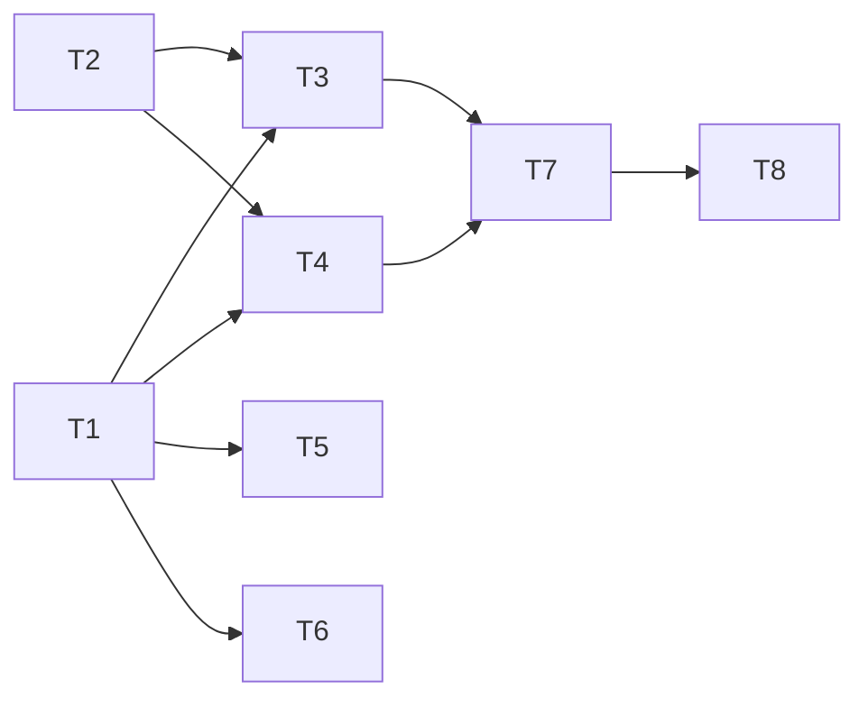

# Relation Observations, Observation Embeddings, and k:v Attributes — Implementation Plan

> **For agentic workers:** REQUIRED SUB-SKILL: Use superpowers:subagent-driven-development (recommended) or superpowers:executing-plans to implement this plan in wave order. Steps use checkbox (`- [ ]`) syntax for tracking.

**Goal:** Give relations observations (same lifecycle and wire shape as entity observations), give every observation its own embedded chunk and search path (FTS via `search_relations`, vector via chunk detail), and add string k:v attributes to entities and relations that are structurally excluded from search and indexing.

**Architecture:** The feature generalizes the existing relation embedding pipeline rather than introducing a second one. A new `relation_observation` table keys on the `taxonomy_relation` mirror id — the same stable owner identity `chunk_vector` already uses — with its own FTS projection. The indexer's relation branch stops producing one triple chunk and produces `[(Relation, triple)] + [(Observation, body) per row]` through the unchanged `embed_chunks_and_commit` path. Attributes live in one `attribute` table for both owner kinds, with no FTS trigger, no chunk, and — the structural guarantee — no revision bump and no enqueue on write. The tool surface is additive: four new MCP tools, optional parameters on existing ones, extra fields on reads.

**Tech Stack:** Oak (`std::collections`, `std::sync`), `rusqlite` (FTS5 external-content tables, `STRICT` tables, JSON projections), serde derive, the existing `include_str!` migration inventory with pinned SHA-256 checksums, the existing `chunk_index_job` lease machinery.

**Spec:** `docs/superpowers/specs/2026-09-14-relation-observations-and-attributes-design.md` (approved 2026-09-14). The plan argues from the spec and repeats its requirement IDs (`REQ-*`).

## Global Constraints

- Migration inventory is a fixed-size array `pub const MIGRATIONS: [(i64, &str); 10]` in `crates/mcpmem-core/src/events.rs` with a pinned-checksum test (`every_migration_version_and_checksum_is_pinned`). Adding a migration requires new SQL in `crates/mcpmem-core/migrations/`, an `; 11]` array, a `(11, include_str!(...))` entry, and the checksum row appended to the pinned `vec![...]` in the test.
- `EntitySnapshot` (used by `capture()` for change events and by `obs_count`/degree counters) must NOT carry attributes. Attributes must not enter `EntityChange` payloads or bump `entity_revision`; `affected_names` must return an empty set for the four new `MutationRequest` variants (`AddRelationObservations`, `DeleteRelationObservations`, `SetAttributes`, `DeleteAttributes`) so `persist_changes` neither emits events nor enqueues reindex jobs.
- The 104 `Entity { ... }` construction sites across `crates/mcpmem-core/src/mutation.rs` and `crates/mcpmem-core/src/graph.rs` (mostly `#[cfg(test)]` modules) gain the new `attributes` field. Use `attributes: None` at every site. The compiler is the sweep gate: a missed site is a build error.
- `Entity` (and therefore `EntityInput = Entity<ObservationInput>`) uses `#[serde(deny_unknown_fields)]` on deserialize. `attributes` must be declared with `#[serde(default, skip_serializing_if = "Option::is_none")]`, the identical pattern to `EntityChange.old_name` (`crates/mcpmem-core/src/mutation.rs:163-166`), so old payloads without the key still parse.
- `Relation` derives `PartialOrd, Ord` (set semantics in `Snapshot.relation_rows`); it must not gain fields. Relation write input is a new `RelationInput` DTO.
- Write `RelationDetails` (search_relations rows) always present: `observations: []` and `attributes: {}` when empty, per spec §9.
- Relation observations and attributes die with the relation: `tombstone_relation_mirror` deletes both in the same transaction; the entity-delete cascade funnels through it.
- Entity observation deletion matches by `body` only (`mutation.rs:841-849`); `delete_relation_observations` matches the same way.
- Pre-flight before any push/PR: `cargo fmt --all --check`, `scripts/check-release-version.sh`, `scripts/check-crate-includes.sh`, `cargo clippy --workspace --all-targets --all-features -- -D warnings`, full `cargo test --workspace --all-targets -- --test-threads=1`, the feature-matrix role_composition/webhook/indexer runs in `.omp/AGENTS.md`, `cargo package -p mcpmem-core --locked --allow-dirty`, then the marker write. Run per task where the quoted command is the relevant subset; the full chain once at the end.
- Version: additive → minor bump 2.0.1 → 2.1.0 in the root `Cargo.toml` and every `crates/*/Cargo.toml`, plus a `CHANGES.md` entry. `check-release-version.sh` enforces workspace consistency.

## Task Graph & Waves



| Wave | Tasks |
|---|---|
| 0 | 1, 2 |
| 1 | 3, 4, 5, 6 |
| 2 | 7 |
| 3 | 8 |

Wave 0 tasks are disjoint files (T1: `events.rs` + migration SQL; T2: `types.rs` + `mutation.rs` + `graph.rs`). Wave 1: T3 `crates/mcpmem-core/src/mutation.rs`; T4 `crates/mcpmem-core/src/graph.rs`; T5 `crates/mcpmem-indexer/src/lib.rs`; T6 `src/vector_store.rs`. Wave 2 T7: `src/actions/memory.rs`, `src/server.rs`, `src/tools.rs`, `tools.json`. Wave 3 T8: `Cargo.toml`, `crates/*/Cargo.toml`, `CHANGES.md`. Every wave-1 task depends only on wave 0 and its own file scope — the crate-compile coupling between T3 and T4 is resolved because `types.rs` (wave 0) declares the new `MutationRequest` variants and the `rel_obs_seq` cell lives on `GraphHandle` (graph.rs, wave 1) with `mutation.rs` tests seeding via direct SQL where a write path is not yet wired.

## Task 1: Migration 0011 and inventory pin

**Depends on:** None

**Files:**
- Create: `crates/mcpmem-core/migrations/0011_relation_observations_and_attributes.sql`
- Modify: `crates/mcpmem-core/src/events.rs` (`MIGRATIONS` array to `; 11]`, add entry 11, extend the pinned checksum vec)
- Test: `crates/mcpmem-core/src/events.rs` (`#[cfg(test)] mod migration_inventory`)

**Interfaces:**
- Consumes: nothing.
- Produces: tables `relation_observation`, `rel_obs_fts` (+ triggers), `attribute`, and `graph_stat` rows `rel_obs_seq` and `relation_obs`. Migration version 11.

- [ ] **Step 1: Write the failing migration inventory test**

Append to the pinned `vec![...]` in `every_migration_version_and_checksum_is_pinned` a `(11, "<new checksum>")` row. For the checksum, run `cargo test -p mcpmem-core` with the new SQL in place, read the expected value from the failure diff, and fill it in — the test computes `sha256(sql)` from `MIGRATIONS`, so the failure names the exact checksum. (The repository's own convention: the checksum is obtained from the failing run, never guessed.)

- [ ] **Step 2: Write the migration SQL**

`crates/mcpmem-core/migrations/0011_relation_observations_and_attributes.sql`:

```sql
CREATE TABLE relation_observation (
    id          INTEGER PRIMARY KEY,
    relation_id INTEGER NOT NULL,
    idx         INTEGER NOT NULL,
    body        TEXT    NOT NULL,
    created_us  INTEGER NOT NULL,
    occurred_us INTEGER CHECK (occurred_us IS NULL OR occurred_us >= 0)
) STRICT;

CREATE INDEX rel_obs_by_relation ON relation_observation(relation_id, idx);

CREATE VIRTUAL TABLE rel_obs_fts
    USING fts5(body, content='relation_observation', content_rowid='id',
               tokenize='unicode61 remove_diacritics 2');

CREATE TRIGGER rel_obs_fts_ai AFTER INSERT ON relation_observation BEGIN
  INSERT INTO rel_obs_fts(rowid, body) VALUES (new.id, new.body);
END;

CREATE TRIGGER rel_obs_fts_bd BEFORE DELETE ON relation_observation BEGIN
  INSERT INTO rel_obs_fts(rel_obs_fts, rowid, body) VALUES ('delete', old.id, '');
END;

CREATE TABLE attribute (
    owner_kind TEXT    NOT NULL CHECK (owner_kind IN ('entity','relation')),
    owner_id   INTEGER NOT NULL,
    key        TEXT    NOT NULL,
    value      TEXT    NOT NULL,
    created_us INTEGER NOT NULL,
    updated_us INTEGER NOT NULL,
    PRIMARY KEY (owner_kind, owner_id, key)
) STRICT;

INSERT OR IGNORE INTO graph_stat(key, value) VALUES
    ('rel_obs_seq', 0), ('relation_obs', 0);
```

- [ ] **Step 3: Register in the inventory**

In `crates/mcpmem-core/src/events.rs`:

```rust
pub const MIGRATIONS: [(i64, &str); 11] = [
    // ... existing 1..10 unchanged ...
    (11, include_str!("../migrations/0011_relation_observations_and_attributes.sql")),
];
```

- [ ] **Step 4: Run the tests and verify they pass**

Run: `cargo test -p mcpmem-core 2>&1 | tail -20`
Expected: `migration_inventory` passes with exactly 11 pinned rows; every other `mcpmem-core` test still passes (schema bootstrap + full migration run on fresh test DBs must apply 0011 cleanly).

- [ ] **Step 5: Commit**

```bash
git add crates/mcpmem-core/migrations/0011_relation_observations_and_attributes.sql crates/mcpmem-core/src/events.rs
git commit -m "feat(core): migration 0011 — relation observations and k:v attributes

Adds relation_observation + rel_obs_fts external-content index and an
attribute table for entity and relation owners, plus rel_obs_seq and
relation_obs graph stats. No code reads these yet: the migration is
inventory-pinned first, so a schema bootstrap error cannot hide behind
later waves. STEP-verified: 0011 applies to a fresh DB (full migration
run) and the pinned checksum matches."
```

## Task 2: Core types, Entity attribute field, and the construction-site sweep

**Depends on:** None (compiles against the existing migration set; field is `Option`, so wire compat is preserved before any table exists)

**Files:**
- Modify: `crates/mcpmem-core/src/types.rs`
- Modify (sweep only): `crates/mcpmem-core/src/mutation.rs`, `crates/mcpmem-core/src/graph.rs` — every `Entity { ... }` literal gains `attributes: None`
- Test: `crates/mcpmem-core/src/types.rs` (`#[cfg(test)] mod tests`)

**Interfaces:**
- Consumes: `ObservationInput`, `Observation`, `Relation` from the same file.
- Produces:
  - `Entity<O = Observation>` gains `attributes: Option<BTreeMap<String, String>>` (serde `default` + `skip_serializing_if = "Option::is_none"`).
  - `RelationInput { from: String, to: String, relation_type: String, observations: Vec<ObservationInput>, attributes: Option<BTreeMap<String, String>> }` — serde camelCase, `deny_unknown_fields`, `relationType` rename, observations/attributes defaulted.
  - `RelationObservationUpdate { relation: Relation, contents: Vec<ObservationInput> }` — serde camelCase, `deny_unknown_fields`.
  - `AttributeSet { owner_kind: String, entity_name: Option<String>, from: Option<String>, to: Option<String>, relation_type: Option<String>, attributes: BTreeMap<String, String> }` — serde camelCase, `deny_unknown_fields`.
  - `AttributeDelete { owner_kind: String, entity_name: Option<String>, from: Option<String>, to: Option<String>, relation_type: Option<String>, keys: Vec<String> }` — same serde rules.
  - `RelationDetail { from: String, to: String, relation_type: String, observations: Vec<Observation>, attributes: BTreeMap<String, String> }` — camelCase, read-only (Serialize only), observations/attributes always present in output.

- [ ] **Step 1: Write the failing serde tests**

In `crates/mcpmem-core/src/types.rs`, `#[cfg(test)] mod tests`, add:

```rust
#[test]
fn entity_without_attributes_parses_and_serializes_without_the_key() {
    let plain = serde_json::from_str::<EntityInput>(
        r#"{"name":"x","entityType":"T","observations":[]}"#
    ).expect("old payload without attributes parses");
    assert_eq!(plain.attributes, None);
    let text = serde_json::to_string(EntityInput {
        name: "y".into(),
        entity_type: "T".into(),
        observations: vec![],
        attributes: None,
    }).expect("serializes");
    assert!(!text.contains("attributes"), "empty attributes are omitted");
}

#[test]
fn entity_with_attributes_round_trips() {
    let input = serde_json::from_str::<EntityInput>(
        r#"{"name":"x","entityType":"T","observations":[],"attributes":{"k":"v","n":"2"}}"#
    ).expect("attributes parse");
    assert_eq!(input.attributes, Some(BTreeMap::new().insert("k", "v".into()).insert("n", "2".into())));
    let text = serde_json::to_string(input).expect("serializes");
    let again = serde_json::from_str::<EntityInput>(text).expect("round trips");
    assert_eq!(again.attributes, input.attributes);
}

#[test]
fn relation_input_defaults_observations_and_attributes() {
    let r = serde_json::from_str::<RelationInput>(
        r#"{"from":"a","to":"b","relationType":"uses"}"#
    ).expect("bare triple parses");
    assert_eq!(r.observations.len(), 0);
    assert_eq!(r.attributes, None);
    assert!(serde_json::from_str::<RelationInput>(
        r#"{"from":"a","to":"b","relationType":"uses","nope":1}"#
    ).is_err(), "deny_unknown_fields stays");
}

#[test]
fn attribute_set_validates_owner_shape_and_rejects_unknown() {
    assert!(serde_json::from_str::<AttributeSet>(
        r#"{"ownerKind":"entity","entityName":"x","attributes":{"k":"v"}}"#
    ).is_ok());
    assert!(serde_json::from_str::<AttributeSet>(
        r#"{"ownerKind":"relation","from":"a","to":"b","relationType":"uses","attributes":{}}"#
    ).is_ok());
    assert!(serde_json::from_str::<AttributeSet>(
        r#"{"ownerKind":"entity","entityName":"x","attributes":{},"boom":1}"#
    ).is_err());
}
```

Run: `cargo test -p mcpmem-core --test-filter types` (or the crate unit target).
Expected: FAIL with "no member named `attributes`" / "cannot find type `RelationInput`".

- [ ] **Step 2: Add the field and types to `types.rs`**

To `Entity<O>`:

```rust
    pub observations: Vec<O>,
    #[serde(default, skip_serializing_if = "Option::is_none")]
    pub attributes: Option<BTreeMap<String, String>>,
```

Add `use std::collections::BTreeMap;` at the top if absent. After `Relation`, add `RelationInput`, `AttributeSet`, `AttributeDelete`, and `RelationDetail` per the Interfaces block. (`BTreeMap` serializes as a JSON object and deserializes from one — the std serde provides `IntoDeserializer` for it; verified at `serde-1.0.228/src/core/de/value.rs:1578`.)

- [ ] **Step 3: Sweep the construction sites**

In `crates/mcpmem-core/src/mutation.rs` and `crates/mcpmem-core/src/graph.rs`, every literal `Entity { ... }` — including every `#[cfg(test)]` site — gains `attributes: None,` after the `observations:` field. Verify with:

```bash
cargo check --workspace 2>&1 | tail -40
```

Expected: no diagnostics. (The compiler is the sweep gate: any missed site is an error naming the line.)

- [ ] **Step 4: Run the serde tests**

Run: `cargo test -p mcpmem-core` (types module subset acceptable mid-task; the crate must reach green).
Expected: the four new tests pass; crate suite green.

- [ ] **Step 5: Commit**

```bash
git add crates/mcpmem-core/src/types.rs crates/mcpmem-core/src/mutation.rs crates/mcpmem-core/src/graph.rs
git commit -m "feat(core): Entity.attributes and relation/attribute write DTOs

Entity gains an optional attributes map (Option + serde default, so old
payloads parse and empty maps are omitted). RelationInput extends the
triple with observations and attributes for create_relations;
AttributeSet/AttributeDelete carry the ownerKind-discriminated write
shape; RelationDetail is the always-present read row. EntitySnapshot is
deliberately untouched: attributes must not flow into change events or
revision bumps. Sweep: every Entity literal gains attributes: None —
104 sites, compiler-verified."
```

## Task 3: Mutation service — relation observation and attribute writes

**Depends on:** 1, 2

**Files:**
- Modify: `crates/mcpmem-core/src/mutation.rs`
- Test: `crates/mcpmem-core/src/mutation.rs` (`#[cfg(test)] mod tests`) and `tests/mutation_service.rs`

**Interfaces:**
- Consumes: `RelationInput`, `AttributeSet`, `AttributeDelete`, `Option<BTreeMap<String,String>>` from types; `taxonomy_relation` mirror + new tables from migration 0011; `graph.next_rel_obs_id()` (provided by Task 4 — tests seed SQL directly until Task 4 lands, or the GraphHandle cell is added here as a two-line stopgap: `pub(crate) fn next_rel_obs_id(&self) -> i64` returning `self.seq_obs.fetch_add(1) + 1` shares the obs counter and is acceptable only until Task 4 replaces it; prefer Task 4 order in wave 1).
- Produces: new `MutationRequest` variants wired end-to-end in `execute`, `affected_names` (empty set arms), and lifecycle side-effects (tombstone cleanup, entity-delete attribute removal, merge attribute merge, wipe FTS reset).

- [ ] **Step 1: Write the failing lifecycle tests**

In `tests/mutation_service.rs` (integration harness present in repo; follows the existing file's GraphHandle/TestKg pattern — see `tests/observation_metadata.rs:169` for the raw-SQL seeding style), add:

```rust
#[test]
fn relation_observations_lifecycle_and_revision_bump() {
    // create entities a, b; relation a uses b WITH one observation
    // assert add_relation_observations returns the added observation
    // assert taxonomy_relation.revision increased and a chunk_index_job row
    //   exists with owner_kind='relation' and matching owner_revision
    // delete the observation by body; assert revision bumped again and the
    //   relation_observation row is gone
}

#[test]
fn tombstoned_relation_loses_observations_and_attributes() {
    // relation with obs + attributes; delete_relations; assert
    //   relation_observation and attribute rows for owner_kind='relation'
    //   are gone and a relation delete chunk job was enqueued
}

#[test]
fn entity_delete_cascades_relation_observations_and_attributes() {
    // delete an endpoint entity; assert its incident relations' obs/attrs
    //   are deleted (via tombstone) and entity attribute rows are deleted
}

#[test]
fn attribute_writes_never_touch_chunk_index_job_or_revision() {
    // set_attributes on entity and relation; assert chunk_index_job has no
    //   new row for the entity (owner_kind='entity' count unchanged) and
    //   taxonomy_relation.revision unchanged; attribute rows upsert
}

#[test]
fn merge_moves_source_attributes_and_source_wins_on_collision() {
    // target has {k: t}, source has {k: s, j: x}; merge(source, target);
    //   assert target attributes are {k: s, j: x}
}
```

Run: `cargo test --test mutation_service -- --test-threads=1`
Expected: FAIL (no handler/mutation variant yet).

- [ ] **Step 2: Extend `MutationRequest` and `MutationResult` arms**

In `enums.rs`-style section of `mutation.rs`:

```rust
    AddRelationObservations {
        relations: Vec<RelationObservationUpdate>,
    },
    DeleteRelationObservations {
        relations: Vec<RelationObservationUpdate>,
    },
    SetAttributes {
        targets: Vec<AttributeSet>,
    },
    DeleteAttributes {
        targets: Vec<AttributeDelete>,
    },
```

with `RelationObservationUpdate` in `types.rs` (fields `relation: Relation`, `contents: Vec<ObservationInput>`).

In `affected_names` add:

```rust
        MutationRequest::AddRelationObservations { .. }
        | MutationRequest::DeleteRelationObservations { .. }
        | MutationRequest::SetAttributes { .. }
        | MutationRequest::DeleteAttributes { .. } => BTreeSet::new(),
```

(This is the spec-critical arm: an endpoint entity here would bump `entity_revision`, emit a change event, and re-enqueue its index job on every attribute write — REQ-ATTR-OFFLINE.)

- [ ] **Step 3: Implement the write helpers**

```rust
fn insert_relation_observations(
    graph: &GraphHandle,
    conn: &Connection,
    relation_id: i64,
    contents: &[ObservationInput],
) -> Result<Vec<Observation>> {
    // idx = COALESCE(MAX(idx),-1) over relation_observation for relation_id
    // INSERT (id=graph.next_rel_obs_id(), relation_id, idx, body, created_us, occurred_us)
    // mirror the entity insert_observations body/occurred validation (occurred_at_us >= 0)
}

fn resolve_relation_mirror(
    conn: &Connection,
    relation: &Relation,
) -> Result<i64> {
    // SELECT id FROM taxonomy_relation
    //  WHERE from_id=(entity id by name) AND to_id=(entity id by name)
    //    AND type_id=(relation type id) AND deleted=0
    // Err(InvalidParams "<from> -> <type> -> <to> not found") when absent
}

fn upsert_attributes(conn, owner_kind: &str, owner_id: i64, attributes: &BTreeMap<String,String>) -> Result<()>
// INSERT ... ON CONFLICT(owner_kind,owner_id,key) DO UPDATE SET value=excluded.value,updated_us=?

fn delete_attribute_keys(conn, owner_kind: &str, owner_id: i64, keys: &[String]) -> Result<()>
// DELETE FROM attribute WHERE owner_kind=?1 AND owner_id=?2 AND key IN (...)

fn bump_relation_revision_enqueue(conn, relation_id: i64) -> Result<()>
// UPDATE taxonomy_relation SET revision=revision+1 WHERE id=?1 RETURNING revision
// then crate::jobs::enqueue_chunk_change(conn, OwnerKind::Relation, relation_id, new_revision, false)
```

In `create_relation_with(conn, input: &RelationInput) -> Result<bool>`: call the existing `create_relation(conn, triple)`; when `changed`, insert relation observations before the existing enqueue (they are read by the worker at claim time, so the single enqueue covers them), then upsert attributes.

- [ ] **Step 4: Implement the four `execute` arms**

`AddRelationObservations`: for each update, `resolve_relation_mirror`, `insert_relation_observations`, then `bump_relation_revision_enqueue`; push `ObservationResult {entity_name: format!("{from} -> {type} -> {to}"), added_observations}`. (Reuse `ObservationResult` — its `entity_name` field carries the triple string; documented in the spec §9 as `{"results":[{from,to,relationType,addedObservations}]}` — the handler will re-shape it in Task 7. Choose `Vec<RelationObservationResult>` to avoid wire confusion: decide here and keep it.)

*Decision: add `RelationObservationResult { from, to, relation_type, added_observations: Vec<Observation> }` and extend `MutationResult` with `RelationObservations(Vec<RelationObservationResult>)` — keeps the MCP wire explicit rather than overloading an entity-shaped DTO.*

`DeleteRelationObservations`: for each update, resolve mirror, `DELETE FROM relation_observation WHERE relation_id=?1 AND body=?2` per content, `bump_relation_revision_enqueue` if any row deleted.

`SetAttributes`: per target, validate shape (exactly one of `entity_name` vs full triple, matching `owner_kind`); resolve owner id (entity id by name, or `resolve_relation_mirror`); `upsert_attributes`; return `MutationResult::Unit`.

`DeleteAttributes`: per target, resolve; `delete_attribute_keys`; `Unit`.

- [ ] **Step 5: Lifecycle wiring**

- In `create_relation` path used by merge: nothing changes (merge calls create_relation with the bare triple; per spec the re-pointed relation starts with no observations).
- In `tombstone_relation_mirror` (both the delete_relations arm and the entity-delete cascade): after the tombstone upsert, add

```rust
    conn.execute("DELETE FROM relation_observation WHERE relation_id=?1", [id]).map_err(sql_error)?;
    conn.execute("DELETE FROM attribute WHERE owner_kind='relation' AND owner_id=?1", [id]).map_err(sql_error)?;
```

- In `delete_entities`: delete entity attribute rows for the entity before removing the entity row:

```rust
    conn.execute("DELETE FROM attribute WHERE owner_kind='entity' AND owner_id=?1", [entity.entity_id]).map_err(sql_error)?;
```

- In the `MergeEntities` arm: after copying observations, upsert source attributes into target (`owner_kind='entity'`, target id), source value winning via `ON CONFLICT ... DO UPDATE SET value=excluded.value`; the source's own attribute rows are deleted by the subsequent `delete_entities(source)`.
- In the `Wipe` arm, after the existing `name_fts`/`obs_fts` reset:

```rust
                "INSERT INTO rel_obs_fts(rel_obs_fts) VALUES('delete-all');",
```

- In `update_counters`, add a `relation_obs` delta branch reading the before/after... it cannot (snapshot has no relation obs). Instead maintain the count directly in the two observation arms: after insert `UPDATE graph_stat SET value=value+?1 WHERE key='relation_obs'` with `?1 = inserted.len()`; after delete with the deleted count. Note this in the commit.

- [ ] **Step 6: Run lifecycle tests + crate suite**

Run: `cargo test --test mutation_service -- --test-threads=1 && cargo test -p mcpmem-core`
Expected: the five new tests pass; crate green.

- [ ] **Step 7: Commit**

```bash
git add crates/mcpmem-core/src/mutation.rs crates/mcpmem-core/src/types.rs
git commit -m "feat(core): relation observation and attribute mutations

AddRelationObservations/DeleteRelationObservations write
relation_observation rows and bump the mirror revision with an index
enqueue; SetAttributes/DeleteAttributes upsert or remove attribute rows
with no revision bump and no queue row (REQ-ATTR-OFFLINE, asserted by
test). affected_names returns an empty set for all four variants so no
entity event fires and no entity reindex is enqueued. Tombstone,
entity-delete and merge cascade clean the new rows; wipe resets
rel_obs_fts. relation_obs counter maintained directly in the two
observation arms because the change snapshot carries no relation obs."
```

## Task 4: GraphHandle surface — reads, seq cell, search query, export

**Depends on:** 1, 2

**Files:**
- Modify: `crates/mcpmem-core/src/graph.rs`
- Test: `crates/mcpmem-core/src/graph.rs` (`#[cfg(test)] mod tests` — TestKg fixture at graph.rs:2049)

**Interfaces:**
- Consumes: mutation variants from Task 2 types; tables from Task 1; `crate::mutation::relations_for`/`read_entity`.
- Produces: GraphHandle methods `add_relation_observations(from, to, relation_type, contents) -> Result<Vec<Observation>>`, `delete_relation_observations(from, to, relation_type, observations) -> Result<()>`, `set_attributes(targets: &[AttributeSet]) -> Result<()>`, `delete_attributes(targets: &[AttributeDelete]) -> Result<()>`, `create_relations(&[RelationInput]) -> Result<Vec<Relation>>` (input widens; output stays triples), `search_relations(from, to, rtype, query: Option<&str>, limit) -> Vec<RelationDetail>`, `next_rel_obs_id()`, attribute population on `get_entity`, `batch_get_entities`, `describe_entity`, and `export`.

- [ ] **Step 1: Write the failing read tests**

In `graph.rs` `#[cfg(test)] mod tests`, using the existing `TestKg` fixture and raw-SQL seeding (mutation arms from Task 3 may be available depending on wave order; seed via SQL when they are not):

```rust
#[test]
fn get_entity_and_describe_include_attributes() {
    // seed entity + attribute rows via SQL
    // kg.get_entity -> attributes Some({k: v}); kg.describe_entity -> attributes Some(...)
}

#[test]
fn batch_get_entities_include_attributes() { /* same, via batch_get_entities */ }

#[test]
fn search_relations_query_matches_relation_observation_bodies() {
    // seed a -> uses -> b with relation_observation rows "contract #12" and "legacy"
    // kg.search_relations(None, None, None, Some("contract"), 10)
    //   -> one RelationDetail { from: a, to: b, observations: [that body], attributes: {} }
    // without query -> both relations; observations always present
}

#[test]
fn export_contains_relation_observations_and_attributes() {
    // seed; kg.export("json", 100) contains the observation body and k:v map
}
```

Run: `cargo test -p mcpmem-core`
Expected: FAIL (methods/fields absent).

- [ ] **Step 2: Seq cell and public write wrappers**

In `GraphHandle` fields add `seq_rel_obs: AtomicI64::new(0)` (matching the `seq_obs` pattern); in `new()` read `read_graph_stat(&conn, "rel_obs_seq")`; in `refresh_seqs` add `self.seq_rel_obs.fetch_max(read_graph_stat(conn, "rel_obs_seq")?, Ordering::Relaxed);`; in `sync_seqs` add the CASE/param for `'rel_obs_seq'`; add:

```rust
pub(crate) fn next_rel_obs_id(&self) -> i64 {
    self.seq_rel_obs.fetch_add(1, Ordering::Relaxed) + 1
}
```

`create_relations` becomes `pub fn create_relations(&self, relations: &[RelationInput]) -> Result<Vec<Relation>>` with the same `mutate` body (MutationRequest::CreateRelations now carries `RelationInput`).

Add `add_relation_observations`, `delete_relation_observations`, `set_attributes`, `delete_attributes` as thin `self.mutate(MutationRequest::...)` wrappers, mirroring the existing entity wrappers (match the arm's `MutationResult` and `unreachable!` shape).

- [ ] **Step 3: Attribute population on reads**

Entity attributes live in the `attribute` table, not in `EntitySnapshot` (global constraint). Add a helper:

```rust
fn attributes_for(conn: &Connection, owner_kind: &str, owner_id: i64) -> Result<BTreeMap<String, String>> {
    // SELECT key, value FROM attribute WHERE owner_kind=?1 AND owner_id=?2 ORDER BY key
    // collect into BTreeMap
}
```

- `get_entity`: inside the existing read transaction, after `snapshot.entity()`, set `.attributes = Some(attributes_for(&tx, "entity", snapshot.entity_id)?)`. If `Some`, remove the `Option` layer and canonicalize (empty map stored as None to keep output stable).

*Decision: store `Some(map)` only when the map is non-empty; `entity.attributes` stays `None` for attribute-less entities. One canonicalization helper `fn some_nonempty(map) -> Option<BTreeMap>` in types or graph; test pins it.*

- `batch_get_entities` (graph.rs:1641): load attributes for the resolved ids in one query (`WHERE owner_kind='entity' AND owner_id IN (...)`) and attach. This covers the `batch_get_entities` MCP tool and keeps `get_entity`/`batch`/`describe` consistent.
- `describe_entity`: add `attributes: Option<BTreeMap<String,String>>` to `EntityDescription` (types.rs), populated the same way; `None` when empty.

- [ ] **Step 4: `search_relations` query mode and `RelationDetail`**

```rust
pub fn search_relations(
    &self,
    from: Option<&str>,
    to: Option<&str>,
    rtype: Option<&str>,
    query: Option<&str>,
    limit: Option<usize>,
) -> Result<Vec<RelationDetail>> {
    // keep the existing exact-match arms as the no-query path, but map each
    // Relation row to RelationDetail:
    //   - observations: SELECT body,created_us,occurred_us,origin_entity_name
    //       FROM relation_observation ro JOIN taxonomy_relation m
    //       ON m.id=ro.relation_id JOIN entity f ON f.id=m.from_id ... WHERE
    //       f.name=?1 AND t.name=?2 AND type name=?3 ORDER BY ro.idx
    //   - attributes: attributes_for(&conn, "relation", mirror.id)
    // query mode:
    //   SELECT m.* FROM rel_obs_fts ft JOIN relation_observation ro
    //     ON ro.id=ft.rowid JOIN taxonomy_relation m ON m.id=ro.relation_id
    //     JOIN entity f/t + type_dict, WHERE rel_obs_fts MATCH ?1
    //     AND (structural filters from/to/rtype applied as an AND on the
    //     resolved entity/type ids, reusing the existing sentinel -1
    //     convention for supplied-but-missing) ORDER BY rank LIMIT ?2
    //   dedupe by (from,to,relationType) before loading detail
}
```

The no-query path must stay byte-identical in ordering semantics to today (ORDER BY from_id, to_id) with the new per-row fields.

- [ ] **Step 5: Export and maintenance**

- `export`: extend the relations JSON projection; each relation object gains:

```sql
'observations', COALESCE((
    SELECT json_group_array(json_object(
        'body',ro.body,'createdAtUs',ro.created_us,'occurredAtUs',ro.occurred_us,
        'originEntityName',NULL))
    FROM relation_observation ro
    JOIN taxonomy_relation m ON m.id=ro.relation_id AND m.deleted=0
    WHERE m.from_id=r.from_id AND m.to_id=r.to_id AND m.type_id=r.type_id
    ORDER BY ro.idx), json('[]')),
'attributes', COALESCE((
    SELECT json_group_object(key, value) FROM attribute
    WHERE owner_kind='relation' AND owner_id=(
        SELECT id FROM taxonomy_relation WHERE from_id=r.from_id AND to_id=r.to_id
        AND type_id=r.type_id AND deleted=0)), json('{}'))
```

  Verify `json_group_object` is available in the bundled SQLite (probe: `SELECT json_group_object('a','b');` in a test). If absent, load attributes in Rust via `attributes_for` and splice the JSON string (the export is string-built today). Entity rows gain `'attributes'` from `attributes_for`-equivalent subquery `WHERE owner_kind='entity' AND owner_id=e.id`. (Spec §9, REQ-ATTR-READ.)
- `run_maintenance`: add `INSERT INTO rel_obs_fts(rel_obs_fts) VALUES('optimize');` beside the existing obs_fts line (graph.rs:1844-1845).
- `wipe` → the mutation arm (Task 3) handles `rel_obs_fts delete-all`; verify in the graph.rs wipe test that `relation_observation` and `attribute` are empty after wipe.

- [ ] **Step 6: Run the crate suite**

Run: `cargo test -p mcpmem-core`
Expected: new read tests pass (`get_entity`/`describe`/`batch` attributes, search_relations query + detail shape, export, wipe); crate green.

- [ ] **Step 7: Commit**

```bash
git add crates/mcpmem-core/src/graph.rs crates/mcpmem-core/src/types.rs
git commit -m "feat(core): relation detail reads, search query, seq cell, export

GraphHandle gains relation observation/attribute mutations, a
rel_obs_seq cell, and next_rel_obs_id. get_entity, batch_get_entities
and describe_entity populate attributes from the attribute table
(snapshots stay clean); search_relations gets an optional FTS query and
returns RelationDetail rows with always-present observations/attributes;
export includes relation observations + entity/relation attributes.
Attributes canonicalized to Option (None when empty) for stable wire."
```

## Task 5: Indexer — relation chunks become multi-chunk

**Depends on:** 1

**Files:**
- Modify: `crates/mcpmem-indexer/src/lib.rs`
- Test: `crates/mcpmem-indexer/src/lib.rs`, `tests/indexer_worker.rs`

**Interfaces:**
- Consumes: migration 0011 `relation_observation`; `ChunkKind::{Relation,Observation}`; the existing mirror fence (`taxonomy_relation.revision`).
- Produces: `relation_chunks(conn, mirror_id, expected_revision) -> Result<Option<Vec<(ChunkKind, String)>>>` (replaces `relation_chunk_text`), consumed by the worker branch and `chunk_text` reassembly (Task 6).

- [ ] **Step 1: Write the failing chunk layout test**

In `tests/indexer_worker.rs` (worker harness runs a real profile + provider stub per existing tests):

```rust
#[test]
fn relation_with_observations_embeds_triple_then_one_chunk_per_observation() {
    // seed a -> uses -> b mirror + relation_observation rows (idx 0, 1)
    // run the worker; assert chunk_vector has owner_kind='relation' rows:
    //   kind='relation' chunk_index=0 = "a\nuses\nb"
    //   kind='observation' chunk_index=0 = body0, chunk_index=1 = body1
}
```

Run: `cargo test --test indexer_worker --features indexer -- --test-threads=1`
Expected: FAIL (relation_chunks missing).

- [ ] **Step 2: Implement `relation_chunks`**

Replace `relation_chunk_text` (lib.rs:611-635) with:

```rust
/// The chunks of one relation: the triple, then one observation chunk per
/// relation_observation row in idx order. Fenced on the taxonomy_relation
/// mirror revision and the liveness of both endpoints.
pub fn relation_chunks(
    conn: &Connection,
    mirror_id: i64,
    expected_revision: i64,
) -> Result<Option<Vec<(ChunkKind, String)>>, rusqlite::Error> {
    let row: Option<(String, String, String, i64)> = conn
        .query_row(
            "SELECT f.name, d.name, t.name, m.revision FROM taxonomy_relation m
         JOIN entity f ON f.id=m.from_id
         JOIN entity t ON t.id=m.to_id
         JOIN type_dict d ON d.id=m.type_id
         WHERE m.id=?1 AND m.deleted=0 AND f.flags=0 AND t.flags=0",
            [mirror_id],
            |r| Ok((r.get(0)?, r.get(1)?, r.get(2)?, r.get(3)?)),
        )
        .optional()?;
    Ok(match row {
        Some((from_name, rtype, to_name, revision)) if revision == expected_revision => {
            let bodies: Vec<String> = conn.query_row(
                "SELECT COALESCE(json_group_array(o.body ORDER BY o.idx), json('[]'))
                 FROM relation_observation o WHERE o.relation_id=?1",
                [mirror_id],
                |r| r.get(0),
            ).map_err(|e| e)? .and_then(|json| serde_json::from_str::<Vec<String>>(&json).unwrap_or_default());
            let mut chunks = Vec::with_capacity(1 + bodies.len());
            chunks.push((
                ChunkKind::Relation,
                format!("{from_name}\n{rtype}\n{to_name}"),
            ));
            for body in bodies {
                chunks.push((ChunkKind::Observation, body));
            }
            Some(chunks)
        }
        _ => None,
    })
}
```

Update the worker branch (lib.rs:306-309):

```rust
                    OwnerKind::Relation => {
                        relation_chunks(&conn, job.owner_id, job.owner_revision)?
                    }
```

(`Option<Vec<(ChunkKind, String)>>` is already the branch's return type; `embed_chunks_and_commit` already accepts any chunk count.)

- [ ] **Step 3: Update the existing single-chunk tests and the reassembly contract**

`tests/indexer_worker.rs` and any `relation_chunk_text` references become `relation_chunks`; a relation with zero observations still yields the triple-only list (empty-obs regression test). Full-scan gate (`verify_vectors_current`, jobs.rs:652-661) needs no change — the triple is always chunk 0, and the orphan clause already flags tombstoned mirrors.

- [ ] **Step 4: Run the indexer suite and the full-scan gate test**

Run: `cargo test --test indexer_worker --features indexer -- --test-threads=1 && cargo test --test indexer_worker --no-default-features --features indexer -- --test-threads=1`
Expected: new layout test passes; the gate tests still pass.

- [ ] **Step 5: Commit**

```bash
git add crates/mcpmem-indexer/src/lib.rs tests/indexer_worker.rs
git commit -m "feat(indexer): relations embed one chunk per observation

relation_chunk_text becomes relation_chunks: the triple chunk at index 0
(kind=relation) plus one kind=observation chunk per relation_observation
row, embedded in one provider call. The chunk pipeline, revision fence
and full-scan gate are unchanged — the triple is always chunk 0, so the
gate's kind='relation' clause still holds."
```

## Task 6: Vector store — chunk text reassembly for relation observations

**Depends on:** 1

**Files:**
- Modify: `src/vector_store.rs`
- Test: `src/vector_store.rs` (`#[cfg(test)] mod tests`, `resolve_owner_renders_entity_and_relation_rows` area at vector_store.rs:1995)

**Interfaces:**
- Consumes: migration 0011 `relation_observation`; chunk layout contract from Task 5 (`kind='observation'`, `chunk_index = idx`, owner = mirror id).
- Produces: `chunk_text` returns the observation body for `(Relation, Observation)` hits — the `includeChunks` detail in every vector search tool.

- [ ] **Step 1: Write the failing reassembly test**

```rust
#[test]
fn chunk_text_relation_observation_hit_returns_the_body() {
    // seed mirror + relation_observation rows; build a ChunkHit {
    //   owner_kind: Relation, owner_id: mirror_id, chunk_kind: Observation,
    //   chunk_index: 1 }
    // chunk_text(hit) == body1
}
```

Run: `cargo test -p mcpmem` (vector_store module)
Expected: FAIL (falls into the triple-rebuild branch and returns the triple).

- [ ] **Step 2: Implement the branch**

In `chunk_text` (`src/vector_store.rs:1129-1177`), the `OwnerKind::Relation` arm becomes:

```rust
            OwnerKind::Relation => match hit.chunk_kind {
                ChunkKind::Observation => {
                    let conn = self.db.lock();
                    conn.query_row(
                        "SELECT body FROM relation_observation
                         WHERE relation_id=?1 AND idx=?2",
                        params![hit.owner_id, hit.chunk_index],
                        |r| r.get(0),
                    )
                    .optional()
                    .map_err(sqlite_err)
                    .ok()
                    .flatten()
                }
                _ => { /* existing triple-rebuild query unchanged */ }
            },
```

(No `resolve_owner` change: relation identity is the triple, regardless of which chunk matched — `search_owner_rows` already renders the owner from `resolve_owner`, and `aggregate_owners` already keys best-chunk on `ChunkKind::Observation` for any owner kind, vector_store.rs:428-432.)

- [ ] **Step 3: Run the vector store suite**

Run: `cargo test --test vector_e2e -- --test-threads=1 && cargo test --test semantic_search --features indexer -- --test-threads=1`
Expected: reassembly test passes; suites green (relation rows with observation detail appear in vector/hybrid/semantic search with `includeChunks`).

- [ ] **Step 4: Commit**

```bash
git add src/vector_store.rs
git commit -m "feat(server): reassemble relation observation chunks on reads

chunk_text resolves (Relation, Observation) hits to the observation body
by (mirror id, idx); the existing triple branch now handles only the
kind=relation chunk. Owner identity and best-chunk aggregation are
unchanged, so relation observations surface as matched chunk detail in
every vector search tool."
```

## Task 7: MCP tool surface — handlers, registry, schemas

**Depends on:** 3, 4

**Files:**
- Modify: `src/actions/memory.rs`, `src/server.rs`, `src/tools.rs`, `tools.json`
- Test: `tests/role_composition.rs` (feature-matrix suite), `tests/semantic_search.rs`

**Interfaces:**
- Consumes: GraphHandle methods and DTOs from Tasks 2-4; the dispatch pattern documented in ScoutTools (tools.json → ALL_TOOLS → KG match arm).
- Produces: tools `add_relation_observations`, `delete_relation_observations`, `set_attributes`, `delete_attributes`; modified `create_relations`, `create_entities`, `upsert_entities`, `search_relations`, `get_entity`, `describe_entity`, `export_graph`; legacy-observations shim coverage for the new observation shapes.

- [ ] **Step 1: Write the failing tool tests**

In `tests/role_composition.rs`, add MCP-round-trip tests following the file's existing harness (build `AppServices`, run tool calls through the MCP dispatch; patterned on existing role_composition tests at the end of that file):

```rust
#[test]
fn relation_observation_tools_round_trip_through_mcp() {
    // create_entities a, b; create_relations with observations + attributes
    // add_relation_observations -> results[0].addedObservations
    // search_relations query "contract" -> row with observations and attributes
    // set_attributes on the relation -> row reflects it on the next search
    // delete_relation_observations -> empty observations
}

#[test]
fn attribute_tools_cover_entities_and_relations() {
    // set_attributes entity + relation; delete_attributes keys;
    // get_entity/describe_entity include attributes
}

#[test]
fn attribute_writes_never_enqueue_index_jobs() {
    // set_attributes; assert chunk_index_job owner count unchanged
}
```

Run: `cargo test --test role_composition --features indexer,webhooks -- --test-threads=1`
Expected: FAIL (unknown tool / missing handler).

- [ ] **Step 2: Handlers in `src/actions/memory.rs`**

Follow the existing handler shapes (`handle_create_relations` at memory.rs:437, `handle_add_observations` at 514). Validate with the existing `validate_name`, `validate_observation`, and caps `MAX_RELATIONS_PER_REQUEST`, `MAX_OBSERVATIONS_PER_ENTITY`, plus new `validate_attribute(key/value)` enforcing key ≤ `MAX_NAME_BYTES`, value ≤ `MAX_OBSERVATION_BYTES`, key non-empty.

- `handle_add_relation_observations` — shape `{"relations":[{from,to,relationType,contents:[ObservationInput]}]}` → `MutationRequest::AddRelationObservations` → render `{"results":[{from,to,relationType,addedObservations:[...]}]}`.
- `handle_delete_relation_observations` — `{"relations":[{from,to,relationType,observations:[{body,occurredAtUs?}]}]}` → delete arm.
- `handle_set_attributes` — parse `Vec<AttributeSet>`, validate `owner_kind ∈ {entity,relation}` and target shape (entity → entityName; relation → from+to+relationType), cap targets at `MAX_RELATIONS_PER_REQUEST`; call `kg.set_attributes`; return `{"results":[...applied post-state...]}` — for each target, re-read via the matching detail read (`get_entity` or `search_relations` by triple) so the caller sees the applied map.
- `handle_delete_attributes` — parse `Vec<AttributeDelete>`, same validation, return the standard unit text used by delete tools (match `handle_delete_observations`'s response shape).
- `handle_create_relations` — deserialize `Vec<RelationInput>`; observation/attribute validation per relation; the "known before" type-suggestion logic keeps reading `relation.relation_type`.
- `handle_create_entities` / `handle_upsert_entities` — deserialize `Vec<EntityInput>` (field now carries attributes); pass through unchanged (mutation arm persists them).
- `handle_search_relations` — thread the optional `query` param; response rows are `RelationDetail` (serialized by serde).
- `handle_get_entity` / `handle_describe_entity` — unchanged code; responses now include attributes via the read models.

- [ ] **Step 3: Tool schemas (`tools.json`)**

Add entries (additive, matching the file's existing JSON shape with `annotations`):

- `add_relation_observations`: `{"relations":[{from,to,relationType,contents:[{body,occurredAtUs?}]}]}`, write tool, non-destructive, non-idempotent.
- `delete_relation_observations`: same relation list with `observations` array (body + optional occurredAtUs), destructive.
- `set_attributes`: `{"targets":[{ownerKind:"entity",entityName,attributes:{}}]}` or `{ownerKind:"relation",from,to,relationType,attributes:{}}` — describe the discriminator in the description and property comments (JSON Schema here is descriptive; exclusivity enforced by the handler).
- `delete_attributes`: same target shape plus `keys:[string]`, destructive.
- Modify `create_relations` item schema: add optional `observations` and `attributes`.
- Modify `create_entities` and `upsert_entities` item schema: add optional `attributes` (`"type":"object","additionalProperties":{"type":"string"}`).
- Modify `search_relations`: add optional `query`; update the description to say rows include observations and attributes.
- Modify `get_entity`/`describe_entity`/`export_graph` descriptions to mention attributes (wire is additive; description keeps the schema honest).
- Fix the existing false claim in `search_nodes`'s description ("Also returns any relations connected to matching entities" — the handler returns entities only; ScoutSearch flagged it). Reword to "Matching entities; relation text is searched via search_relations."

- [ ] **Step 4: Registry and dispatch**

- `src/tools.rs`: add `ToolMeta { Some("add_relation_observations"), false }` (write=true → GraphWrite), plus `delete_relation_observations`, `set_attributes`, `delete_attributes` with `false`; keep them out of the name constants (KG category derives from ALL_TOOLS — ScoutTools §4).
- `src/server.rs`: add the four match arms in the KG dispatch block (`src/server.rs:1124-1195`), calling the new handlers. For `search_relations`'s query param nothing changes server-side beyond the handler.
- `src/server.rs` legacy-observations shim: extend the three schema-pointer rewrites (server.rs:845-869) and the call-time adaptations to cover the new observation arrays (`add_relation_observations.contents`, `delete_relation_observations.observations`, `create_relations.observations`) so `--legacy-observations` mode stays coherent; leave `attributes` untouched (never rewritten).

- [ ] **Step 5: Run the MCP and feature-matrix suites**

Run: `cargo test --test role_composition --features indexer,webhooks -- --test-threads=1 && cargo test --test semantic_search --features indexer -- --test-threads=1 && cargo test --test vector_e2e -- --test-threads=1`
Expected: new tool tests pass; existing suites green.

- [ ] **Step 6: Commit**

```bash
git add src/actions/memory.rs src/server.rs src/tools.rs tools.json tests/role_composition.rs tests/semantic_search.rs
git commit -m "feat(server): relation observation and attribute MCP tools

Four new tools — add/delete_relation_observations, set/delete_attributes
— registered in tools.json, ALL_TOOLS and the KG dispatch table.
create_relations, create_entities and upsert_entities accept optional
observations/attributes; search_relations gains an optional FTS query
and returns detail rows; get_entity/describe_entity include attributes.
Legacy-observations shim covers the new observation pointers. search_nodes
description corrected (it never returned relations)."
```

## Task 8: Version bump and changelog

**Depends on:** 7

**Files:**
- Modify: `Cargo.toml`, `crates/mcpmem-core/Cargo.toml`, `crates/mcpmem-runtime/Cargo.toml`, `crates/mcpmem-indexer/Cargo.toml`, `crates/mcpmem-webhook/Cargo.toml`, `crates/mcpmem-oauth/Cargo.toml`, `CHANGES.md`

**Interfaces:**
- Consumes: the completed feature; the repository's release-version convention (`scripts/check-release-version.sh` checks workspace crates agree).

- [ ] **Step 1: Write the CHANGES.md entry**

Add under the next-version heading (match the file's existing format):

```
## 2.1.0 (unreleased)

### Added
- Relations have observations: `add_relation_observations`,
  `delete_relation_observations`, and optional `observations` on
  `create_relations`. Relation observations are embedded as chunks and
  full-text searchable via `search_relations(query=...)`.
- k:v string attributes on entities and relations:
  `set_attributes`, `delete_attributes`, optional `attributes` on
  create/upsert, returned by get/describe/search/export. Attributes are
  not indexed and not searchable.
- `search_relations` rows include observations and attributes;
  `export_graph` includes relation observations and attributes.
```

- [ ] **Step 2: Bump versions to 2.1.0**

Root `Cargo.toml` (`version = "2.0.1"` → `2.1.0` at line 7) and each `crates/*/Cargo.toml` `version` field. Do not touch `Cargo.lock` by hand — let `cargo` refresh it.

- [ ] **Step 3: Run the version consistency script**

Run: `scripts/check-release-version.sh`
Expected: no FAIL lines (workspace crates consistent; no `--registry` on main).

- [ ] **Step 4: Full pre-flight**

Run the repository pre-flight exactly as documented in `.omp/AGENTS.md` (fmt, check-release-version, check-crate-includes, clippy --all-features, full test suite, feature-matrix role_composition/indexer/webhook runs, `cargo package -p mcpmem-core --locked --allow-dirty`), then the marker write:

```sh
git rev-parse HEAD > "$(git rev-parse --git-dir)/omp-preflight-pass"
```

- [ ] **Step 5: Commit**

```bash
git add Cargo.toml crates/*/Cargo.toml CHANGES.md
git commit -m "feat: bump to 2.1.0 — relation observations and attributes

Additive contract: relations carry observations (embedded, searchable),
entities and relations carry non-indexed k:v attributes. Full pre-flight
green on the exact commit."
```

## Self-Review

**1. Spec coverage:** REQ-OBS-STORE (T1/T3), REQ-OBS-CRUD (T3/T7), REQ-OBS-INDEX (T5), REQ-OBS-FTS (T4/T7), REQ-OBS-SEARCH (T6), REQ-ATTR-STORE (T1), REQ-ATTR-CRUD (T3), REQ-ATTR-OFFLINE (T3 test + affected_names ∅, asserted in T3 Step 1 test 4), REQ-ATTR-READ (T4/T7), REQ-LIFECYCLE (T3 + T4 wipe test), REQ-COMPAT (T2 serde default tests + T7 schema additions). Non-goals honored: no webhook/event coverage (affected_names ∅, EntitySnapshot untouched), no attribute indexing (no trigger, no chunk, no enqueue — asserted), read_graph/path tools keep triples (Relation untouched), code-index subsystem untouched.

**2. Placeholder scan:** No TBD/TODO. The one deliberate seam — `next_rel_obs_id` living on `GraphHandle` (Task 4) while `mutation.rs` (Task 3) calls it — is resolved by wave order and an explicit stopgap note in Task 3's Interfaces. Test code in Task 4 Step 1 seeds via SQL when Task 3 has not landed by wave ordering; the wave table puts 3 and 4 in the same wave, so Task 4's tests rely on direct SQL seeding (the documented repo pattern, `tests/observation_metadata.rs:169`) — the commit gate is per-crate compilation, and any inter-task coupling surfaces in the Task 7 integration run.

**3. Type consistency:** `RelationInput`, `RelationObservationUpdate`, `AttributeSet`, `AttributeDelete`, `RelationDetail` are introduced once (Task 2) and referenced with identical field names in Tasks 3-7. `RelationObservationResult` is introduced in Task 3 where its sibling `ObservationResult` already lives (mutation.rs). `Entity.attributes: Option<BTreeMap<String, String>>` everywhere; `create_relations` returns `Vec<Relation>` after widening its input. `search_relations` new signature `(from, to, rtype, query, limit) -> Result<Vec<RelationDetail>>` is used consistently by memory.rs.

**4. Graph validation:** Edges: T1→{3,4,5,6}, T2→{3,4}, T3→7, T4→7, T7→8. No cycles; all tasks appear in exactly one wave. Same-wave files: W1 {mutation.rs}, {graph.rs}, {indexer/lib.rs}, {vector_store.rs} — disjoint. W2 T7 owns {memory.rs, server.rs, tools.rs, tools.json} alone. W3 T8 owns version files alone. Between T3 (mutation.rs) and T4 (graph.rs), the only shared symbol is `next_rel_obs_id` — resolved by the stopgap note (shared obs counter until T4; replaced by the dedicated cell in the same wave before the integration run, verified by the T7 suite).

## Execution Handoff

Plan complete and saved to `docs/superpowers/plans/2026-09-14-relation-observations-and-attributes.md`. Two execution options:

1. **Subagent-Driven (recommended)** — fresh subagents per available task: waves 0 and 1 run in parallel worktrees, each task reviewed, then the wave integrated with a full-suite checkpoint. Fast iteration, delivered in waves.
2. **Inline Execution** — execute tasks in this session using executing-plans, wave by wave, with full-suite checkpoints at each wave boundary.

Which approach?