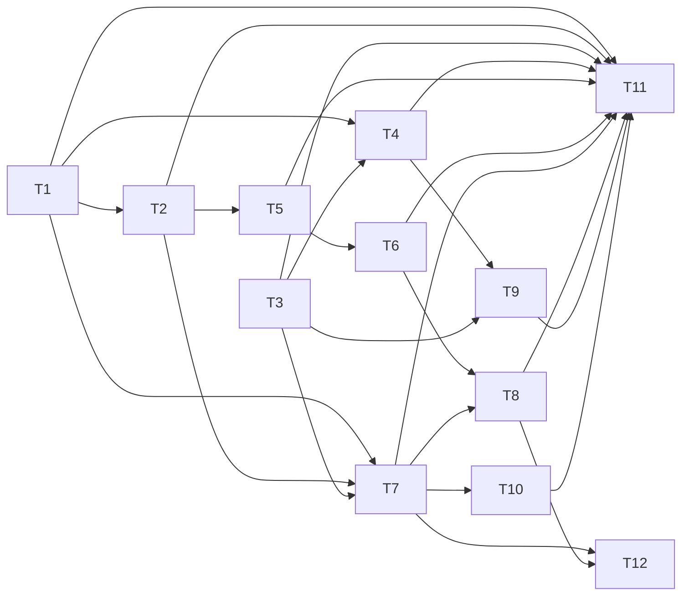

# File Attachments with Embeddings — Implementation Plan

> **For agentic workers:** REQUIRED SUB-SKILL: Use `skill://subagent-driven-development` (recommended) or `skill://executing-plans` to implement this plan in wave order. Steps use checkbox (`- [ ]`) syntax for tracking.

**Goal:** Let a user attach text or PDF files to graph entities; an async worker extracts text (PDFs via LLM-driven OCR), chunks it per page, and embeds it through the existing fenced indexer so semantic search returns file hits with filename, page and excerpt.

**Architecture:** One new extraction worker (new `mcpmem-extractor` crate) turns attachments into permanent per-page text stored in the graph SQLite file; the *existing* indexer worker embeds that text through a new `OwnerKind::Attachment` arm. No second embedding path. Bytes live in SQLite so each workspace stays one portable file. `[ocr]` config selects the OCR model independently while defaulting to the primary OpenAI embedding credentials (`provider = "inherit"`).

**Tech Stack:** Rust (edition 2024, thiserror/anyhow `Result`), rusqlite (bundled), reqwest blocking (OCR HTTP), pdfium (PDF page rendering, prebuilt bindings), existing mcpmem-core jobs machinery, existing vector_store (usearch blobs + FTS5).

**Spec:** `docs/superpowers/specs/2026-10-02-file-attachments-design.md` — this plan argues from the spec; executors read both.

## Global Constraints

- Supported MIME types: `text/*`, `text/markdown`, `application/pdf`. Code files are out of scope (tree-sitter owns code symbols).
- Default limits: `[attachments] max-bytes = 50 MiB` per attachment, `workspace-byte-budget = 256 MiB`. Both enforced at `attach_file`; errors name the violated budget.
- `[ocr] model` selects the OCR model independently. `[ocr] provider = "inherit"` (default) reuses the primary `[indexer]` provider's OpenAI credentials; explicit `provider`, `base-url`, `api-key-file` override. No `[ocr]` section + PDF upload → `status='error'` naming the configuration gap; text attach still works.
- Every mutation/ownership of `attachment`, `attachment_text`, `attachment_job` happens inside the workspace graph file. No attachment data in the registry.
- OCR never runs without a serving profile; an unknown OCR provider kind fails the job with `unsupported ocr provider '<kind>'`.
- The repo rule: every user-facing feature ships with its README section in the same change.
- `PRAGMA foreign_keys = OFF` on the legacy graph connection — cascade deletes are explicit in mutation code, never DDL-only.
- Migration numbers come from `crates/mcpmem-core/migrations/`; the graph-file migration list lives at `crates/mcpmem-core/src/events.rs` (ordered `include_str!` tuples). **Number the new migration with the next free number**: run `ls crates/mcpmem-core/migrations/ | tail -1` at execution time. If workspaces (PR #55) already added 0014, the attachment migration becomes `0015_attachments.sql`; this plan writes `0014` and every reference below must follow the actual filename.
- Pre-flight before any push: the full chain from `.omp/AGENTS.md` (`cargo fmt --all --check && scripts/check-release-version.sh && scripts/check-crate-includes.sh && cargo clippy --workspace --all-targets --all-features -- -D warnings && cargo test --workspace --all-targets -- --test-threads=1 &&` the indexer/role_composition/webhook feature matrices `&& cargo package -p mcpmem-core --locked`, then the preflight marker write).
- New crate `mcpmem-extractor` joins the workspace with `version = "2.1.5"` matching the other crates; `scripts/check-crate-includes.sh` must stay green.
- Commit messages follow repo style (`feat:` / `docs:` / `chore:`) and carry the cost annotation.

## Task Graph & Waves



| Wave | Tasks |
|---|---|
| 0 | 1, 3 |
| 1 | 2, 4 |
| 2 | 5, 7 |
| 3 | 6, 9 |
| 4 | 8, 10 |
| 5 | 11, 12 |

Same-wave file scopes are disjoint: T1 (migrations + `events.rs`) ∥ T3 (`config_file.rs` + `mcpmem.example.toml`); T2 (`jobs.rs`) ∥ T4 (new crate + root `Cargo.toml` + `main.rs`); T5 (indexer crate) ∥ T7 (`tools.rs`/`server.rs`/new `attachment_actions.rs`); T6 (`vector_store.rs`) ∥ T9 (`runtime.rs`/`main.rs`/`Cargo.toml`); T8 (`vector_actions.rs`/`tools.rs`) ∥ T10 (`ui/*`); T11 (README/CHANGES) ∥ T12 (tool manifests).

`main.rs` and `Cargo.toml` appear in T4 (wave 1) and T9 (wave 3) — different waves, serialized, no conflict.

---

### Task 1: Attachment schema (migration + registration)

**Depends on:** None

**Files:**
- Create: `crates/mcpmem-core/migrations/0014_attachments.sql` (or `0015`, see Global Constraints)
- Modify: `crates/mcpmem-core/src/events.rs` (ordered migration list)
- Test: inline in `crates/mcpmem-core/src/events.rs` (existing migration tests if present; else the migration apply path is already covered by full-suite startup)

**Interfaces:**
- Consumes: the migration list convention `(N, include_str!("../migrations/….sql"))` in `events.rs`.
- Produces: tables `attachment`, `attachment_text`, `attachment_job` with the exact columns below — T2, T4, T7 depend on them.

- [ ] **Step 1: Write the migration**

Create `crates/mcpmem-core/migrations/0014_attachments.sql`:

```sql
-- File attachments on entities: bytes + metadata, permanent per-page
-- extracted text, and a durable extraction queue. Additive.
CREATE TABLE attachment (
  id INTEGER PRIMARY KEY,
  workspace_id TEXT NOT NULL,
  entity_id INTEGER NOT NULL,
  filename TEXT NOT NULL,
  mime TEXT NOT NULL,
  size_bytes INTEGER NOT NULL,
  sha256 BLOB NOT NULL,
  content BLOB NOT NULL,
  status TEXT NOT NULL CHECK (status IN ('uploaded','extracting','ready','error')),
  revision INTEGER NOT NULL DEFAULT 0,
  last_error TEXT,
  created_us INTEGER NOT NULL
) STRICT;

CREATE TABLE attachment_text (
  attachment_id INTEGER NOT NULL,
  page INTEGER NOT NULL,
  text TEXT NOT NULL,
  chars INTEGER NOT NULL,
  PRIMARY KEY (attachment_id, page)
) STRICT;

CREATE TABLE attachment_job (
  attachment_id INTEGER PRIMARY KEY,
  state TEXT NOT NULL CHECK (state IN ('pending','leased','done','dead')),
  lease_token TEXT,
  lease_epoch INTEGER NOT NULL DEFAULT 0,
  lease_until_us INTEGER,
  next_attempt_us INTEGER NOT NULL,
  attempts INTEGER NOT NULL DEFAULT 0,
  last_error TEXT
) STRICT;

CREATE INDEX attachment_entity ON attachment (entity_id);
CREATE INDEX attachment_workspace ON attachment (workspace_id);
CREATE UNIQUE INDEX attachment_entity_name ON attachment (entity_id, filename);
```

`entity_id` carries no `REFERENCES` clause: the graph connection runs `PRAGMA foreign_keys = OFF`, so a dangling FK would be unenforced decoration, and cascade is implemented in code (Task 2) instead.

- [ ] **Step 2: Register the migration**

In `crates/mcpmem-core/src/events.rs`, append after the last tuple (currently 0013):

```rust
  (14, include_str!("../migrations/0014_attachments.sql")),
```

Match the existing tuple style exactly (indentation, trailing comma). If the next free number is 0015, use `(15, …)` and the actual filename.

- [ ] **Step 3: Verify it applies**

Run: `cargo test --workspace --all-targets -- --test-threads=1`
Expected: PASS — every startup applies pending migrations; a fresh in-memory graph must now contain `attachment`, `attachment_text`, `attachment_job`.

- [ ] **Step 4: Commit**

```bash
git add crates/mcpmem-core/migrations/0014_attachments.sql crates/mcpmem-core/src/events.rs
git commit -m "feat: add attachment tables and extraction queue schema"
```

---

### Task 2: Core jobs — enum variants, attachment repository, cascade

**Depends on:** 1

**Files:**
- Modify: `crates/mcpmem-core/src/jobs.rs` (`ChunkKind` ~:83, `OwnerKind` ~:100, `enqueue_chunk_change` ~:28)
- Modify: `crates/mcpmem-core/src/mutation.rs` (entity delete path — grep `DELETE FROM entity` for the exact site)
- Test: inline `#[cfg(test)] mod tests` in `jobs.rs` (repo convention)

**Interfaces:**
- Consumes: tables from T1.
- Produces:
  - `ChunkKind::Attachment` (as_str `"attachment"`), `OwnerKind::Attachment` (as_str `"attachment"`) — T5, T6 consume.
  - `AttachmentJobRepository` with `enqueue(conn, id)` (row `pending`), `claim(conn, now) -> Option<Job>`, `renew(conn, job, until) -> bool`, `finish(conn, id, error: Option<String>)` — T4, T7 consume.
  - `enqueue_attachment_changes(conn, attachment_id, revision)` — queues `chunk_index_job` rows `('attachment', …)` for every serving profile — T4 consumes.
  - `delete_attachment_rows(conn, attachment_id)` — deletes `attachment_text`, `attachment`, `attachment_job`, and `chunk_vector` rows `owner_kind='attachment'` for all profiles — T7 consumes.
  - Entity-delete cascade inside `mutation.rs`'s entity delete path — T7 consumes.

- [ ] **Step 1: Write the failing tests**

In `jobs.rs` tests module:

```rust
#[test]
fn attachment_kind_strings_round_trip() {
    assert_eq!(ChunkKind::Attachment.as_str(), "attachment");
    assert_eq!(OwnerKind::Attachment.as_str(), "attachment");
}

#[test]
fn enqueue_attachment_changes_queues_per_serving_profile() {
    // in-memory graph + one adopted active profile (reuse existing fixture
    // helpers from this module), a pending attachment id 7.
    enqueue_attachment_changes(&conn, 7, 0)?;
    let rows = conn.query_row(
        "SELECT count(*) FROM chunk_index_job WHERE owner_kind='attachment' AND owner_id=7",
        [], |r| r.get::<i64>(0)?,
    ).optional()?;
    assert_eq!(rows, Some(1)); // one per adopted profile
}

#[test]
fn delete_attachment_rows_removes_chunks_and_job() {
    // seed chunk_vector row (owner_kind='attachment', owner_id=9) and
    // attachment_job row; call delete_attachment_rows(&conn, 9);
    // assert all three sources have zero matching rows.
}
```

- [ ] **Step 2: Run to verify they fail**

Run: `cargo test --test tests/indexer_worker.rs` — after `--test-threads=1` for the workspace; expected: FAIL (no `Attachment` variants; functions undefined).

- [ ] **Step 3: Extend the enums**

In `jobs.rs`:

```rust
pub enum ChunkKind {
    Identity,
    Observation,
    Relation,
    Attachment,
}

    // as_str match arm:
    ChunkKind::Attachment => "attachment",
```

```rust
pub enum OwnerKind {
    Entity,
    Relation,
    Attachment,
}

    // as_str match arm:
    OwnerKind::Attachment => "attachment",
```

Check every `match` over these enums in the workspace (grep `OwnerKind::Relation` / `ChunkKind::Relation`) and add the new arm, returning the same error/no-op the `Relation` arm returns until the task that implements the behavior lands — the indexer `lib.rs:301-308` match is implemented in T5; the vector-store parse is T6; both are serialized after this task so a no-op arm here cannot ship silently (compile error is impossible to leave: Rust exhaustiveness).

- [ ] **Step 4: Attachment job repository**

Add to `jobs.rs`, mirroring the existing `IndexJobRepository` lease idioms (fencing on `lease_epoch`, `state='leased'`, `lease_until_us`):

```rust
pub struct AttachmentJobRepository { conn: … } // same connection wrapper pattern as IndexJobRepository

impl AttachmentJobRepository {
    /// Insert a pending row; no-op when the row already exists.
    pub fn enqueue(&self, conn, attachment_id: i64) -> Result<(), rusqlite::Error> { … }
    /// Claim the oldest due pending/expired-leased job, fenced like the
    /// indexer claim (see jobs.rs indexer claim SELECT).
    pub fn claim(&self, conn, now: i64) -> Result<Option<AttachmentJob>, rusqlite::Error> { … }
    /// Extend the lease; returns false when epoch/token/state moved.
    pub fn renew(&self, conn, job, until: i64) -> Result<bool, rusqlite::Error> { … }
    /// Set done, or pending-with-error / dead when attempts reached the bound.
    pub fn finish(&self, conn, job, error: Option<String>) -> Result<(), rusqlite::Error> { … }
}

pub const ATTACHMENT_MAX_ATTEMPTS: i64 = 8; // mirrors webhook worker bound
```

`AttachmentJob` carries `attachment_id`, `lease_epoch`, `lease_token`, `attempts`.

- [ ] **Step 5: Profile-sweep enqueue and chunk purge helper**

```rust
pub fn enqueue_attachment_changes(
    conn: &Connection,
    attachment_id: i64,
    revision: i64,
) -> Result<(), rusqlite::Error> {
    self.conn.execute(
        "INSERT INTO chunk_index_job(profile_id,owner_kind,owner_id,owner_revision,operation) \
         SELECT ?2,'attachment',?1,?3,'upsert' FROM index_profile_registry r \
         WHERE r.serving_profile IS NOT NULL OR r.state='Rebuilding'",
        [attachment_id, Option::none(), revision],
    ).map_err(sql_error)?;
    Ok(())
}
```

(Match the existing parameter style of the rescan INSERT at `jobs.rs:294-298`.)

```rust
pub fn delete_attachment_rows(
    conn: &Connection,
    attachment_id: i64,
) -> Result<(), rusqlite::Error> {
    conn.execute("DELETE FROM attachment_text WHERE attachment_id=?1", [attachment_id])?;
    conn.execute("DELETE FROM chunk_vector WHERE owner_kind='attachment' AND owner_id=?1", [attachment_id])?;
    conn.execute("DELETE FROM attachment_job WHERE attachment_id=?1", [attachment_id])?;
    conn.execute("DELETE FROM attachment WHERE id=?1", [attachment_id])?;
    Ok(())
}
```

- [ ] **Step 6: Entity-delete cascade**

In `mutation.rs`'s entity delete path (grep `DELETE FROM entity`), before deleting the entity row, inside the same transaction:

```rust
for attachment_id in /* SELECT id FROM attachment WHERE entity_id=? */ {
    delete_attachment_rows(&conn, attachment_id)?; // chunks + text + job + row
}
```

- [ ] **Step 7: Run the tests**

`cargo test --test indexer_worker --features indexer -- --test-threads=1` plus the jobs unit tests. Expected: PASS.

- [ ] **Step 8: Commit**

```bash
git add crates/mcpmem-core/src/jobs.rs crates/mcpmem-core/src/mutation.rs
git commit -m "feat: attachment owner kind, job repository, and cascade delete"
```

---

### Task 3: Config sections `[ocr]` and `[attachments]`

**Depends on:** None

**Files:**
- Modify: `src/config_file.rs` (`IndexerSection` ~:253; typed-section parsing/validation below it; inline tests ~:876)
- Modify: `mcpmem.example.toml` (`[indexer]` ~:137)
- Test: inline in `config_file.rs`

**Interfaces:**
- Consumes: the existing `[indexer]` section parse-and-validate pattern (`parse_choice`, `provider_kind` handling ~:760-814).
- Produces:
  - `OcrSection { provider: String, model: String, base_url: Option<String>, api_key_file: Option<String> }` with provider default `"inherit"` — T4, T9 consume.
  - `AttachmentsSection { max_bytes: i64, workspace_byte_budget: i64, allow_mime: Vec<String> }` with defaults 50 MiB / 256 MiB / `["text/*", "text/markdown", "application/pdf"]` — T7 consumes.
  - `OcrSettingsResolved` (the same struct layered with environment variables, resolved in `main.rs` by T4).
  - Validation: unknown `provider` fails config parse with a named error; non-positive budgets fail.

- [ ] **Step 1: Write the failing tests**

```rust
#[test]
fn ocr_section_defaults_to_inherit_and_requires_model() {
    // parse a file with only [ocr] model = "gpt-4o-mini"
    assert_eq!(file.ocr.provider, "inherit");
    // parse a file with [ocr] provider = "bogus" → Err mentioning provider
}

#[test]
fn attachments_section_defaults() {
    // empty [attachments] → max_bytes == 50 MiB, budget == 256 MiB,
    // allow_mime == ["text/*", "text/markdown", "application/pdf"]
}
```

- [ ] **Step 2: Run to verify they fail**

Run: `cargo test --test config_file -- --test-threads=1` (confirm the feature set; if `config_file.rs` tests run under default features, use that). Expected: FAIL (no `ocr`/`attachments` fields).

- [ ] **Step 3: Implement the sections**

In `config_file.rs`, mirroring `IndexerSection`:

```rust
pub struct OcrSection {
    pub provider: String,          // "inherit" (default) | "openai"
    pub model: String,             // required
    pub base_url: Option<String>,
    pub api_key_file: Option<String>,
}

pub struct AttachmentsSection {
    pub max_bytes: i64,            // default 50 * 1024 * 1024
    pub workspace_byte_budget: i64, // default 256 * 1024 * 1024
    pub allow_mime: Vec<String>,   // default ["text/*", "text/markdown", "application/pdf"]
}
```

Add `pub ocr: OcrSection, pub attachments: AttachmentsSection` to the file's root struct with the defaults above; validate in the same pass that validates `[indexer]` (unknown provider → named error; budgets `<= 0` → named error). `allow_mime` entries support a trailing `/*` prefix wildcard (validate: entry must be `type/subtype` or `type/*`), rejected otherwise.

- [ ] **Step 4: Document in the example config**

Append to `mcpmem.example.toml`:

```toml
[ocr]
# OCR for PDF attachments. `provider = "inherit"` (default) reuses the
# primary [indexer] provider's OpenAI credentials; `model` is selected
# independently. Unset section disables PDF OCR (text files still work).
model = "gpt-4o-mini"
# provider = "inherit"
# base-url = ""
# api-key-file = ""

[attachments]
# Limits for file attachments. Both enforced at attach time.
# max-bytes = 52428800          # 50 MiB per file
# workspace-byte-budget = 268435456  # 256 MiB per workspace
# allow-mime = ["text/*", "text/markdown", "application/pdf"]
```

- [ ] **Step 5: Run the tests**

Expected: PASS.

- [ ] **Step 6: Commit**

```bash
git add src/config_file.rs mcpmem.example.toml
git commit -m "feat: ocr and attachments config sections"
```

---

### Task 4: `mcpmem-extractor` crate — OCR provider and extraction worker

**Depends on:** 1, 3

**Files:**
- Create: `crates/mcpmem-extractor/Cargo.toml`
- Create: `crates/mcpmem-extractor/src/lib.rs` (worker loop + text assembly)
- Create: `crates/mcpmem-extractor/src/provider.rs` (OcrProvider trait + strict registry + OpenAI vision client)
- Create: `crates/mcpmem-extractor/src/pdf.rs` (`#[cfg(feature = "pdf")]` pdfium render)
- Create: `crates/mcpmem-extractor/README.md`
- Modify: `Cargo.toml` (workspace member + optional dep + `extractor`/`pdf` features)
- Modify: `src/main.rs` (resolve OCR settings from env over file, mirroring the indexer settings layering at `main.rs:142-164`)
- Test: inline tests + `tests/extractor.rs` (registered in `tests/mod.rs`)

**Interfaces:**
- Consumes: T1 tables; T3 `OcrSection`/resolved settings; core `AttachmentJobRepository`, `enqueue_attachment_changes`, `delete_attachment_rows`.
- Produces:
  - `mcpmem_extractor::OcrProvider` trait: `fn transcribe_page(&self, page_image: &[u8], mime: &str) -> Result<String, String>`.
  - `mcpmem_extractor::ExtractionService { database: path, ocr: Option<Arc<OcrProvider>> }` + `RunReport` — T9 consumes.
  - Text assembly that writes `attachment_text` and flips status `uploaded → extracting → ready|error`.
  - Strict dispatch: `unsupported ocr provider '<kind>'` for unknown kinds; URL with userinfo rejected at construction (mirror `ProviderRegistry`).

- [ ] **Step 1: Crate scaffolding**

`crates/mcpmem-extractor/Cargo.toml` (mirror `mcpmem-indexer/Cargo.toml`; version `2.1.5`, `edition = "2024"`):

```toml
[dependencies]
mcpmem-core = { path = "../mcpmem-core", version = "2.1.5" }
reqwest = { version = "0.12", default-features = false, features = ["blocking", "json", "rustls-tls"] }
rusqlite = { version = "0.40", features = ["bundled"] }
serde = { version = "1", features = ["derive"] }
serde_json = "1"
thiserror = "2"
tracing = "0.1"
base64 = "0.22"          # page images to data URLs
pdfium = { version = "0.2", optional = true }

[features]
pdf = ["dep:pdfium"]
```

Wire into the workspace: add `"crates/mcpmem-extractor"` to `[workspace] members`, and to the main crate:

```toml
mcpmem-extractor = { path = "crates/mcpmem-extractor", version = "2.1.5", optional = true }
extractor = ["dep:mcpmem-extractor"]
pdf = ["extractor", "mcpmem-extractor/pdf"]
```

Verify `scripts/check-crate-includes.sh` stays green.

- [ ] **Step 2: Write the failing worker test**

`tests/extractor.rs` (root test suite; register `mod extractor;` in `tests/mod.rs`):

```rust
#[test]
fn extraction_ready_for_text_file_skips_ocr() {
    // in-memory graph + attachment row (status='uploaded', mime='text/plain',
    // content = "hello\nworld\n", no OCR configured)
    // run one worker poll; assert status == 'ready', one attachment_text row
    // (page 1, "hello\nworld\n"), and a chunk_index_job queued.
}

#[test]
fn pdf_without_ocr_config_fails_job_and_names_the_gap() {
    // attachment mime='application/pdf', no [ocr] section
    // assert status == 'error' and last_error contains "ocr"
}
```

- [ ] **Step 3: Run to verify they fail**

Run: `cargo test --test extractor --features extractor,pdf -- --test-threads=1`
Expected: FAIL (crate/compile or no trait).

- [ ] **Step 4: Implement the provider**

`provider.rs` — strict dispatch mirroring the indexer's `ProviderRegistry`:

```rust
pub struct OcrProviderRegistry { inner: Option<Arc<OcrProvider>> }

pub trait OcrProvider {
    /// Transcribe one rendered page image into plain text.
    fn transcribe_page(&self, page_image: &[u8], mime: &str) -> Result<String, String>;
}

pub struct OpenAiVisionProvider {
    client: reqwest::blocking::Client,
    url: url::Url,
    api_key: String,
    model: String,
    page_prompt: String, // "Transcribe this page verbatim; keep layout order."
}

impl OcrProvider for OpenAiVisionProvider {
    fn transcribe_page(&self, page_image: &[u8], mime: &str) -> Result<String, String> {
        // POST {model, messages:[{role:"user", content:[
        //   {type:"text", text: self.page_prompt},
        //   {type:"image_url", image_url:{url:"data:<mime>;base64," + b64}}]}]}
        // to self.url; parse choices[0].message.content
    }
}

pub fn from_settings(settings: &OcrSettingsResolved, timeout: Duration)
    -> Result<OcrProviderRegistry, String> {
    match settings.provider {
        "inherit" => {
            if no openai credentials present { return Err("ocr: provider 'inherit' but no openai "
                + "embedding provider credentials are configured; set [ocr] provider/base-url "
                + "and api-key-file, or configure [indexer] openai"); }
            OpenAiVisionProvider { url/from indexer openai settings, … }
        }
        "openai" => { /* base-url + api-key-file required, both validated */ }
        kind      => Err("unsupported ocr provider '" + kind + "'"),
    }
}
```

Mirror the indexer's construction-time checks: URL carrying `user:pass` → reject; missing key file → named error. `api::Debug` for the registry must redact the key (mirror `ProviderSettings`).

- [ ] **Step 5: Implement rendering + worker loop**

`pdf.rs`:

```rust
#[cfg(feature = "pdf")]
pub fn render_pages(bytes: &[u8], dpi: u32) -> Result<Vec<&[u8]>, String> {
    // pdfium: open document from bytes, for each page render_bitmap(dpi)
    // → RGBA; encode PNG with a pure-Rust encoder? No — render JPEG via
    // pdfium's raster → feed directly: OpenAI accepts PNG/JPEG data URLs.
    // Keep dpi configurable; default 150.
}
```

(Match the pdfium API available in the pinned version; encode the rendered raster as PNG/JPEG bytes before returning.)

`lib.rs` worker loop (mirror `IndexerWorker` structure: claim → outside-tx work → fenced commit; bounded attempts):

```rust
pub struct ExtractionService { database: path, ocr: Option<Arc<OcrProviderRegistry>> }
impl ExtractionService {
    fn poll_once(&self) -> Result<RunReport, String> {
        let conn = open_graph(&self.database)?;
        let job = AttachmentJobRepository.claim(&conn, now_us)?; // None → idle
        if job None { return Ok(RunReport { extracted: 0 }) }
        // re-read attachment row (status, mime, content, sha256);
        // set status='extracting' (same transaction as claim), bump revision
        let text_pages: Vec<(u32, String)> = match mime {
            text/*           => { decode utf-8 (BOM strip, CRLF normalize); [(1, text)] }
            application/pdf  => match self.ocr {
                Some(ocr) => pdf::render_pages(content, dpi).and_then(each page → ocr.transcribe_page),
                None      => Err("ocr: no [ocr] provider configured for PDF attachment")
            }
            _ => Err("unsupported mime '" + mime + "'"),
        };
        // outside the write transaction: all HTTP calls happen here
        // fenced write: re-check job epoch + attachment revision; then
        //   INSERT OR REPLACE attachment_text rows, set status='ready',
        //   enqueue_attachment_changes(conn, id, revision), job done
        // on Err: finish(job, Some(error)); status='error' + last_error
    }
}
```

- [ ] **Step 6: `/ui`-independent progress surface**

`list_attachments`/`get_attachment` in T7 read `status`,`last_error`,`revision` from the `attachment` row; the worker writes them — no extra API needed here.

- [ ] **Step 7: Run the tests**

`cargo test --test extractor --features extractor,pdf -- --test-threads=1` → PASS.
Also `cargo test --test extractor --no-default-features --features extractor -- --test-threads=1` (no pdf feature; PDF attach path is compile-gated and the test for it is `#[cfg(feature = "pdf")]`).

- [ ] **Step 8: Commit**

```bash
git add crates/mcpmem-extractor Cargo.toml src/main.rs tests/extractor.rs tests/mod.rs
git commit -m "feat: extraction worker with OCR provider and PDF rendering"
```

---

### Task 5: Indexer `OwnerKind::Attachment` arm

**Depends on:** 2

**Files:**
- Modify: `crates/mcpmem-indexer/src/lib.rs` (owner dispatch `:301-308`; add `attachment_chunks` beside `canonical_document`; crate README)
- Test: inline `#[cfg(test)]` + `tests/indexer_worker.rs`

**Interfaces:**
- Consumes: `ChunkKind::Attachment`, `OwnerKind::Attachment` from T2.
- Produces: `attachment_chunks(conn, attachment_id, expected_revision) -> Result<Option<Vec<(ChunkKind, String)>>, rusqlite::Error>` — chunk `i` is page `i+1` (**chunk_index = page − 1** is the contract T6 relies on). `None` when the attachment is missing/superseded (routes through the existing retry path).

- [ ] **Step 1: Write the failing test**

`tests/indexer_worker.rs`:

```rust
#[test]
fn attachment_arm_assembles_one_chunk_per_page() {
    // seed attachment id 3 revision 0 + attachment_text pages 1..3
    let chunks = attachment_chunks(&conn, 3, 0)?.expect_some();
    assert_eq!(chunks.len(), 3);
    assert_eq!(chunks[0].0, ChunkKind::Attachment);
    assert_eq!(chunks.len() is text of page 1; // text equality via raw read
}

#[test]
fn attachment_arm_superseded_revision_returns_none() {
    // expected_revision != current revision → None (retry path, not silent embed)
}
```

- [ ] **Step 2: Run to verify they fail**

`cargo test --test indexer_worker --features indexer -- --test-threads=1`
Expected: FAIL (`attachment_chunks` undefined; match not exhaustive).

- [ ] **Step 3: Implement**

```rust
/// Pages of one attachment in chunk form: chunk i = page i+1. Fenced on
/// attachment.revision and liveness (status != 'error').
pub fn attachment_chunks(
    conn: &Connection,
    attachment_id: i64,
    expected_revision: i64,
) -> Result<Option<Vec<(ChunkKind, String)>>, rusqlite::Error> {
    let row: Option<(String, i64)> = conn.query_row(
        "SELECT status, revision FROM attachment WHERE id=?1", [attachment_id],
        |r| Ok((r.get::<String>(0)?, r.get::<i64>(1)?)),
    ).optional()?;
    match row {
        None => Ok(None), // vanished → retry/dead-letter path
        Some((status, revision)) if revision != expected_revision || status == "error" => Ok(None),
        Some(_) => {
            let pages = conn.query_rows(
                "SELECT page, text FROM attachment_text WHERE attachment_id=?1 ORDER BY page",
                [attachment_id],
                |r| Ok((r.get::<i64>(0)?, r.get::<String>(1)?)),
            )?;
            Ok(Some(pages.map(|(page, text)| (ChunkKind::Attachment, text))))
        }
    }
}
```

Add the dispatch arm at `lib.rs:301-308`:

```rust
OwnerKind::Attachment => {
    attachment_chunks(&conn, job.owner_id, job.owner_revision)?
}
```

Chunk split: if the profile's token cap is exceeded (the profile carries no token cap today; use the same split rule as entity documents — grep the canonical-document chunker and reuse its splitter with the same constants), split the page text into consecutive sub-chunks **without** merging pages; page attribution comes from `chunk_index = page − 1` with the first sub-chunk's index equal to `page − 1`. Reuse the existing splitter function to avoid a second convention.

- [ ] **Step 4: Run tests**

Both new tests + full `indexer_worker` suite: `cargo test --test indexer_worker --features indexer -- --test-threads=1` → PASS.

- [ ] **Step 5: Update crate README**

One line under “How the worker runs”: attachment owners (files) embed one chunk per extracted page, re-embedding from stored text on rebuilds.

- [ ] **Step 6: Commit**

```bash
git add crates/mcpmem-indexer/src/lib.rs crates/mcpmem-indexer/README.md tests/indexer_worker.rs
git commit -m "feat: index attachment pages through the existing embedder"
```

---

### Task 6: Vector store — attachment chunk resolution

**Depends on:** 5

**Files:**
- Modify: `src/vector_store.rs` (chunk-kind parse ~:609, `chunk_text` ~:1130, `resolve_owner` ~:1091, best-chunk mapping ~:430)
- Test: inline in `vector_store.rs` (existing fixture style ~:1422)

**Interfaces:**
- Consumes: `ChunkKind::Attachment` string `"attachment"` from T2/T5; the chunk_index = page − 1 contract from T5.
- Produces: `chunk_text(hit)` returns `Some("page {page} — {excerpt}")` style? No — returns the plain page text; the actions layer (T8) composes filename/excerpt labels. `resolve_owner(OwnerKind::Attachment, id)` returns `(filename, "attachment")`.

- [ ] **Step 1: Write the failing tests**

```rust
#[test]
fn chunk_text_resolves_attachment_pages() {
    // seed attachment + one attachment_text row at page 3, chunk-index 2
    let hit = ChunkHit { owner_kind: Attachment, owner_id: …, chunk_index: 2, kind: Attachment, … };
    assert_eq!(vs.chunk_text(&hit), Some(page text));
}

#[test]
fn chunk_text_unknown_attachment_returns_none() { … }

#[test]
fn resolve_owner_renders_attachment_filename() { … }
```

- [ ] **Step 2: Run to verify they fail**

Expected: FAIL (parse arms, functions).

- [ ] **Step 3: Implement**

- Parse arm (~:609): `"attachment" => ChunkKind::Attachment`.
- `chunk_text`: add before the fallback:

```rust
ChunkKind::Attachment => {
    let page = hit.chunk_index + 1;
    self.conn.query_row(
        "SELECT text FROM attachment_text WHERE attachment_id=?1 AND page=?2",
        [hit.owner_id, page], |r| Ok(r.get::<String>(0)?),
    ).optional()?
}
```

- `resolve_owner` add:

```rust
(OwnerKind::Attachment, id) => {
    self.conn.query_row(
        "SELECT filename FROM attachment WHERE id=?1", [id],
        |r| Ok((r.get::<String>(0)?, "attachment")),
    ).optional()?
}
```

- Best-chunk mapping (~:430): add `ChunkKind::Attachment => Some(hit.chunk_index as usize)` so `includeChunks` semantics extend to pages (page = index + 1).

- [ ] **Step 4: Run tests**

`cargo test --test vector_store -- --test-threads=1` (or the file's suite under the feature set CI uses) → PASS.

- [ ] **Step 5: Commit**

```bash
git add src/vector_store.rs
git commit -m "feat: resolve attachment chunks to page text in the vector store"
```

---

### Task 7: MCP tools + HTTP API + attach flow

**Depends on:** 1, 2, 3

**Files:**
- Create: `src/attachment_actions.rs` (handlers: `handle_attach_file`, `handle_list_attachments`, `handle_get_attachment`, `handle_delete_attachment`)
- Modify: `src/tools.rs` (`ToolCategory` ~:23, `ALL` ~:35, slug mapping ~:44, `category_of`, tool defs ~:230)
- Modify: `src/server.rs` (tool dispatch ~:994; HTTP routes for `/ui/api/attachments*`)
- Test: `tests/attachment_e2e.rs` (registered in `tests/mod.rs`)

**Interfaces:**
- Consumes: T1 tables; T2 `AttachmentJobRepository::enqueue`, `delete_attachment_rows`; T3 `AttachmentsSection` limits.
- Produces: MCP tools `attach_file`, `list_attachments`, `get_attachment`, `delete_attachment` under a new `Attachment` tool category (slug `attachments`, gated `--enable-attachments`); HTTP routes read/write the same handlers; `attach_file` response `{ attachmentId: i64, status: "uploaded" }`.

- [ ] **Step 1: Write the failing e2e tests**

```rust
#[test]
fn attach_file_stores_bytes_and_queues_job() {
    // base64 "hello" + entity id; call handle_attach_file;
    // assert attachmentId is Some, status "uploaded", row exists,
    // attachment_job state 'pending'
}

#[test]
fn attach_file_rejects_oversize_and_unknown_mime_with_named_error() {
    // max-bytes = 4 → "attachment exceeds max-bytes"; mime "application/x-msdos-program"
    // → "unsupported mime type"
}

#[test]
fn delete_attachment_removes_blob_text_chunks_and_job() { … }

#[test]
fn attach_file_is_authorized_by_workspace_registry() {
    // no access to the workspace → error before any write (same assert path
    // the graph tools already exercise)
}
```

- [ ] **Step 2: Run to verify they fail**

`cargo test --test attachment_e2e -- --test-threads=1` → FAIL.

- [ ] **Step 3: Implement the handlers**

`attachment_actions.rs`, following `vector_actions.rs` structure (route through the workspace registry check first, exactly like the existing graph/vector tools):

- `attach_file(workspace_id, entity_id, filename, mime, content_b64)`:
  1. authorize (existing registry check);
  2. validate `mime` against `AttachmentsSection::allow_mime` (with `type/*` prefix match) → `unsupported mime type '<mime>'`;
  3. decode base64; enforce `max_bytes` → `attachment exceeds max-bytes`;
  4. sum `size_bytes` over the workspace's attachments + new size ≤ `workspace_byte_budget` → `workspace byte budget exceeded`;
  5. one transaction: INSERT attachment row (`status='uploaded'`, sha256 = sha2::digest, `revision=1`), `AttachmentJobRepository::enqueue`;
  6. return `Ok({ attachmentId, status: "uploaded" })`.
- `list_attachments(entity_id)` → rows with status/revision/size/filename + per-page count.
- `get_attachment(id)` → metadata, content (base64), status, `last_error`, pages `[{page, text}]`.
- `delete_attachment(id)` → authorize; `delete_attachment_rows` (T2) in one transaction.

- [ ] **Step 4: Register tools and dispatch**

`tools.rs`: add `ToolCategory::Attachment` (slug `"attachments"`) to the enum, `ALL`, the slug map, and `category_of`. Add the four tool definitions with JSON schemas (`filename` string, `mime` string, `content` string (base64), `entityId` integer, optional `workspaceId`). `server.rs` dispatch: `"attach_file" => attachment_actions::handle_attach_file(kg, tool_args)`, same for the other three. Wire `--enable-attachments` to `src/config.rs`/`src/lib.rs` enable-flag parsing like the existing categories.

- [ ] **Step 5: HTTP routes**

In `server.rs` (admin area): `GET /ui/api/attachments?entityId=`, `POST /ui/api/attachments` (multipart or raw body per the existing admin API style — match `POST /ui/api/webhooks`), `GET /ui/api/attachments/{id}/download`, `DELETE /ui/api/attachments/{id}`. All go through the same handlers; same workspace authz.

- [ ] **Step 6: Update manifests**

Extend `src/tools.rs` tool list already done in step 4; the checked-in `tools.json` is updated in T12 with the full new surface (both tools and vectors change) — do NOT touch it here.

- [ ] **Step 7: Run tests**

`cargo test --test attachment_e2e -- --test-threads=1` → PASS; full suite (the repo pre-flight chain) stays green.

- [ ] **Step 8: Commit**

```bash
git add src/attachment_actions.rs src/tools.rs src/server.rs src/config.rs src/lib.rs tests/attachment_e2e.rs tests/mod.rs
git commit -m "feat: attachment MCP tools and admin http api"
```

---

### Task 8: Vector search returns attachment hits

**Depends on:** 6, 7

**Files:**
- Modify: `src/vector_actions.rs` (search result row builders ~:170-213, `handle_vector_search_entities` ~:280)
- Modify: `src/tools.rs` (vector tool defs gain `includeAttachments` param)
- Test: `tests/vector_e2e.rs`, `tests/attachment_e2e.rs`

**Interfaces:**
- Consumes: T6 `chunk_text`/`resolve_owner` for attachment owners; T7 tool registration.
- Produces: search hit rows carry `kind: "attachment"` and, for attachment owners, `{ filename, page, excerpt }`; every vector search tool accepts `includeAttachments: bool` (default `true`), which when `false` filters `owner_kind != 'attachment'` (single-store filter in `VectorStore::search_chunks` — add an optional predicate param, or filter the result set in the actions layer; prefer the actions layer, keeping the store API untouched).

- [ ] **Step 1: Write the failing test**

```rust
#[test]
fn vector_search_returns_attachment_hits_with_filename_page_excerpt() {
    // seed entity with an observation + one attached file with 2 pages,
    // embed via the worker test harness (reuse vector_e2e fixture);
    // query for a page-2 token; assert the hit row has kind "attachment",
    // filename, page == 2 and an excerpt.
}

#[test]
fn include_attachments_false_drops_file_hits() { … }
```

- [ ] **Step 2: Run to verify they fail**

`cargo test --test vector_e2e --features indexer -- --test-threads=1` → FAIL.

- [ ] **Step 3: Implement**

In `vector_actions.rs`, in the row-builder: when `hit.chunk_kind == ChunkKind::Attachment`, render

```json
{ "kind": "attachment", "ownerId": …, "filename": <resolve_owner name>,
  "page": chunk_index + 1, "excerpt": <chunk_text truncated to 200 chars>,
  "distance": … }
```

Add `includeAttachments` (default true) to the vector tools' parameter schemas in `tools.rs`; when false, filter the candidate set before ranking (actions layer) — attachment-owner ids only, entity/relation ids unaffected.

- [ ] **Step 4: Run tests**

`cargo test --test vector_e2e --features indexer -- --test-threads=1` and `attachment_e2e` → PASS.

- [ ] **Step 5: Commit**

```bash
git add src/vector_actions.rs src/tools.rs tests/vector_e2e.rs tests/attachment_e2e.rs
git commit -m "feat: surface attachment hits in vector search with page and excerpt"
```

---

### Task 9: Runtime role wiring for the extraction worker

**Depends on:** 4, 3

**Files:**
- Modify: `src/runtime.rs` (`IndexerService` ~:184 pattern; add `ExtractionService` + `RoleService` impl + role loop)
- Modify: `src/main.rs` (role string parsing `--role extractor`, settings resolution already in T4; startup wiring mirroring the indexer role at `main.rs:164`)
- Modify: `Cargo.toml` (feature already added by T4; role gating config in `[roles]`/example toml if the runtime reads a role list)
- Test: `tests/role_composition.rs` (feature-matrix runs exist for indexer/webhooks; add `extractor` to the matrix)

**Interfaces:**
- Consumes: `mcpmem_extractor::ExtractionService` + resolved OCR/attachments settings (T4), `[ocr]`/`[indexer]` settings (T3).
- Produces: the `--role extractor` process role; the same `RoleService::run()` shape as `IndexerService`.

- [ ] **Step 1: Write the failing test**

In `tests/role_composition.rs`, extend the feature matrix by one combination: `--features extractor`, `--features extractor,pdf` — assert the role parses and the poll loop idles (no crash) with no jobs. (Mirror the existing indexer/webhooks matrix assertions.)

- [ ] **Step 2: Run to verify it fails**

`cargo test --test role_composition --features extractor` → FAIL (unknown role).

- [ ] **Step 3: Implement**

`runtime.rs`:

```rust
pub struct ExtractionService {
    database: std::path::PathBuf,
    ocr: Option<Arc<mcpmem_extractor::OcrProviderRegistry>>,
}

#[cfg(feature = "extractor")]
impl RoleService for ExtractionService {
    fn run(&self) -> mcpmem_runtime::RoleFuture {
        // poll loop with backoff, mirroring IndexerService::run:
        // ExtractionService { database, ocr }.poll_once() in a loop,
        // sleep 1s idle, log info/warn/error per outcome like the
        // webhook worker's delivery logging
    }
}
```

`main.rs`: extend the role parser with `"extractor"` (feature-gated), build `ExtractionService` from the resolved settings (T4), and register it in the role table next to `IndexerService`. Resolve `OcrSettingsResolved` (T4 layering) and construct the registry **outside** the async context (same `spawn_blocking` hazard as `IndexerService::provider_registry` — note it in a comment).

- [ ] **Step 4: Run tests**

`cargo test --test role_composition --features extractor,pdf -- --test-threads=1` plus the role matrix → PASS.

- [ ] **Step 5: Document the role in the example config**

`mcpmem.example.toml` roles comment: add `"extractor"` (needs the `extractor` Cargo feature; PDF OCR needs `pdf`).

- [ ] **Step 6: Commit**

```bash
git add src/runtime.rs src/main.rs mcpmem.example.toml tests/role_composition.rs
git commit -m "feat: extractor runtime role with poll loop"
```

---

### Task 10: Admin UI attachments panel

**Depends on:** 7

**Files:**
- Modify: `src/ui/admin.html` (panel container + upload form)
- Modify: `src/ui/admin.js` (fetch list, upload, delete, polling status badges)
- Modify: `src/ui/graph.css` (panel styles; reuse existing panel styles)

**Interfaces:**
- Consumes: the HTTP routes from T7 (`GET/POST/DELETE /ui/api/attachments*`, `GET …/download`); the workspace selector already in the admin UI.
- Produces: an “Attachments” panel per selected entity: upload button (file picker, client-side size/MIME pre-check), table (filename, size, status badge `uploaded | extracting | ready | error` with title = `last_error`), download link when `ready`, delete button. Views: entity detail view lists attachments; status badges poll every 2s while any row is `uploaded`/`extracting`.

- [ ] **Step 1: Implement the panel**

`admin.js`: `loadAttachments(entityId)`, `uploadAttachment(entity, file)`, `pollAttachments()` (2s refresh while processing), `deleteAttachment(id)` — all against the T7 routes, using the already-present `workspaceId` from the workspace selector. `admin.html`: panel markup + `<input type="file" accept=".txt,.md,.pdf,text/*,application/pdf">`. `graph.css`: reuse `admin.css`-adjacent panel styles (match the existing tables/badges).

- [ ] **Step 2: Verify by running the server**

Start the server per `.omp/AGENTS.md` (http transport, a workspace, `--enable-attachments`), open `/ui` in a browser, attach a small text file and a PDF, confirm: immediate `processing` badge → `ready`, download works, delete removes the row, and the search box returns file hits with filename/page. Take screenshots for the PR body. This is a UI verification — no automated test (repo convention: web UI verified manually).

- [ ] **Step 3: Commit**

```bash
git add src/ui/admin.html src/ui/admin.js src/ui/graph.css
git commit -m "feat: attachments panel in admin ui"
```

---

### Task 11: README + CHANGES

**Depends on:** 1, 2, 3, 4, 5, 6, 7, 8, 9, 10

**Files:**
- Modify: `README.md` (features list, new tools, config `[ocr]`/`[attachments]`, roles, limits)
- Modify: `CHANGES.md` (new unreleased section entry)
- Modify: `crates/mcpmem-extractor/README.md` (already created in T4 — finalize; add docs on the provider contract)

**Interfaces:** none.

- [ ] **Step 1: README**

Under the vector/indexer feature description: bullets for attachments (async extraction, PDF OCR via `[ocr]`, search hits carrying filename/page/excerpt), the four MCP tools, the `--enable-attachments` flag, the `[ocr]` and `[attachments]` sections verbatim from `mcpmem.example.toml`, the `extractor` role line, and the limits with defaults. State that code files are not attachments (tree-sitter path unchanged).

- [ ] **Step 2: CHANGES**

`## Unreleased` (or the current open version section per repo convention — match the latest entry's style): bullet `file attachments with per-page embeddings (text + LLM-OCR'd PDF) — async extraction worker, [ocr] and [attachments] config, attachment MCP tools, admin UI panel`.

- [ ] **Step 3: Commit**

```bash
git add README.md CHANGES.md crates/mcpmem-extractor/README.md
git commit -m "docs: attachment feature in readme and changelog"
```

---

### Task 12: Tool manifests

**Depends on:** 7, 8

**Files:**
- Modify: `tools.json` (add `attach_file`, `list_attachments`, `get_attachment`, `delete_attachment`; `includeAttachments` param on vector tools)
- Modify: `vector_tools.json` (same vector-tool deltas)

**Interfaces:** consumes the final tool names/schemas from T7/T8.

- [ ] **Step 1: Regenerate or hand-edit the manifests**

Check whether a generator exists (`scripts/*` shows none; the manifests are checked in) → hand-edit to match the exact schemas from `tools.rs` (T7/T8). Types must match the JSON schemas byte-for-byte: `attach_file` params `workspaceId?`, `entityId`, `filename`, `mime`, `content`; search tools add `includeAttachments` (default `true`).

- [ ] **Step 2: Verify**

`cargo test --workspace --all-targets -- --test-threads=1` + the full pre-flight chain (Global Constraints) stays green; `scripts/check-crate-includes.sh` passes.

- [ ] **Step 3: Commit**

```bash
git add tools.json vector_tools.json
git commit -m "chore: sync tool manifests with attachment surface"
```

---

## Self-Review

**Spec coverage** — requirement → task: (1) immediate return → T7; (2) text without OCR config → T4 step 2 test + T4 worker; (3) PDF via existing queue → T4+T5; (4) hit filename/page/excerpt → T6+T8; (5) rebuild without re-OCR → T4 permanent text + T5 chunks-from-text + T2 `enqueue_attachment_changes` per profile; (6) revision fence → T2 repository fencing + T5 revision check; (7) cascade → T2 `delete_attachment_rows` + mutation hook + T7 tool; (8) budgets/MIME → T3+T7; (9) strict OCR dispatch → T4; (10) workspace authz → T7 step 7 (existing registry path); (11) README same change → T11. Spec §OCR config (`provider = "inherit"` credential fallback) → T4 step 4. Spec §chunking one-chunk-per-page, page split caping → T5 step 3. Spec §tools/UI quartet → T7/T10.

**Placeholder scan:** all steps carry code or an explicit command; the only conditional is the migration number, which carries the deciding command (`ls … | tail -1`) and the name to use in each branch. pdfium's exact raster API is pinned to “match the API available in the pinned version” — one line, deliberate, because the crate's surface varies by patch version; the render function's signature and behavior are fixed.

**Type consistency:** `ChunkKind::Attachment`/`OwnerKind::Attachment` introduced T2, consumed T5/T6/T8; `chunk_index = page − 1` defined T5, consumed T6 (`page = chunk_index + 1`) and T8 (`page = chunk_index + 1`); `delete_attachment_rows`/`enqueue_attachment_changes`/`AttachmentJobRepository::enqueue` defined T2, consumed T4/T7; `ExtractionService` defined T4, consumed T9; `[ocr]`/`[attachments]` structs defined T3, consumed T4/T7/T9.

**Graph validation:** no cycles; every `Depends on:` edge appears in the mermaid and the waves table; dependencies always point to lower-numbered tasks; same-wave pairs have disjoint file scopes (T1∥T3, T2∥T4, T5∥T7, T6∥T9, T8∥T10, T11∥T12); `main.rs`+`Cargo.toml` split across waves (T4 then T9); `tools.rs` split across waves (T7 then T8). T11 depends on all ten predecessors and sits alone with T12 in wave 5.