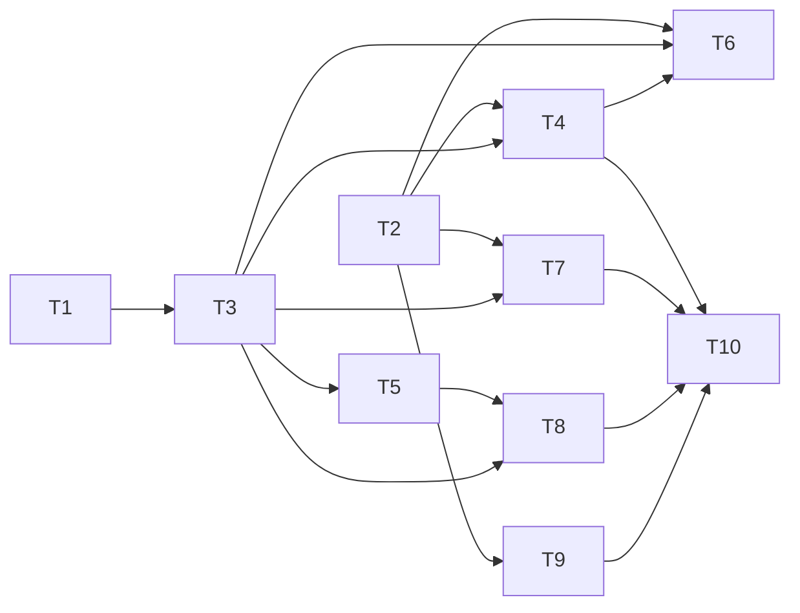

# File Attachments with Embeddings — Implementation Plan

> **For agentic workers:** Read the linked spec before a task. Use `skill://agents/subagent-driven-development` or `skill://agents/executing-plans` to implement each wave. Mark each step with `- [ ]`. The controller owns git and full-suite verification; workers do not run git or project-wide checks in flight.

**Goal:** Add durable text and PDF attachments to workspace entities and return page-level hits through the existing indexer.

**Architecture:** Each workspace graph file stores attachment bytes, upload sessions, page text, and an exact segment mapping. HTTP accepts a bounded body stream; MCP sends small chunks across calls. A durable extraction queue lets a separate worker process write page text; the current indexer embeds the segments. Attachments have their own OAuth scope and use the existing workspace grants.

**Tech Stack:** Rust 2024, SQLite/rusqlite incremental blob I/O, axum streamed bodies, existing core/indexer/runtime crates, reqwest blocking vision calls, and the external Poppler `pdfinfo`/`pdftoppm` commands.

**Spec:** `docs/superpowers/specs/2026-10-02-file-attachments-design.md`. Its numbered R1–R28 requirements and wire shapes control this plan.

## Global constraints

- Migration 15 follows `0014_workspace_marker.sql`; do not modify migration 14 or its checksum.
- Keep `/mcp`, stdio, and other HTTP routes at the current 16 MiB request limit. A 50 MiB HTTP upload has its own counted stream.
- The per-file default is 52,428,800 bytes. The workspace budget default is 268,435,456 bytes, including active upload reservations.
- One MCP chunk contains at most 1,048,576 decoded bytes. Each call stays below the unchanged 16 MiB JSON-RPC cap.
- Store no workspace ID on an attachment, extraction, mapping, or upload row. Resolve the selected graph through `WorkspaceRegistry` on each call.
- Require the `attachments` tool/OAuth scope and the correct workspace grant for attachment operations. Keep `graph-write` separate.
- Keep search tools under `vectors` scope. Without `attachments` consent, omit attachment candidates before ranking. Do not omit entity or relation candidates.
- Use the default OpenAI vision host only with a first-party `openai` provider. Compatible-provider inheritance needs an explicit non-OpenAI `vision-url`.
- Do not require a local extractor role to accept an upload. Keep `uploaded` jobs durable for a separate worker process.
- Check the enabled `attachments` category on each HTTP attachment route before any request body is read.
- A second filename on one entity conflicts. Do not implement an implicit overwrite or version.
- Each wave must finish before dependent tasks start. Concurrent workers edit only their named paths. The controller stages exact paths after workers stop.

## Contract and path map

The merged code, not the former plan, locates these seams: `src/http.rs:233-290` owns routes and body limits; `src/server.rs:128-129,285-347,928-1002` owns MCP limits and batch scope screening; `src/ui/index.html:64-76` and `src/ui/graph.js:830-895` own the inspector; `src/lib.rs:225-281` owns category flags; `crates/mcpmem-runtime/src/lib.rs:13-33,93-100,115-141` owns role parsing and services. `tests/*.rs` are separate integration tests. There is no `tests/mod.rs`, `src/cli.rs`, or `pdfium` binding in this implementation.

The durable schema and JSON contracts in the spec are the single source of truth. Keep field spelling exactly as specified: `workspaceId`, `entityName`, `attachmentId`, `uploadId`, `nextIndex`, `receivedBytes`, `expectedBytes`, `sha256`, `filename`, `page`, `excerpt`, and `includeAttachments`. Do not add a second translation table with different casing. T6 passes the authenticated principal's `attachments` scope as `allow_attachments: bool` to each search handler. T8 combines that value with `includeAttachments` before ranking. Neither task edits the other's file in wave 3.

| Shared seam | Owner task | Consumer tasks |
|---|---|---|
| Migration 15, marker guard | T1 | T3–T9 |
| Scope `attachments`, `[ocr]`, `[attachments]` settings | T2 | T4, T6, T7, T9 |
| `AttachmentRepository`, extraction queue, `OwnerKind::Attachment` | T3 | T4–T8 |
| Extractor role and Poppler/vision worker | T4 | T10 |
| Indexer attachment arm | T5 | T8 |
| MCP upload/read/delete actions and tool manifest | T6 | T7, T9 |
| Bounded HTTP routes | T7 | T9 |
| Search consent (`allow_attachments: bool`) | T6 `src/server.rs` | T8 `src/vector_actions.rs` and `src/vector_store.rs` |
| Vector search, hybrid, MMR | T8 | T10 |
| Entity inspector | T9 | T10 |

## Dependency graph and file ownership

| Wave | Independent tasks | Disjoint complete scopes |
|---|---|---|
| 0 | T1, T2 | T1: migration, `events.rs`, `workspace.rs`, `tests/workspace_registry.rs`, `tests/workspace_identity.rs`, `tests/workspace_workers.rs`, `tests/event_outbox.rs`; T2: config, auth/scope, CLI and related tests. |
| 1 | T3 | Core attachment repository, core jobs, mutation cascade, core manifest, and mutation tests. |
| 2 | T4, T5 | T4: extractor/runtime crate, root manifest and lock, runtime role and tests, release scripts; T5: indexer crate and indexer worker tests. |
| 3 | T6, T7, T8, T9, T10 docs | The four code scopes are separate. T10 owns README, CHANGES, CI workflows, and the preflight rule. |
| 4 | T10 acceptance | Run the full checks, local smoke, browser review, and release-target renderer check after code integration. |

T4 and T5 never edit each other's crates. T6 and T8 never edit each other's manifests or tests. T6 owns the `src/server.rs` search-dispatch consent argument. T8 owns the search-handler parameter and candidate filter. Both use the pinned `allow_attachments: bool` seam. T2 owns `src/tools.rs` for the full feature; T6 consumes its constants without changing it. T4 owns `Cargo.toml` and `Cargo.lock`; T6 uses the already-declared dependencies. T9 may add a browser test dependency to root `Cargo.toml` only after T4 finishes. T10 does not edit code from an earlier wave. No worker edits an excluded shared file. Workers report any incorrect path or seam instead of silently substituting a file.

T6 defines `server::attachments_enabled()` from the process category flags. T7 uses this gate before it reads an HTTP upload body. T7 and T9 use the fixed HTTP routes in the approved design. Run their integration tests after all four tasks finish.

The approved design fixes the public behavior and test names. T10 can write docs and CI checks now. Final acceptance still needs integrated code.

## Task 1: Migration 15 and graph marker

**Depends on:** None. **Requirements:** R3, R9, R10, R13.

**Files:** Create `crates/mcpmem-core/migrations/0015_attachments.sql`. Modify `crates/mcpmem-core/src/events.rs`, `src/workspace.rs`, `tests/workspace_registry.rs`, `tests/workspace_identity.rs`, `tests/workspace_workers.rs`, and `tests/event_outbox.rs`. Core migration tests stay inline in `events.rs`.

**Interface:** Six new tables, including `attachment_chunk(attachment_id,chunk_index,page,segment_index,text)`, have the spec's columns and keys. Both vector tables admit the `attachment` owner; `chunk_vector.kind` admits `attachment`.

- [ ] Add a migration test that applies 14 to a fixture with entity/relation vectors and jobs. Assert that migration 15 preserves those rows, their PKs, and all named indexes. Assert that allowed attachment rows insert into both vector tables and that an unrelated owner or kind still fails a CHECK.
- [ ] Create STRICT attachment, page, segment, extraction-job, upload-session, and upload-chunk tables. Add `UNIQUE(entity_id,filename)`, an index on `attachment(entity_id)`, and indexes on due extraction jobs and expiring sessions. Keep graph rows free of workspace IDs. Include checks for valid statuses and stages.
- [ ] Rebuild `chunk_vector` and `chunk_index_job` within migration 15. Copy existing rows before dropping their old tables. Recreate `chunk_vector_owner`, `chunk_vector_type`, `chunk_index_job_due`, and `chunk_index_job_owner` after the old indexes disappear. Preserve all columns, primary keys, remaining CHECKs, and stored vector bytes from migration 0009.
- [ ] Append `(15, include_str!("../migrations/0015_attachments.sql"))` to `MIGRATIONS` and set its array length to 15. Compute and pin only the new checksum in the inventory test. Keep the recorded version-14 checksum `7eb71e14f5978792748beb04a81601daf4ccbc0cbaa92e60b3189fa91d2021d7` unchanged.
- [ ] Change the read-only marker check in `WorkspaceRegistry::open_with_principals`: require an actual version-14 ledger row and reject a `MAX(version)` above `MIGRATIONS.last().0`. The migration runner then verifies all historical checksums and applies 15. Keep the older binary's `database schema is newer than this binary` refusal.
- [ ] Test an existing graph at 14 upgrading to 15, reopening at 15, a missing version-14 marker, and a ledger version greater than the compiled maximum. Run `cargo test -p mcpmem-core migration_inventory::every_migration_version_and_checksum_is_pinned -- --test-threads=1` and `cargo test --test workspace_registry -- --test-threads=1` after the wave is stable. A test must fail before the change and pass after it.

## Task 2: Configuration and the attachments scope

**Depends on:** None. **Requirements:** R4, R7–R8, R16, R22–R23.

**Files:** Modify `src/config_file.rs`, `src/tools.rs`, `src/lib.rs`, `src/config.rs`, `src/authz.rs`, `src/principals.rs`, `src/oauth_routes.rs`, `mcpmem.example.toml`, `tests/config_file.rs`, `tests/oauth_config.rs`, `tests/oauth_discovery.rs`, and `tests/scope_gating.rs`.

**Interface:** `ToolCategory::Attachments` has slug `attachments`. The category owns exactly `begin_attachment_upload`, `append_attachment_chunk`, `finish_attachment_upload`, `cancel_attachment_upload`, `list_attachments`, `get_attachment`, `read_attachment_chunk`, `get_attachment_page`, and `delete_attachment`. `--enable-attachments` gates all nine names. `--enable-all` includes this category. `AttachmentsSection` has `max_bytes`, `workspace_byte_budget`, and `allow_mime`; `OcrSection` has `provider`, `model`, optional `vision_url`, and optional `api_key_file`.

- [ ] Add failing tests for the category parse, CLI flag, static bearer scopes, principal validation, OAuth advertised scope, and denied attachment call inside a JSON-RPC batch. Assert that `graph-write` alone does not authorize an attachment tool.
- [ ] Extend `ToolCategory::ALL`, `slug`, `FromStr`, `category_of`, and the tool-name classifier. Let the existing `authz::missing_scope` remain the authoritative MCP decision. Extend CLI/config file flag selection and OAuth discovery. Do not add attachments to `GraphWrite`.
- [ ] Parse `[attachments]` with the spec's 50/256 MiB defaults and the MIME allowlist `text/*`, `text/markdown`, `application/pdf`. Reject nonpositive limits and a per-file cap larger than the workspace budget. Parse `[ocr]` with default provider `inherit`, independent `model`, and an optional full `vision-url`. Resolve the default OpenAI vision URL only for a first-party provider during PDF extraction. Keep an absent `[ocr]` distinct from an explicit section. Do not reject an unknown provider or missing key file during config parsing; text extraction must still work.
- [ ] Document Poppler as an external prerequisite in `mcpmem.example.toml`; do not claim that `pdfium` or Poppler is bundled. Show an optional vision URL and distinguish it from the OpenAI embeddings URL. State that compatible-provider inheritance needs an explicit vision URL.
- [ ] Run `cargo test --test config_file -- --test-threads=1`, `cargo test --test oauth_config -- --test-threads=1`, `cargo test --test oauth_discovery -- --test-threads=1`, and `cargo test --test scope_gating -- --test-threads=1` after the wave is stable. The OAuth tests must exercise withheld and granted `attachments` consent. Test both an absent vision URL and an explicit compatible-provider URL.

## Task 3: Core attachment repository and fences

**Depends on:** T1. **Requirements:** R2, R3, R5, R6, R9–R13, R15–R16, R20–R21, R27–R28.

**Files:** Create `crates/mcpmem-core/src/attachments.rs`. Modify `crates/mcpmem-core/src/lib.rs`, `crates/mcpmem-core/src/jobs.rs`, `crates/mcpmem-core/src/mutation.rs`, and `crates/mcpmem-core/Cargo.toml`. Modify `tests/mutation_service.rs`. Keep repository and job tests inline in their core modules.

**Interface:** `AttachmentRepository<'a>::new(conn: &'a Connection) -> Self` owns sessions and finalization on the resolved graph connection. Its public operations are `begin_upload(principal_id,entity_id,filename,mime,expected_bytes,expected_sha256,expires_us,limits) -> AttachmentResult<Uuid>`, `append_chunk(principal_id,upload_id,index,content,now_us) -> AttachmentResult<(i64,i64)>`, `finish_upload(principal_id,upload_id,now_us,limits) -> AttachmentResult<i64>`, `cancel_upload(principal_id,upload_id,now_us) -> AttachmentResult<()>`, `expire_uploads(now_us) -> AttachmentResult<u64>`, `store_reader(entity_id,filename,mime,reader,expected_bytes,expected_sha256,limits,now_us) -> AttachmentResult<i64>`, and `delete_attachment(attachment_id) -> AttachmentResult<()>`. Use `&str` for names, MIME, and principal ID; `Uuid` for upload ID; `&[u8;32]` for the digest; `&[u8]` for a chunk; `&mut impl Read` for the reader; and `&AttachmentLimits` for limits. `AttachmentLimits { max_bytes: i64, workspace_byte_budget: i64, allow_mime: Vec<String> }` is a core value. `AttachmentError` distinguishes duplicate filename, MIME, size, budget, not found, wrong principal, expired session, order, incomplete data, hash mismatch, and storage failures, so HTTP can choose 409, 413, 403, or 404 without parsing error text. `AttachmentJobRepository::new(&Connection)` owns claim, renew, retry, and fenced finish. `OwnerKind::Attachment` and `ChunkKind::Attachment` serialize as `attachment`. The stable segment cap is 1,600 Unicode scalar characters.

`AttachmentJobRepository::claim_due(now_us: i64, lease_us: i64) -> AttachmentResult<Option<AttachmentJob>>` claims the next due job. `renew(job: &AttachmentJob, now_us: i64, lease_us: i64) -> AttachmentResult<bool>` extends its lease. `complete(job: &AttachmentJob, now_us: i64, pages: &[(i64, String)]) -> AttachmentResult<bool>` stores all pages, segments, status, and index enqueues in one fenced transaction. `retry(job: &AttachmentJob, now_us: i64, next_attempt_us: i64, stage: &str, reason: &str, dead: bool) -> AttachmentResult<bool>` records an error without publishing partial text. It retains status `extracting` unless `dead` is true; a terminal failure sets `error`. `AttachmentJob` carries the attachment ID, revision, lease token, lease epoch, and attempts. `delete_attachment_rows(conn: &Connection, attachment_id: i64) -> AttachmentResult<()>` is the in-transaction helper for entity cascade; `delete_attachment` starts its own transaction and calls it. `delete_incomplete_uploads_for_entity(conn: &Connection, entity_id: i64) -> AttachmentResult<()>` removes unfinished sessions and chunks by entity ID in that transaction. `refresh_attachment_vector_types(conn: &Connection, entity_id: i64, type_id: i64) -> AttachmentResult<()>` updates existing attachment vectors and the affected profile generations in that transaction.

- [ ] Test reservation and budget arithmetic with completed bytes and incomplete upload reservations. Test one-entity duplicate conflicts, another-entity reuse, ordered chunks, exact replay, divergent replay, partial finish, SHA mismatch, idempotent finish, expiry, wrong principal, and deletion during a session. Delete a parent that has only an incomplete upload. Assert that its session and chunks disappear and that the reserved bytes become available. Assert that no failed operation leaves a final attachment or pending extraction job.
- [ ] Implement upload sessions with a one-hour expiry. Each append writes at most 1 MiB in a short transaction. Verify the attached principal on every session action. The caller has already resolved the workspace; a session ID from another graph has no row. Finalize with a single transaction, a `zeroblob`, and `rusqlite` incremental blob writes. Reserve within the same graph transaction used for budget checks. Record the successful `attachment_id` for a repeated finish.
- [ ] Add the shared `store_reader` finalization method for bounded HTTP spools. Both it and `finish_upload` create a pending `attachment_job` only after bytes, SHA-256, MIME, live-entity check, budget, and filename uniqueness pass. Protect from a concurrent entity delete with the same graph write transaction. Enable the rusqlite `blob` feature in the core crate manifest.
- [ ] Implement the deterministic segmenter in `attachments.rs`. Persist each segment's exact text, page, local segment index, and global `chunk_index` at extraction finish. Include a multi-segment page with combining marks and a second page in the test; reconstruction must equal the original page strings exactly.
- [ ] Extend `jobs.rs` claim parsing, `enqueue_chunk_change`, `owner_revision`, `owner_type_id`, `IndexProfileRegistry::begin_rebuild`, and `verify_vectors_current`. A ready attachment's type ID comes from its live parent. The rebuild sweep queues every ready attachment at its stored revision. The scan checks each expected `(attachment_id,chunk_index)` against one current vector; a ready attachment with no non-empty segments needs a done job but no vector. Reject stale/orphan vectors and pending extraction/index jobs. Keep entity/relation behavior unchanged. Test held, serving, and candidate profile queues. Test that transient extraction errors keep `extracting` with the last stage; terminal errors set `error`.
- [ ] In `mutation.rs::UpsertEntities`, call `refresh_attachment_vector_types` after a parent type change. In the same mutation transaction, update `type_id` on its stored attachment vectors across profiles. Advance each affected ANN generation once and clear its full-scan mark. Leave attachment revisions, embedding blobs, and extraction jobs unchanged. Test rollback, affected generations, and no new provider work.
- [ ] Delete incomplete upload sessions and chunks by `entity_id` before deleting a parent, including sessions with `attachment_id=NULL`. Delete completed sessions, page text, segment rows, extraction job, all profile jobs, vectors, and the attachment in that same transaction. Release the reservation and advance affected ANN generations; clear full-scan marks. Call `delete_attachment_rows` for completed attachments from `mutation.rs::delete_entities`. Test delete after an index claim and delete through entity cascade.
- [ ] Run `cargo test -p mcpmem-core attachments::tests -- --test-threads=1`, `cargo test -p mcpmem-core jobs::tests -- --test-threads=1`, and `cargo test --test mutation_service -- --test-threads=1` after the wave is stable. Confirm each new fence test fails without the attachment branch.

## Task 4: Extraction worker, runtime role, and release crate

**Depends on:** T2, T3. **Requirements:** R6–R8, R10–R12, R18, R20, R22–R23, R27.

**Files:** Create `crates/mcpmem-extractor/Cargo.toml`, `crates/mcpmem-extractor/src/lib.rs`, `crates/mcpmem-extractor/src/ocr.rs`, `crates/mcpmem-extractor/src/pdf.rs`, `crates/mcpmem-extractor/README.md`, `tests/attachment_extraction.rs`, and `tests/fixtures/two-page-ocr.pdf`. Modify root `Cargo.toml`, `Cargo.lock`, `crates/mcpmem-runtime/Cargo.toml`, `crates/mcpmem-runtime/src/lib.rs`, `src/runtime.rs`, `src/main.rs`, `mcpmem.example.toml`, `scripts/check-release-version.sh`, `scripts/publish-crates.sh`, and `tests/role_composition.rs`. T2 changes the example config in wave 0; T4 adds the role example after that wave ends.

**Interface:** `OcrProvider::transcribe_page(&self, image: &[u8], mime: &str) -> Result<String, OcrError>` operates on one page. `ExtractionWorker::new(graph_path, ocr: Option<Arc<dyn OcrProvider>>)` and `run_once(now_us) -> Result<ExtractionReport, ExtractionError>` use the T3 repository. `RuntimeRole::Extractor` has name `extractor`. The root `extractor` feature enables `indexer`, `mcpmem-extractor`, and `mcpmem-runtime/extractor`, so the credential layer compiles. Only an enabled extractor role does extraction. The worker calls `AttachmentRepository::expire_uploads(now_us)` on periodic polls. Upload tools do not depend on the local role or feature; the `uploaded` job remains durable until a worker claims it.

- [ ] Add a failing test with a text attachment and no `[ocr]`: it must move from `uploaded` to `ready`, store page 1, and enqueue the existing embedding job. An invalid UTF-8 text file must fail at stage `decode`. Add `tests/fixtures/two-page-ocr.pdf` and a fake vision HTTP endpoint. Name the real-PDF test `pdf_render_routes_page_to_vision`. Assert one vision call per rendered page and the exact page order; this test must spawn Poppler.
- [ ] Add OCR credential tests with separate fake embedding and vision endpoints. Resolve the effective primary key with the existing `config_file::indexer_settings` precedence. For inherited first-party `openai`, use the default vision host only when `vision-url` is absent. For inherited `openai-compatible`, require an explicit `vision-url` outside the default OpenAI host. Fail a PDF job at stage `config` before any request if that URL is absent or points to the OpenAI host. Assert that only the configured compatible vision endpoint receives its key. For explicit `openai`, require a readable `api-key-file` with a non-empty key. Test absent and invalid files as terminal `config`-stage PDF failures with no request; text extraction still succeeds. Reject URL userinfo and redirects. Test missing `[ocr]`, non-OpenAI inheritance, and an unknown OCR provider; the last case becomes a `config`-stage job failure with the exact named message.
- [ ] Use `pdfinfo` for page count and `pdftoppm` for one page per invocation. Pass argument vectors through `Command`, never interpolate a shell. Feed a private temporary PDF from the stored blob; collect one bounded rendered image at a time, and check exit status and stderr. On an absent executable, failed render, or empty image, record `error_stage="render"` and no successful OCR. The executable is an external host dependency, not a crate or bundled binary.
- [ ] Keep OCR calls outside a graph write transaction. On success, use the T3 lease/revision fence and write all page and segment rows, status `ready`, incremented revision, and profile enqueues in one transaction. Clear the last error stage and message. On a transient error, retain the blob, publish no partial page rows, store the stage and reason, and keep status `extracting` until the next attempt. At the eight-attempt bound or on a permanent config error, set status `error`. A lost lease cannot commit either outcome. Sweep expired upload sessions on each periodic workspace turn.
- [ ] Add `mcpmem-extractor` to the workspace and optional root dependency at version `2.1.6`, matching the merged root manifest. Add `tempfile`, `sha2`, and `base64` as runtime root dependencies; the current root manifest lists them under dev-dependencies only. Add the `extractor` feature to `mcpmem-runtime/Cargo.toml`. Add runtime role parse, service composition, per-workspace scheduling, and `--role extractor` wiring in the actual runtime crate and `main.rs`. If attachment tools are enabled but the local process has no extractor role, emit a startup warning. The warning must not claim a remote worker exists. Do not refuse startup or disable uploads. Add `extractor` to the role example in `mcpmem.example.toml`. Extend both release scripts' fixed crate lists/order, so the crate can be published before the root binary.
- [ ] Test a process without the extractor role and a build without the extractor feature. Both accept an upload and retain a durable `uploaded` job; both warn when attachment tools are enabled. Start a separate extractor process against the same workspace graph. Assert that it claims the job and makes the attachment `ready` without a local worker on the MCP process. Run `command -v pdfinfo && command -v pdftoppm && pdfinfo -v && pdftoppm -v` on a release target. This command is identical in bash and fish. Run `cargo test --test attachment_extraction --features extractor -- pdf_render_routes_page_to_vision --exact --nocapture` on that target; the test fails if Poppler is missing. Run `cargo test --test role_composition --features extractor -- --test-threads=1` after T4 and T5 finish their wave.

## Task 5: Existing indexer accepts attachment owners

**Depends on:** T3. **Requirements:** R9–R12, R25.

**Files:** Modify `crates/mcpmem-indexer/src/lib.rs`, `crates/mcpmem-indexer/README.md`, and `tests/indexer_worker.rs`.

**Interface:** An attachment upsert reads ordered `(chunk_index,text)` from `attachment_chunk`, verifies the attachment is ready with the claimed revision, and returns the same `(ChunkKind,String)` sequence consumed by `IndexerWorker::embed_chunks_and_commit`. No page number is derived from a chunk index.

- [ ] Add a test that splits page 1 into at least two segments and includes page 2. Embed the ordered segments with the existing worker. Assert that persisted `chunk_vector.chunk_index` matches each `attachment_chunk.chunk_index`. Change the revision between claim and commit; assert that `commit_chunks` refuses the stale write. Delete the attachment after claim and assert the same fence. Add a blank page with zero segments; assert zero embedding provider calls, a done job, and zero vectors.
- [ ] Add the `OwnerKind::Attachment` dispatch arm in `IndexerWorker::run_once`. Read segment text, not the PDF blob or a reconstructed page. Reuse the worker's provider request, lease renewal, vector validation, retry, and dead-letter paths for non-empty segments. For zero segments, call the fenced `commit_chunks(job, now_us, Some(&[]), source)` directly. Do not call `embed_texts` with an empty request. A missing or superseded attachment follows the existing bounded retry path, not a fabricated empty success.
- [ ] Update the indexer crate README to state that attachment text is durable and rebuilds do not repeat OCR. Correct its obsolete claim of unlimited retries: the worker dead-letters after eight attempts.
- [ ] Run `cargo test --test indexer_worker --features indexer -- --test-threads=1` after the wave is stable. Run the same command with `--no-default-features --features indexer` to check the lean build. New revision tests must fail before the attachment fence is implemented.

## Task 6: MCP attachment tools and 50 MiB sessions

**Depends on:** T2, T3, T4. **Requirements:** R2–R6, R15–R16, R19.

**Files:** Create `src/attachment_actions.rs` and `tests/attachment_mcp.rs`. Modify `src/server.rs`, `src/lib.rs`, and `tools.json`. T2 edits `src/lib.rs` in an earlier wave; only T6 adds the new module and dispatch now.

**Interface:** Implement the nine MCP tool names and the exact JSON requests and replies in the spec. Every tool needs the `attachments` category from T2. `get_attachment` omits raw bytes; `read_attachment_chunk` caps decoded bytes at 1 MiB; `get_attachment_page` caps output at 4,096 Unicode characters. Keep 16 MiB per inbound JSON-RPC message. The vector search dispatch reads the principal's scopes from `authz`. When the principal lacks `attachments`, it passes `allow_attachments: false` to the T8 search handlers; otherwise `true`. This parameter applies only to attachment candidates. Entity and relation candidates always stay available under `vectors` scope.

- [ ] Write a failing integration test that sends 50 sequential 1 MiB MCP calls, finishes, reads bytes back in bounded chunks, and checks the complete SHA-256. Test a 1 MiB+1 chunk and an oversized single JSON-RPC body. Assert that neither changes the global MCP cap.
- [ ] Test a batch containing a valid graph mutation and an attachment call without `attachments` scope. Assert the entire batch is refused before either write. Test access granted by `graph-write` alone, a reader's upload, another principal's append, and an append after the caller changes its default workspace. Inspect each graph for stray rows.
- [ ] Resolve the workspace on every call with `WorkspaceRegistry::resolve`. Use `WorkspaceAccess::Write` for begin, append, finish, cancel, and delete. Use `WorkspaceAccess::Read` for list, metadata, page, and byte reads. Pass the authenticated principal ID to the T3 repository. Check MIME before session creation and before the final write. Wire `allow_attachments: bool` from the principal's `attachments` consent into the search dispatch.
- [ ] Add the nine schemas to `tools.json`. The shared `category_of` classifier from T2 controls both listing and calls. Update `src/server.rs` tool listing to use the attachment category, not its old graph-read/write shortcut for every item in `tools.json`. Keep `dispatch_http_body`'s whole-batch scope check and the authoritative `handle_tools_call` check. Do not add a bypass for upload chunks. Test the consent argument at the dispatch seam.
- [ ] Run `cargo test --test attachment_mcp --features extractor -- --test-threads=1` and `cargo test --test scope_gating -- --test-threads=1` after T6 and T8 finish their wave. The full-size test must compare content, not only a row count.

## Task 7: Streamed HTTP attachment routes

**Depends on:** T2, T3. **Requirements:** R1, R4–R5, R15–R17, R24.

**Files:** Modify `src/http.rs`. Create `tests/attachment_http.rs`.

**Interface:** Implement the HTTP routes listed in the spec in `http::router`. The raw POST body returns `{attachmentId,status}`. The JSON list/metadata/page routes are bounded. The download route streams bytes without base64. No attachment route uses `admin_gate`.

- [ ] Add a failing router test that sends a 50 MiB HTTP body as bounded stream chunks. Assert an exact byte-for-byte download and early 413 for byte 52,428,801. Test no `Content-Length`, a false short length, disconnect before finish, a wrong MIME, and a 16 MiB+ JSON-RPC request to `/mcp` that remains rejected. Disable the `attachments` category in a local server while a scoped bearer and a writable workspace remain. Assert that every attachment route fails, and that the upload handler rejects the request before it reads a body byte.
- [ ] Gate every attachment route on the process category flag before any other check, in the style of `src/http.rs:1712-1728`. Then authenticate with `principal_of`, check the `attachments` scope, then resolve the selected workspace with the correct read/write grant before consuming an upload body. Match current `unauthorized`, `insufficient_scope`, and `workspace_failure` responses. Keep the category, OAuth scope, and workspace grant checks separate. A denied caller must not write a spool or a graph row.
- [ ] Register the raw upload route at `src/http.rs:233-290` with a route-local extractor limit override. Read a raw body stream and count every byte in the handler; `DefaultBodyLimit` alone does not limit it. Fail as soon as the counter exceeds the configured per-file cap, including when a Content-Length header lies. Spool to a private temporary file, then use T3 `store_reader`. A dropped request removes the spool. Do not change the default `/mcp` body limit.
- [ ] Stream a download from SQLite in bounded pieces; send the stored MIME and a safe attachment filename. Keep the scope and workspace gate on list, page, metadata, download, and delete. Test a reader can fetch but not delete; a writer without the `attachments` scope cannot fetch or upload.
- [ ] Run `cargo test --test attachment_http --features extractor -- --test-threads=1` after the wave is stable. Check a real HTTP POST and streamed download through a local server, not only an in-process router test.

## Task 8: Vector, hybrid, semantic, and MMR search

**Depends on:** T3, T5. **Requirements:** R9, R13–R15, R19, R26.

**Files:** Modify `src/vector_store.rs`, `src/vector_actions.rs`, `src/runtime.rs`, `vector_tools.json`, `tests/vector_e2e.rs`, `tests/semantic_search.rs`, and `tests/indexer_worker.rs`. The runtime and indexer test files contain direct `search_chunks` callers.

**Interface:** The vector store resolves an attachment hit through `attachment_chunk` by `(attachment_id,chunk_index)` and returns the stored page and segment text. An attachment result adds `filename`, `page`, and `excerpt`. `includeAttachments=false` excludes those candidates before top-K owner aggregation. `allow_attachments=false` from T6 does the same when the principal lacks consent, independently of the boolean. `filter.kind="attachment"` and the parent entity type filter work across the search paths.

- [ ] Add a failing test with two segments on page 1 and a hit on page 2. Assert exact excerpt and page for vector, semantic, and hybrid results with and without `includeChunks`; assert MMR metadata separately, because its current API has no `includeChunks` option. Assert that a filtered search still returns `topK` graph owners when enough exist. Check a missing parent entity produces no file result. Run each search with `allow_attachments: false`. Assert ranked results contain no attachment row and no excerpt, while same-ranked entity and relation rows stay present. With `allow_attachments: true`, the attachment appears.
- [ ] Extend owner parsing, `resolve_owner`, `chunk_text`, `owner_key`, and a page/segment lookup in `vector_store.rs` and `vector_actions.rs`. Add `VectorStore::attachment_segment(&ChunkHit) -> Option<(i64,String)>` for page and exact text, and `VectorStore::matched_chunk_vector(&ChunkHit) -> Result<Option<Vec<f32>>>` for MMR. Extend `search_chunks` and `search_owners` with an `allow_attachments: bool` that filters attachment rows before distance ranking. Gate the candidate feed of every search path on `allow_attachments && include_attachments`. Extend vector, semantic, hybrid, and MMR paths and `filter.kind`. Hybrid FTS stays entity-only. Do not infer page from `chunk_index`.
- [ ] Migrate all direct `search_chunks` callers to the new boolean argument. Use `false` for entity-only runtime searches. Use `true` for the unfiltered indexer test. Do not keep an old-signature wrapper.
- [ ] Extend MMR's owner candidate query at `src/vector_actions.rs:678-702`. It now selects entity and attachment candidates with `filter.kind`, and requires an identity vector for entities; an attachment has no identity chunk, so compare its best matched segment vector through `matched_chunk_vector`. Keep entity identity-vector behavior. Extend MMR's `build_named_results` output to include attachment kind, filename, page, and excerpt without changing entity row fields. Exclude attachment candidates before ranking when `allow_attachments` or `include_attachments` is false.
- [ ] In hybrid fusion, run entity FTS only when `filter.kind` is absent or `"entity"`. When `filter.kind="attachment"`, do not call `search_nodes_filtered`; attachment hits enter the fusion by vector rank only. Apply the same gate in fused semantic search. Update only `vector_tools.json` for vector and semantic tool schemas. Add `includeAttachments` with default true to applicable searches. Do not edit `tools.json`, which T6 owns.
- [ ] Run `cargo test --test vector_e2e --features indexer -- --test-threads=1` and `cargo test --test semantic_search --features indexer -- --test-threads=1` after T6 and T8 finish their wave. A page-2 MMR test must fail on the prior entity-only MMR path. Each consent, retype, kind-gate, and zero-segment test must fail before its attachment branch exists.

## Task 9: Attachment panel in the graph inspector

**Depends on:** T2. **Requirements:** R4, R5, R17, R27.

**Files:** Modify `src/ui/index.html`, `src/ui/graph.js`, `src/ui/graph.css`, `src/ui/admin.js`, and `tests/ui_http.rs`. The only `admin.js` change adds `attachments` to its principal scope picker. Do not put the entity inspector in the admin SPA or edit `src/ui/admin.html`.

**Interface:** The inspector binds to the selected workspace and entity. It uses the T7 HTTP routes and the spec's metadata fields. It keeps the viewer's existing `graph-read` login and requests `attachments` as a separate OAuth consent. A read-only workspace grant can view attachments but not upload or delete.

- [ ] Add the inspector panel, picker, list, status/error badges, page viewer, download, and delete. Upload a browser `File` directly as the raw HTTP body; do not convert 50 MiB to base64 or a single JSON string. Use an Authorization header; never put an OAuth token in a query parameter.
- [ ] Add a separate `attachments` consent path to the graph viewer. It must request the added scope when needed and retain `graph-read` for the rest of the graph. Do not assume that an OAuth token with only `graph-read` can upload. A 403 must name the missing scope without initiating a write.
- [ ] Add `attachments` to the admin principal scope picker at `src/ui/admin.js:301`. Keep it a scope choice, not an admin attachment panel.
- [ ] Poll while status is `uploaded` or `extracting`. Show `error_stage` and `last_error` as an error badge while `extracting` after a transient failure. Keep polling after that failure; stop only at `ready` or terminal `error`. Clear the badge on success. Cancel pending fetches and polling on node/workspace switches with the existing generation and abort-controller pattern. Render untrusted filenames and page text as text, not HTML. A stale upload response must not populate a different node's inspector.
- [ ] Extend `tests/ui_http.rs` for static asset and HTTP contract coverage. Verify the actual `/ui` surface in a browser with an OAuth writer, an OAuth reader, a duplicate filename, a failed PDF render badge, a page read, a download, and a workspace switch. Use a browser to prove retry-to-success: fail the first extraction attempt, observe the polling inspector show the `config` or `render` error badge while status stays `extracting`, let the next attempt succeed, and assert `ready` with no error badge. The browser check, not an asset-string assertion, proves the interaction.

## Task 10: Public docs, release gate, and final acceptance

**Depends on:** T4, T7, T8, T9. **Requirements:** R1–R28, especially R18.

**Files:** Modify `README.md`, `CHANGES.md`, `.github/workflows/ci.yml`, `.github/workflows/release.yml`, and `.omp/AGENTS.md`. T4 owns the extractor crate README and release scripts; coordinate the release checks without editing those files concurrently. Extend the preflight role matrix in `.omp/AGENTS.md` to include the extractor feature.

T10 starts the public docs and CI checks from the approved design after T4. The controller completes T10 acceptance only after T6–T9 integration.

- [ ] Add the complete attachment section to README in the same feature delivery. Include the 50 MiB streamed HTTP and chunked MCP protocol, the 16 MiB MCP cap, status/error stages, per-entity duplicate policy, workspace and `attachments` scope gates, Poppler installation, separate vision URL with its first-party and compatible-provider rule, and the extractor role. State the startup warning meaning: the current process lacks an extractor role and another process must run one. Name a separate extractor process as the remote-worker prerequisite. Do not claim that a warning proves a worker exists. Update CHANGES with the same behavior.
- [ ] Add Poppler provisioning and the real-PDF fixture smoke to CI/release workflows for builds that exercise `--features extractor`. Do not raise workflow `permissions:`. The runtime dependency must be listed in the release notes even though crates.io does not package it. If a release target lacks both `pdfinfo` and `pdftoppm`, block the PDF-enabled release rather than treating the test as skipped.
- [ ] Run the repository's full preflight from `.omp/AGENTS.md` once after all workers stop. Include crate version/include checks, `cargo fmt --all --check`, clippy with all features, the full workspace suite, indexer and role feature matrices, and `cargo package -p mcpmem-core --locked`. Extend the role matrix for `extractor`. Do not run these commands during concurrent edits.
- [ ] Smoke a real 50 MiB upload over HTTP and a 50-chunk MCP upload against a locally running server. Inspect the final bytes, page-2 search hit, profile rebuild without a second OCR call, and deletion. Run `command -v pdfinfo && command -v pdftoppm && pdfinfo -v && pdftoppm -v` and the PDF render-to-fake-vision test on the deployment target. Record the observed result, not only a passing process exit.
- [ ] Run a separate-user extractor smoke against a locally running MCP process. Start the MCP process without an extractor role, upload through it, and confirm the job stays `uploaded`. Start a second process with `--role extractor` on the same workspace graph, and confirm the job becomes `ready` and searchable. Also confirm the startup warning appears once on the first process and that the warning alone proves no remote worker.

## Requirement-to-task audit

| Requirement | Primary testable task | Cross-check |
|---|---|---|
| R1 | T7 HTTP byte counter | T10 server smoke |
| R2 | T6 MCP 50-chunk test | T3 session repository |
| R3 | T1 schema inspection | T3, T6 distinct graph fixtures |
| R4 | T2 scope tests | T6 batch/principal, T7 HTTP, T9 consent |
| R5 | T3 unique per-entity key | T6 MCP, T7 HTTP, T9 UI |
| R6 | T4 text extraction | T3 pending queue, T6 upload response |
| R7 | T4 distinct fake endpoints | T2 configuration |
| R8 | T4 config/render failure | T9 visible error stage, T10 release smoke |
| R9 | T3 mapping and T5 embed | T8 page-2 search |
| R10 | T3 profile enqueue/rebuild | T4 success transaction |
| R11 | T4 call-count test | T5 rebuild reads segments |
| R12 | T3 live fences | T5 claimed-job test |
| R13 | T3 full-scan tests | T8 orphan suppression |
| R14 | T8 four search paths | T10 search smoke |
| R15 | T3 cascade | T6 and T7 deletes, T8 next snapshot |
| R16 | T3 limits and reservations | T6 MCP, T7 stream boundary |
| R17 | T9 browser session | T7 route tests |
| R18 | T4 release scripts and README | T10 public docs and release-target smoke |
| R19 | T6 consent argument | T8 filtered ranking, T4 separate processes |
| R20 | T4 startup warning and role tests | T3 durable pending queue |
| R21 | T3 vector-type refresh and generation invalidation | T8 retype search, T5 no re-embedding |
| R22 | T4 missing-key `config` failure | T5 text extraction without OCR |
| R23 | T4 distinct credential endpoints | T2 vision URL parsing |
| R24 | T7 category-flag route gate | T6 dispatch seams |
| R25 | T5 empty-slice fenced commit | T3 zero-segment scan gate |
| R26 | T8 kind-gated FTS fusion | T9 inspector retry test |
| R27 | T4 transient retry state | T9 retry-to-success browser test |
| R28 | T3 entity-keyed session cleanup | T6 delete during session, T10 smoke |

## Corrections to the former plan

The former plan was wrong about migration number 14, a `tests/mod.rs` registration file, `src/server.rs` HTTP routes, an admin SPA entity inspector, inherited OCR endpoint, and page arithmetic. It also named `pdfium = "0.2"` as if native rendering came with the crate; it does not. The new contract uses Poppler as an explicit host dependency. It extends both CHECK-constrained vector tables, every queue/rebuild/fence/full-scan path, and MMR. No non-compiling Rust sketches or commands for nonexistent test targets remain.

This revision addresses the review of the pre-revision documents. Search now needs `attachments` consent in addition to `vectors` scope. Uploads stay durable when no local extractor role runs, and a startup warning names the prerequisite without claiming a worker exists. Search applies attachment consent and `filter.type` updates at the parent, and the parent-type refresh no longer requires OCR or embeddings. An explicit OpenAI OCR provider needs an `api-key-file`; compatible-provider inheritance needs an explicit vision URL outside the default OpenAI host. HTTP attachment routes gate on the enabled category before reading a body. Zero-segment attachments commit an empty vector set without a provider request. Kind-filtered hybrid and fused semantic searches exclude entity FTS candidates. Transient extraction failures retain `extracting` and expose the last error stage. Entity deletion removes incomplete upload sessions, chunks, and reservations in one transaction.
