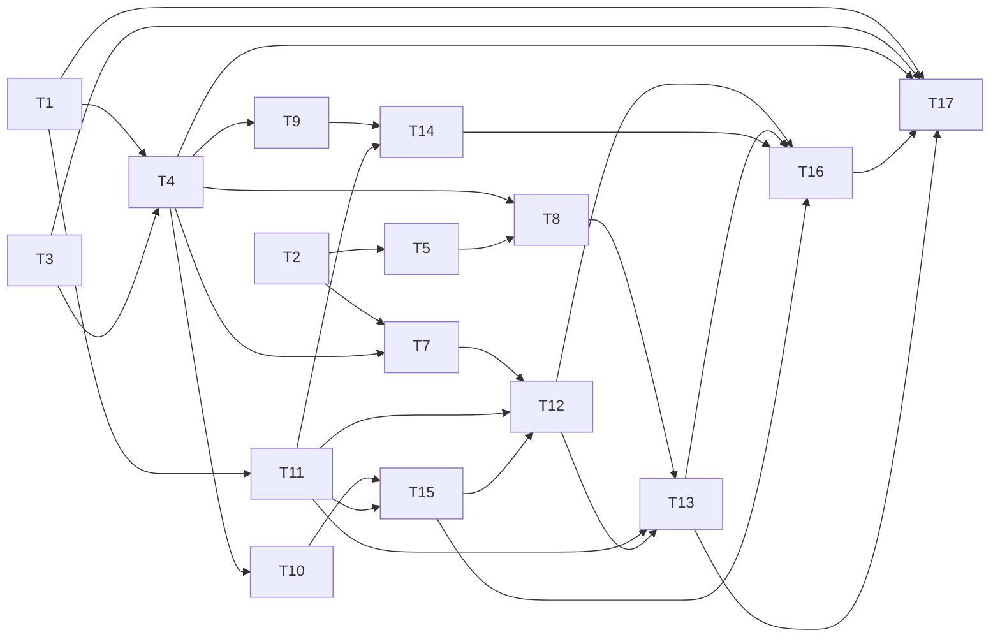

# Optional browser UI rebuild - implementation plan

> **For agentic workers:** SUB-SKILL: use `superpowers:subagent-driven-development` (recommended) or `superpowers:executing-plans` to implement this plan in wave order. Steps use checkbox (`- [ ]`) syntax for tracking.

**Goal:** Rebuild the mcpmem browser UI as an optional React module, served at `/ui`, with all JSON moved under `/ui/api/*`.

**Architecture:** One Rust binary. A Cargo `ui` feature and a `[server] ui` runtime switch gate one root-crate Rust module that embeds built React assets and thin API adapters. The React app is a Vite build with a filesystem-routed shell. OAuth consent stays in the OAuth crate, outside the `ui` feature.

**Tech Stack:** Rust (axum, tower); React 18, TypeScript, Tailwind, shadcn/ui (new-york), lucide-react, Vite; Playwright for browser tests; Python/node scripts for checks.

**Spec:** `docs/superpowers/specs/2026-10-04-optional-ui-rebuild-design.md`. The plan argues from the spec; implementers read both.

## Global Constraints

- Every source file used by `include_str!` or `include_bytes!` stays inside the root crate; keep `scripts/check-crate-includes.sh` green.
- The `--no-default-features` build must not list `reqwest` or `aws*` crates in `cargo tree --no-default-features -e normal`. The `ui` feature adds no HTTP client.
- Run the repository pre-flight from `.omp/AGENTS.md` before any push or `gh pr` step on this branch.
- Use the `OMP_PREFLIGHT_CMD` chain: fmt check, release-version, crate-includes, package, clippy `--all-features -D warnings`, the full test matrix, and the graph-only tree guard.
- Write the marker at the exact pushed HEAD.
- OAuth consent behavior is frozen: intersection-only scope offers, HTML escaping, CSRF, single-use code, deny path. Restyle only.
- Attachment uploads accept only the configured text and PDF MIME types. Show "Other file types coming soon" as static text.
- Do not map `vector_refresh_graph_cache` to a rebuild control. Do not add an index refresh button.
- Dark theme only, sentence case, no emoji, plain hyphen instead of em dash, dates `2026-09-04`, times 24 h.
- ASD-STE100 for every comment, commit message, and doc. Short complete sentences.
- Record tokens burned and approximate cost in every commit message. The repo rule demands it.
- README is the public record of features. Every user-facing change ships its README section in the same change.
- The controller owns git. Subagents never commit, branch, stash, checkout, or rebase.
- Every task ends with its own failing-before / passing-after test cycle and a commit.

## Task Graph & Waves



| Wave | Tasks |
|---|---|
| 0 | 1, 2, 3 |
| 1 | 4, 5, 6 |
| 2 | 7, 8, 9, 10, 11, 15 |
| 3 | 12, 14 |
| 4 | 13 |
| 5 | 16, 17 |

Task 1 builds the frontend toolchain and a placeholder shell. Task 2 adds durable observation IDs, ID-keyed deletes, and an edit operation to the core crate. Task 3 declares the `ui` feature and the runtime switches. Task 4 moves the existing UI handlers into the gated module and re-points every route and test. Tasks 5 and 6 handle vector relation filters and the consent restyle. Tasks 7 to 10 build the new API adapters. Tasks 11 and 15 build the React foundation and the Files feature. Tasks 12, 13, and 14 build the Graph, Search, and Admin screens. Task 17 packages and documents; task 16 adds the browser suite.

---

### Task 1: Frontend build toolchain and asset manifest

**Depends on:** None

**Files:**
- Create: `ui/package.json`, `ui/package-lock.json`, `ui/vite.config.ts`, `ui/tsconfig.json`, `ui/tailwind.config.js`, `ui/postcss.config.js`
- Create: `ui/src/tokens.css` (copy of `designs/mcpmem-ui-handoff/tokens.css`)
- Create: `ui/src/app.tsx`, `ui/src/main.tsx`, `ui/src/index.html`, `ui/src/vite-env.d.ts`
- Create: `ui/scripts/build-ui.mjs`, `ui/scripts/check-ui-manifest.mjs`
- Test: `ui/scripts/check-ui-manifest.mjs`

**Interfaces:**
- Consumes: `designs/mcpmem-ui-handoff/tokens.css`, `designs/mcpmem-ui-handoff/screens/*.html` (as reference).
- Produces: a build command that writes `ui/dist/` and `ui/dist/ui-manifest.json`; the manifest shape every later Rust task reads:
  `{ "files": { "/ui/assets/index-<sha>.js": { "contentType": "text/javascript; charset=utf-8", "bytes": 12345, "sha256": "abc..." }, ... }, "pages": { "graph": "/ui", "search": "/ui/search", "admin": "/ui/admin" } }`

- [ ] **Step 1: Write the failing manifest check**

Create `ui/scripts/check-ui-manifest.mjs`:

```js
import { readFileSync, existsSync } from "node:fs";
const mf = readFileSync("ui/dist/ui-manifest.json", "utf8");
const manifest = JSON.parse(mf);
let failures = 0;
const check = (name, ok, detail) => { console.log(`[${ok ? "PASS" : "FAIL"}] ${name}`); if (!ok) { console.log("  " + detail); failures++; } };
check("manifest exists", manifest.files && typeof manifest.files === "object", mf.slice(0, 200));
for (const [path, meta] of Object.entries(manifest.files || {})) {
  check(`path is under /ui/assets/: ${path}`, path.startsWith("/ui/assets/") && !path.includes(".."), path);
  const disk = path.replace(/^\/ui\//, "ui/dist/");
  check(`file exists: ${disk}`, existsSync(disk), "missing built file");
  const buf = readFileSync(disk);
  check(`sha256 matches: ${path}`, hash(buf) === meta.sha256, meta.sha256);
  check(`content type set: ${path}`, typeof meta.contentType === "string", String(meta.contentType));
}
check("legacy asset names are gone", !Object.keys(manifest.files || {}).some(p => /graph\.css|graph\.js|nav\.css|admin\.js|admin\.css/.test(p)), "old names must not be regenerated");
function hash(buf) { /* sha256 hex via node:crypto createHash */ }
process.exit(failures ? 1 : 0);
```

Implement `hash` with `node:crypto`:

```js
import { createHash } from "node:crypto";
function hash(buf) { return createHash("sha256").update(buf).digest("hex"); }
```

- [ ] **Step 2: Run the check to verify it fails**

Run: `node ui/scripts/check-ui-manifest.mjs`
Expected: FAIL with "manifest exists" (no build output yet).

- [ ] **Step 3: Write the build scaffold**

Create `ui/package.json` with the exact dependencies (pinned by the lockfile commit):

```json
{
  "name": "mcpmem-ui",
  "private": true,
  "type": "module",
  "scripts": {
    "build": "vite build && node scripts/build-ui.mjs",
    "check": "node scripts/check-ui-manifest.mjs && tsc --noEmit"
  },
  "dependencies": {
    "react": "^18.3.1",
    "react-dom": "^18.3.1",
    "lucide-react": "^0.468.0",
    "class-variance-authority": "^0.7.1",
    "clsx": "^2.1.1",
    "tailwind-merge": "^2.6.0"
  },
  "devDependencies": {
    "@types/react": "^18.3.5",
    "@types/react-dom": "^18.3.0",
    "@vitejs/plugin-react": "^4.3.4",
    "tailwindcss": "^3.4.15",
    "postcss": "^8.4.47",
    "autoprefixer": "^10.0.1",
    "typescript": "^5.6.3",
    "vite": "^6.0.0"
  }
}
```

Create `ui/vite.config.ts` with the filesystem page router:

```ts
import { defineConfig } from "vite";
import react from "@vitejs/plugin-react";

export default defineConfig({
  plugins: [react()],
  base: "/ui/",
  build: {
    outDir: "dist",
    emptyOutDir: true,
    assetsDir: "assets",
    rollupOptions: { output: { entryFileNames: "assets/index-[hash].js", assetFileNames: "assets/[name]-[hash][extname]" } }
  },
  server: { port: 4173, strictPort: true }
});
```

Create the placeholder shell in `ui/src/main.tsx`, `ui/src/app.tsx`, `ui/src/index.html`. The shell renders a `<main>Loading shell</main>` with a link to `/ui/search`; it compiles and builds. Copy `tokens.css` into `ui/src/tokens.css`.

Create `ui/scripts/build-ui.mjs` to walk `ui/dist/assets/*` and write `ui-manifest.json` with the shape from `Interfaces`:

```js
import { globSync, readFileSync, writeFileSync } from "node:fs";
import { createHash } from "node:crypto";
const files = globSync("ui/dist/assets/*").map(p => {
  const buf = readFileSync(p);
  const name = p.split("/").pop();
  const contentType = name.endsWith(".js") ? "text/javascript; charset=utf-8"
    : name.endsWith(".css") ? "text/css; charset=utf-8" : "application/octet-stream";
  return [`/ui/assets/${name}`, { contentType, bytes: buf.length, sha256: createHash("sha256").update(buf).digest("hex") }];
});
writeFileSync("ui/dist/ui-manifest.json", JSON.stringify({
  files: Object.fromEntries(files),
  pages: { graph: "/ui", search: "/ui/search", admin: "/ui/admin" }
}, null, 2));
```

- [ ] **Step 4: Run the build and the check**

Run: `cd ui && npm install && npm run build && npm run check`
Expected: PASS on every manifest check; `ui/dist/ui-manifest.json` present.

- [ ] **Step 5: Commit**

```bash
git add ui/package.json ui/package-lock.json ui/vite.config.ts ui/tsconfig.json ui/tailwind.config.js ui/postcss.config.js ui/src ui/scripts
git commit -m "build: scaffold the React UI toolchain"
```

Annotate the commit with tokens burned and approximate cost, per the repo rule.

---

### Task 2: Durable observation IDs, ID-keyed deletes, and edit

**Depends on:** None

**Files:**
- Modify: `crates/mcpmem-core/src/types.rs:70-90`, `crates/mcpmem-core/src/graph.rs:21-22,128,2099-2112`, `crates/mcpmem-core/src/mutation.rs:255-330,815-830,1292-1310,1359-1375`
- Test: `crates/mcpmem-core/tests/observation_ids.rs` (new)

**Interfaces:**
- Consumes: existing `Observation` struct and `MutationService::apply_with_result`.
- Produces:
  - `Observation { body, created_at_us, occurred_at_us, origin_entity_name, observation_id: Option<i64> }`, serialized as `observationId` in camelCase JSON, `#[serde(default, skip_serializing_if = "Option::is_none")]`.
  - `MutationRequest::EditObservation { entityName, observationId, body, occurredAtUs }`
  - `MutationRequest::DeleteObservationById { entityName, observationId }`
  - `MutationRequest::DeleteRelationObservationById { from, to, relationType, observationId }`
  - `MutationService::edit_observation(...)`, `delete_observation_by_id(...)`, `delete_relation_observation_by_id(...)`.

- [ ] **Step 1: Write the failing tests**

Create `crates/mcpmem-core/tests/observation_ids.rs`:

```rust
#[test]
fn observation_id_round_trips_through_node_read() {
    // create entity with two equal observation bodies, read back via
    // GraphHandle::get_entity, assert distinct observationId values.
}

#[test]
fn delete_observation_by_id_removes_only_the_target_duplicate() {
    // two equal bodies, delete by the second id, read back: exactly one left.
}

#[test]
fn edit_observation_preserves_created_at_and_origin() {
    // add observation with occurred_at_us, edit body via EditObservation,
    // assert created_at_us and origin_entity_name unchanged, body replaced,
    // and FTS finds the new body while the old body text is not a hit.
}

#[test]
fn relation_observation_delete_by_id_targets_one_row() {
    // add two equal relation observations, delete one by id, read the
    // relation detail: exactly one remains.
}
```

Adapt names to the crate's existing test conventions from `crates/mcpmem-core/tests/`.

- [ ] **Step 2: Run the tests to verify they fail**

Run: `cargo test -p mcpmem-core --test observation_ids -- --test-threads=1`
Expected: FAIL with "no field named observation_id" or "unknown variant EditObservation".

- [ ] **Step 3: Extend the wire types**

In `types.rs`, add `observation_id: Option<i64>` to `Observation` with:

```rust
#[serde(default, skip_serializing_if = "Option::is_none")]
pub observation_id: Option<i64>,
```

- [ ] **Step 4: Select ids in every browser JSON projection**

In `graph.rs:22`, change `OBSERVATION_JSON` to include `'observationId',o.id`. In the relation detail projection around `graph.rs:2099-2112`, add `'observationId',ro.id`. In `relation_details` around `graph.rs:128`, add `ro.id`. Do not change the MCP `EntitySnapshot` shape; it continues to omit the field and its deserializer must tolerate the absent field (same as `attributes`).

- [ ] **Step 5: Add the ID-keyed mutations**

In `mutation.rs`, add the three enum variants to `MutationRequest`, parse them, and implement:

```rust
pub fn edit_observation(&self, graph: &GraphHandle, entity: &str, obs_id: i64, body: &str, occurred_at_us: Option<i64>) -> Result<(), MCSError>
```

The body of `edit_observation` runs inside the existing `TxGuard` transaction:

```sql
UPDATE observation SET body=?1, occurred_us=?2 WHERE id=?3 AND entity_id=?4
```

Then update the FTS index explicitly, because `obs_fts` has an insert trigger but no update trigger:

```sql
INSERT INTO obs_fts(obs_fts, rowid, body) VALUES ('delete', ?3, old_body);
INSERT INTO obs_fts(rowid, body) VALUES (?3, ?1);
```

Run `update_counters` and the existing change-event emission path. Implement `delete_observation_by_id` with `DELETE FROM observation WHERE id=?1 AND entity_id=?2` and `delete_relation_observation_by_id` with `DELETE FROM relation_observation WHERE id=?1 AND relation_id=(SELECT id FROM taxonomy_relation WHERE from_id=?2 AND to_id=?3 AND type_id=?4 AND deleted=0)`, both inside the transaction with FTS deletes.

- [ ] **Step 6: Run the tests to verify they pass**

Run: `cargo test -p mcpmem-core --test observation_ids -- --test-threads=1`
Expected: PASS on all four tests.

- [ ] **Step 7: Commit**

```bash
git add crates/mcpmem-core/src/types.rs crates/mcpmem-core/src/graph.rs crates/mcpmem-core/src/mutation.rs crates/mcpmem-core/tests/observation_ids.rs
git commit -m "feat: add observation ids with keyed delete and edit"
```

Annotate the commit with tokens burned and approximate cost.

---

### Task 3: The `ui` feature and the runtime switches

**Depends on:** None

**Files:**
- Modify: `Cargo.toml:94-111`, `src/lib.rs:57-108`, `src/config_file.rs:273-285,418-456`, `src/config.rs:10-70,418-484`
- Test: `tests/config_file.rs` (extend), `tests/ui_switches.rs` (new)

**Interfaces:**
- Consumes: existing `ExplicitArgs` precedence rules.
- Produces:
  - Cargo feature `ui = []`; `default = ["code", "oauth", "ui"]`.
  - CLI: `--ui true|false` (explicit value only; when absent, the compiled feature decides the default).
  - TOML: `[server] ui = true|false`.
  - `Config.ui_enabled: bool`.
  - A startup refusal for an explicit `--ui true` or a file true in a build without the `ui` feature. Mirror the OAuth refusal in `src/config.rs:301-320`.

- [ ] **Step 1: Write the failing switch tests**

Create `tests/ui_switches.rs`:

```rust
#[test]
fn ui_defaults_on_when_feature_present() {
    // Config::default().ui_enabled == true when built with the ui feature.
}

#[test]
fn config_file_turns_ui_off_and_cli_overrides() {
    // [server] ui = false in a config file applied to empty args -> ui_enabled false.
    // Same file + --ui true on the command line -> ui_enabled true.
}

#[test]
fn explicit_ui_true_without_feature_refuses_startup() {
    // Mirrors tests/oauth_config.rs:683-695: build a Config in a
    // cfg(not(feature = "ui")) test that requests ui_enabled and assert
    // the named refusal error.
}
```

The third test must be wrapped in `#[cfg(not(feature = "ui"))]` and the file compiled for `--no-default-features` in the wave integration run.

- [ ] **Step 2: Run the tests to verify they fail**

Run: `cargo test --test ui_switches --test config_file -- --test-threads=1`
Expected: FAIL (no `--ui` argument, unknown `[server]` key `ui`).

- [ ] **Step 3: Declare the feature and add the CLI flag**

In `Cargo.toml`:

```toml
ui = []
default = ["code", "oauth", "ui"]
```

In `src/lib.rs` `Args`, after `legacy_observations`:

```rust
/// Embed and serve the optional browser UI under /ui.
#[arg(long, action = clap::ArgAction::Set, value_parser!(bool))]
pub ui: Option<bool>,
```

The field carries no default: `None` means the compiled feature decides. clap has no bool `ValueEnum`; `Set` plus a bool value parser gives the `--ui true|false` value flag. The prior plan text used `default_value_t = true`; that default is unconditional and made every `--no-default-features` startup refuse. Corrected in task 3, fix round 1.

- [ ] **Step 4: Add the TOML key and merge**

In `config_file.rs` `ServerSection`, add `pub ui: Option<bool>`. In `apply`, follow the existing `legacy_observations` pattern:

```rust
assign(&mut args.ui, server.ui, cli.absent("ui"));
```

- [ ] **Step 5: Add the runtime field and the refusal**

In `config.rs`, add `pub ui_enabled: bool` to `Config`, resolve it as `args.ui.unwrap_or(cfg!(feature = "ui"))`, and add the refusal in `from_args`. The refusal fires only on an explicit enable:

```rust
#[cfg(not(feature = "ui"))]
if args.ui == Some(true) {
    return Err(... "the ui build feature is not compiled into this binary");
}
```

The `Config::default()` constructor arms `ui_enabled: true` under `cfg(feature = "ui")` and `false` under `cfg(not(feature = "ui"))`, so a no-feature default build starts with the UI off.

- [ ] **Step 6: Run the tests to verify they pass**

Run: `cargo test --test ui_switches --test config_file -- --test-threads=1`
Expected: PASS on all switch tests.

- [ ] **Step 7: Commit**

```bash
git add Cargo.toml src/lib.rs src/config_file.rs src/config.rs tests/ui_switches.rs tests/config_file.rs
git commit -m "feat: add the optional ui feature and runtime switch"
```

Annotate the commit with tokens burned and approximate cost.

---

### Task 4: Move the UI handlers into the gated module

**Depends on:** Task 1, Task 3

**Files:**
- Create: `src/ui/mod.rs`, `src/ui/assets.rs`, `src/ui/pages.rs`, `src/ui/api/graph.rs`, `src/ui/api/search.rs`, `src/ui/api/admin.rs`, `src/ui/api/attachments.rs`, `tests/ui_router.rs` (new)
- Modify: `src/http.rs:71-86,273-349,129-267`, `src/oauth_routes.rs:251-297`, `src/server.rs:606-645`, `src/main.rs`
- Delete: `src/ui/index.html`, `src/ui/graph.css`, `src/ui/graph.js`, `src/ui/admin.html`, `src/ui/admin.js`, `src/ui/admin.css`, `src/ui/nav.css`, `tests/ui_graph_defects.test.mjs`
- Re-point tests: `tests/ui_http.rs`, `tests/principal_admin.rs`, `tests/attachment_http.rs`, `tests/webhook_admin.rs`, `tests/repo_admin.rs`, `tests/workspace_http.rs`, `tests/oauth_flow.rs`

**Interfaces:**
- Consumes: `ui/dist/ui-manifest.json` from Task 1, `Config.ui_enabled` from Task 3.
- Produces:
  - `crate::ui::attach(router, state) -> Router<HttpState>`, registered from `http.rs` only under `#[cfg(feature = "ui")]`; it self-checks `state.ui_enabled` and returns the input router unchanged when off.
  - `HttpState.ui_enabled: bool`, plumbed through `HttpRunConfig`, `TestSetup`, `Config`.
  - Routes moved verbatim to new paths. The workspace, graph, node, expand, relation, search, and attachment reads move under `/ui/api/*`.
  - The principal, waitlist, webhooks, and repository admin routes move under `/ui/api/*` too. Keep their existing gates and payloads.
  - Add `GET /ui/api/relation` as a thin wrapper that selects one triple via the existing relation search.
  - Page routes: `GET /ui`, `GET /ui/search`, `GET /ui/admin`, `GET /ui/admin/callback`, `GET /ui/assets/*` (from the manifest).
  - OAuth client seeding gated on `ui_enabled` at runtime AND the compiled feature.

- [ ] **Step 1: Write the failing router-matrix tests**

Create `tests/ui_router.rs`:

```rust
fn spawn(bin: &[[&str]], bearer: Option<&str>) -> TestServer;

#[test]
fn pages_and_assets_serve_with_runtime_ui_on() {
    // spawn with --enable-all and config [server] ui=true;
    // GET /ui, /ui/search, /ui/admin -> 200 text/html;
    // every manifest path -> 200 with the manifest content type.
}

#[test]
fn legacy_json_urls_are_gone() {
    // GET /ui/graph, /ui/node, /ui/workspaces, /ui/attachments with a valid
    // graph-read token -> 404, not JSON. /ui/search is a page now: it returns
    // 200 text/html with no JSON envelope (corrected per the design; the
    // first brief text wrongly listed it among the legacy JSON URLs).
}

#[test]
fn data_moves_under_api() {
    // GET /ui/api/graph?workspaceId=.. and /ui/api/search?q=.. with a valid
    // graph-read token -> 200 JSON with the spec envelope.
}

#[test]
fn runtime_ui_off_returns_404_everywhere() {
    // spawn with [server] ui=false and a full admin+graph token;
    // every page, asset, and /ui/api/* route -> 404.
}
```

The last three tests must also run in a `--no-default-features` build; gate them with `#[cfg(feature = "ui")]` and add a companion test that asserts the routes are absent when the feature is gone, in a `#[cfg(not(feature = "ui"))]` block.

Add `ui_switches`-style startup tests: `--ui true` without the feature refuses (already in Task 3); with the feature and `ui=false`, the OAuth store does not seed new browser clients.

- [ ] **Step 2: Run the tests to verify they fail**

Run: `cargo test --test ui_router -- --test-threads=1`
Expected: FAIL (routes still at the old paths, no `/ui/api/*`).

- [ ] **Step 3: Embed the built assets from the manifest**

In `src/ui/assets.rs`, load the manifest at build time. A checked-in generated include keeps the literal-include guard green:

```rust
const MANIFEST: &str = include_str!("ui/dist/ui-manifest.json");
```

Parse `MANIFEST` at startup into `Vec<(String, AssetMeta)>`; resolve each `/ui/assets/*` path to `include_bytes!` in one const table generated to match the manifest exactly:

```rust
const UI_ASSET_BYTES: &[(&str, &[u8])] = &[
    ("index-[sha].js", include_bytes!("ui/dist/assets/index-[sha].js")),
];
```

Update `scripts/check-crate-includes.sh` expectations only if the pattern changes. Every literal path must stay under the root crate.

- [ ] **Step 4: Move the handlers and route table**

Move the viewer, admin, and attachment handler code from `src/http.rs` into the four `api/*` files and `pages.rs`. Change only the URL prefix and add the `GET /ui/api/relation` adapter. Rewrite `src/http.rs` to keep only `/mcp`, `/`, auth resolution, response layers, and:

```rust
#[cfg(feature = "ui")]
let router = crate::ui::attach(router, &state);
```

`crate::ui::attach` checks `state.ui_enabled` and registers pages, assets, and the four API groups. When `ui_enabled` is false it returns the router untouched, so every `/ui/*` path is an ordinary 404.

- [ ] **Step 5: Plumb the switch and gate the OAuth seeding**

Add `ui_enabled` to `HttpRunConfig`, `HttpState`, and `TestSetup`. In `oauth_routes.rs`, seed the two reserved browser clients only when the caller supplies the UI-enabled flag. `OauthState::open` keeps its signature; `server.rs` passes the resolved flag. Existing stored client rows are never deleted when the flag is off.

- [ ] **Step 6: Delete the old shell and re-point the tests**

Delete `src/ui/*` and `tests/ui_graph_defects.test.mjs`. Update the affected tests to the new URLs:

- `tests/ui_http.rs:434-500`: replace `test_ui_shell_served_as_html` and `test_ui_assets_served_with_content_types` with assertions against the React shell and the manifest asset contract.
- Data and gate tests: move every old `/ui/*` JSON call to its `/ui/api/*` counterpart. The mapping list is search, graph, node, expand, workspaces, and `attachments*`.
- `tests/oauth_flow.rs`, `tests/principal_admin.rs`: keep the exact redirect URIs; update only the data URLs they call.

- [ ] **Step 7: Run the re-pointed suites and the matrix**

Run:
`cargo test --test ui_router --test ui_http --test principal_admin --test attachment_http --test workspace_http --test oauth_flow -- --test-threads=1`
Expected: PASS. Then run the no-default route absence test once in the wave integration.

- [ ] **Step 8: Commit**

```bash
git add src/ui src/http.rs src/oauth_routes.rs src/server.rs src/main.rs tests
git rm -r src/ui tests/ui_graph_defects.test.mjs 2>/dev/null || true
git commit -m "refactor: gate the browser UI as an optional Rust module"
```

Annotate the commit with tokens burned and approximate cost.

---

### Task 5: Structured relation hits and pre-rank triple filters

**Depends on:** Task 2

**Files:**
- Modify: `src/vector_store.rs:1265-1292`, `src/vector_actions.rs:41-69,100-155,483-505`, `crates/mcpmem-core/src/graph.rs:1215-1274` (filter reuse)
- Test: `tests/semantic_search.rs` (extend), `tests/vector_triple_filters.rs` (new)

**Interfaces:**
- Consumes: `SearchFilter` and the `resolve_owner` query in `vector_store.rs`.
- Produces:
  - `RelationOwner { from: String, to: String, relation_type: String }` resolved from a relation owner id.
  - `SearchFilter.from: Option<String>`, `SearchFilter.to: Option<String>`, `SearchFilter.relation_type: Option<String>`; all applied before ranking and before the candidate pool truncation in both `search_best_chunks` and `rank_chunks`.
  - Vector result rows for `kind == "relation"` carry `{from,to,relationType}` instead of the formatted `"f -> T -> t"` name string.

- [ ] **Step 1: Write the failing tests**

Create `tests/vector_triple_filters.rs`:

```rust
// 1. relation hit carries a structured triple, and the old formatted name
//    string does not appear anywhere in the row.
// 2. from/to/relationType filters exclude a relation before ranking:
//    seed two relations A->B and C->D of the same type, filter from=C,
//    assert only the C->D relation can appear and k is honored after filter.
// 3. the filter applies before the fetch_k pool, not after: seed more than
//    fetch_k candidates, filter to one, assert that one still ranks.
```

Extend `tests/semantic_search.rs` in the style of the existing `filter_selects_kind_and_type_before_ranking` test.

- [ ] **Step 2: Run the tests to verify they fail**

Run: `cargo test --test vector_triple_filters --test semantic_search -- --test-threads=1`
Expected: FAIL (no `from`/`to` fields; formatted name present).

- [ ] **Step 3: Resolve relation rows to triples**

In `vector_store.rs`, add `pub fn resolve_relation_owner(&self, owner_id: i64) -> Result<Option<RelationOwner>, _>` alongside `resolve_owner`, reusing the existing join. `resolve_owner` for `OwnerKind::Relation` returns the triple fields; the caller in `vector_actions.rs` builds the row with `from`, `to`, `relationType`.

- [ ] **Step 4: Carry triple filters through the search path**

Add the three fields to `SearchFilter` in `vector_actions.rs`, parse them in `parse_filter`, and pass them into `search_best_chunks` and `rank_chunks`. In `rank_chunks`, when a filter field is present, resolve the relation owner by `sv.owner_id` and check before the pool is truncated:

```rust
if let Some(want) = params.filter.as_ref().and_then(|f| f.from.as_deref())
    && rel_owner.as_deref().map(|o| o.from.as_deref()).as_deref() != Some(want)
{ continue; }
```

- [ ] **Step 5: Run the tests to verify they pass**

Run: `cargo test --test vector_triple_filters --test semantic_search -- --test-threads=1`
Expected: PASS.

- [ ] **Step 6: Commit**

```bash
git add src/vector_store.rs src/vector_actions.rs crates/mcpmem-core/src/graph.rs tests
git commit -m "feat: resolve relation triples and filter before rank"
```

Annotate the commit with tokens burned and approximate cost.

---

### Task 6: Restyle the OAuth consent page

**Depends on:** None

**Files:**
- Modify: `crates/mcpmem-oauth/src/consent.html`, `crates/mcpmem-oauth/src/consent_scope.html`, `crates/mcpmem-oauth/src/consent.rs:215-250`

**Interfaces:**
- Consumes: the handoff screen `designs/mcpmem-ui-handoff/screens/05-oauth-consent.html` and `tokens.css`.
- Produces: the same server-rendered consent flow with the dark handoff look; no behavior change.

- [ ] **Step 1: Write the failing style contract test**

Extend `tests/oauth_consent.rs` with an assertion that the rendered page carries the handoff surface markers: wordmark element, scope-card rows, dimension tokens. Keep every existing behavioral assertion green.

- [ ] **Step 2: Run the tests to verify they fail**

Run: `cargo test --test oauth_consent -- --test-threads=1`
Expected: the new assertion FAILs (old markup), existing tests PASS (proves no behavior regression yet).

- [ ] **Step 3: Restyle the templates**

Apply the tokens.css variables and the handoff layout to `consent.html` and `consent_scope.html`. Preserve these details byte-for-byte: the `action="consent"` form, hidden `csrf` and `state`, and the requested-scope intersection rows. Also keep the Deny and Approve buttons, the escaping of client name and destination, and the relative form post. Add the signed-in identity and revocation note from the handoff. Do not add a workspace dropdown or an account switch. Keep all styles inside the OAuth crate.

- [ ] **Step 4: Run the tests to verify they pass**

Run: `cargo test --test oauth_consent -- --test-threads=1`
Expected: PASS on every assertion.

- [ ] **Step 5: Commit**

```bash
git add crates/mcpmem-oauth/src/consent.html crates/mcpmem-oauth/src/consent_scope.html crates/mcpmem-oauth/src/consent.rs tests/oauth_consent.rs
git commit -m "style: restyle the OAuth consent page to the handoff"
```

Annotate the commit with tokens burned and approximate cost.

---

### Task 7: Browser mutation gateway

**Depends on:** Task 2, Task 4

**Files:**
- Create: `src/ui/api/mutations.rs`, `tests/ui_mutations.rs` (new)
- Create: `crates/mcpmem-core/src/mutation.rs` additions (see Controller ruling)
- Modify: `src/ui/mod.rs` (register the mutations routes)

**Controller ruling (2026-10-04, ledger):** Task 2 implemented `editObservation` and the ID-keyed deletes only. `reverseRelation` and `changeRelationType` do not exist in core. The gateway cannot dispatch to them. Task 7 therefore ALSO implements the two atomic triple mutations in `mcpmem-core`:

- `MutationRequest::ReverseRelation` / `ChangeRelationType`, payloads `{from,to,relationType}` and `{from,to,relationType,newRelationType}` (snake_case variants in the real enum).
- Both run inside one `TxGuard` transaction. Insert a fresh UNIQUE mirror row. Never use the `ON CONFLICT DO UPDATE` upsert, which would resurrect a tombstoned triple with the old id. Update the physical relation row, re-home `relation_observation.relation_id` and `attribute.owner_id` children, tombstone the old mirror, and re-enqueue both chunk jobs.
- A self-loop reverse is a no-op with a named error.
- `ChangeRelationType` to the identical triple is a no-op.
- Tests cover: swap with observations and attributes preserved; the old triple gone; a failed create rolls back and never deletes the old triple; self-loop no-op; duplicate-target conflict returns 409-equivalent.
- Controller ruling 2 (2026-10-04, post-review): reverse and retype MUST be invertible. When the target triple exists only as a tombstoned mirror row (deleted=1), delete that tombstone first, then apply the fresh UNIQUE insert. This is not an upsert and does not resurrect the old id; it lets a UI undo-reverse or re-change-type back to the original triple. Add round-trip tests for both operations.

**Interfaces:**
- Consumes: `MutationService` request variants from Task 2; the auth helpers and `workspace_failure` mapping from `http.rs`.
- Produces: `POST /ui/api/mutations` with body `{workspaceId, operation, payload}`.
  - The operation and payload pairs come from the spec contract table. The values are:

    ```text
    createEntity | renameEntity | mergeEntities | deleteEntity | createRelation | deleteRelation | reverseRelation | changeRelationType | setEntityAttributes | deleteEntityAttributes | setRelationAttributes | deleteRelationAttributes | addObservation | deleteObservation | editObservation | addRelationObservation | deleteRelationObservation
    ```
  - Every relation operation carries `{from,to,relationType}`.
  - Errors use the `{code,message}` contract; unknown and denied workspaces both map to 404.

- [ ] **Step 1: Write the failing mutation tests**

Create `tests/ui_mutations.rs`:

```rust
// writer creates an entity and adds an observation -> 200, read back matches.
// reader POSTs a mutation -> 403.
// writer without graph-write scope -> 403 before any workspace lookup.
// deleteObservation targets one of two equal bodies by id.
// editObservation preserves createdAtUs and originEntityName.
// reverseRelation swaps from/to atomically; observations and attributes
//   follow the triple; the old triple no longer exists.
// changeRelationType re-types in one transaction; self-loop reverse no-ops.
// named-conflict createRelation -> 409 with a safe message.
// unknown operation -> 400; unknown/denied workspace -> 404, same body.
```

- [ ] **Step 2: Run the tests to verify they fail**

Run: `cargo test --test ui_mutations -- --test-threads=1`
Expected: FAIL (route not found, 404).

- [ ] **Step 3: Implement the adapter**

In `mutations.rs`, parse `operation` as a tagged enum. Validate the payload per the spec table. Check `graph-write` scope and `WorkspaceAccess::Write`. Dispatch to the shared `MutationService` paths. `reverseRelation` uses the mirror-preserving transaction from Task 2's plan; a failed create is rolled back and never deletes the old triple. Map `WorkspaceError::AccessDenied | NotFound` to 404, name conflicts to 409, invalid payload to 400, missing scope to 403.

- [ ] **Step 4: Register the route**

In `src/ui/mod.rs`, add `router = crate::ui::api::mutations::attach(router);` inside the `ui_enabled` branch. The adapter's attach takes the router only, matching every sibling adapter; it reads capability state from `HttpState` where it needs a gate.

- [ ] **Step 5: Run the tests to verify they pass**

Run: `cargo test --test ui_mutations -- --test-threads=1`
Expected: PASS on every assertion in the matrix.

- [ ] **Step 6: Commit**

```bash
git add src/ui/api/mutations.rs src/ui/mod.rs tests/ui_mutations.rs
git commit -m "feat: add the browser mutation gateway"
```

Annotate the commit with tokens burned and approximate cost.

---

### Task 8: Search API modes

**Depends on:** Task 4, Task 5

**Files:**
- Modify: `src/ui/api/search.rs` (replaces the moved direct-search handler)
- Test: `tests/ui_search_modes.rs` (new)

**Interfaces:**
- Consumes: `GraphHandle::search_nodes_filtered` and `search_relations`; the vector paths from Task 5; the attachments-consent rule.
- Produces:
  - `GET /ui/api/search?workspaceId&q&mode&scope&type?&from?&to?&relationType?&k?` with `mode ∈ {direct, semantic, hybrid}`, `scope ∈ {nodes, relations}`, `k ∈ {10,20,50}`.
  - Response `{ results: SearchHit[], count, elapsedMs }` per the spec tagged union.
  - Semantic mode embeds the query server-side; hybrid uses the server embedding plus fusion.
  - Attachment hits only when the token has `vectors` AND `attachments` scope; else excluded before ranking.
  - 503 with `{code:"unavailable",...}` when the requested mode's profile or provider is not usable.
  - From/to/relationType filters apply before ranking and `k`.

- [ ] **Step 1: Write the failing mode tests**

Create `tests/ui_search_modes.rs`:

```rust
// direct nodes: q matches name FTS; envelope matches the spec.
// direct relations: q matches relation-observation FTS; hit has from/to/relationType.
// semantic: with a fake provider configured, embedding call happens and a
//   relation hit returns the structured triple.
// hybrid: returns textScore/vecScore when fusion applies.
// unavailable: no serving profile -> 503 for semantic and hybrid, direct still works.
// attachments: with vectors+attachments scope a file hit appears; with
//   vectors only it is excluded before topK and no excerpt leaks.
// filters: from/to/relationType filter before k on the candidate pool.
```

Follow the fixture patterns in `tests/semantic_search.rs` and `tests/vector_e2e.rs`.

- [ ] **Step 2: Run the tests to verify they fail**

Run: `cargo test --test ui_search_modes -- --test-threads=1`
Expected: FAIL (route absent or old shape).

- [ ] **Step 3: Implement the mode dispatcher**

Rewrite the search handler as a mode dispatcher. Direct builds one response from node and relation FTS. Semantic and hybrid share the adapted vector path from Task 5; the adapter converts vector rows into `SearchHit` rows and never parses a formatted name. Attachment candidates are dropped before ranking when the token lacks `attachments` scope. Wrap profile misuse in the 503 mapping.

- [ ] **Step 4: Run the tests to verify they pass**

Run: `cargo test --test ui_search_modes -- --test-threads=1`
Expected: PASS.

- [ ] **Step 5: Commit**

```bash
git add src/ui/api/search.rs tests/ui_search_modes.rs
git commit -m "feat: add direct, semantic, and hybrid search modes"
```

Annotate the commit with tokens burned and approximate cost.

---

### Task 9: Admin API additions

**Depends on:** Task 4

**Files:**
- Modify: `src/ui/api/admin.rs` (the moved admin handlers)
- Test: `tests/ui_admin_workspaces.rs` (new), extend `tests/workspace_http.rs`

**Interfaces:**
- Consumes: the moved admin handlers from Task 4; `WorkspaceRegistry::grant/revoke/set_visibility/grants`; `vector_store` stats.
- Produces:
  - `GET|POST /ui/api/workspaces` (list accessible + create)
  - `GET /ui/api/workspaces/{id}`, `PATCH /ui/api/workspaces/{id}` with body `{visibility}`
  - `GET|POST /ui/api/workspaces/{id}/grants` with `{principalId, role}`; `DELETE /ui/api/workspaces/{id}/grants/{principalId}`
  - `GET /ui/api/vectors/stats?workspaceId`
  - All existing admin handlers unchanged in behavior at their new paths.

- [ ] **Step 1: Write the failing tests**

Create `tests/ui_admin_workspaces.rs`:

```rust
// a workspace owner without the admin scope lists, grants, revokes, and
// flips visibility on their own workspace.
// an admin who does not own the workspace cannot list its grants, grant,
//   revoke, or change visibility (404 semantics, no leak).
// a non-owner reader cannot create a workspace grant list for a workspace
//   they can read.
// create_workspace with a duplicate name -> 409.
// vector stats require vectors scope and a usable profile; missing profile
//   returns 503; stats contain only measured fields.
```

Extend `tests/workspace_http.rs` for the visibility toggle path.

- [ ] **Step 2: Run the tests to verify they fail**

Run: `cargo test --test ui_admin_workspaces --test workspace_http -- --test-threads=1`
Expected: FAIL (routes absent).

- [ ] **Step 3: Implement the adapters**

Add the workspace and vector-stats adapters to `admin.rs`, wrapping the existing registry and stats services. Keep the owner-only checks in the registry; the adapter never substitutes `admin` for ownership. Use the shared `workspace_failure` mapping.

- [ ] **Step 4: Run the tests to verify they pass**

Run: `cargo test --test ui_admin_workspaces --test workspace_http -- --test-threads=1`
Expected: PASS.

- [ ] **Step 5: Commit**

```bash
git add src/ui/api/admin.rs tests/ui_admin_workspaces.rs tests/workspace_http.rs
git commit -m "feat: add workspace and vector admin adapters"
```

Annotate the commit with tokens burned and approximate cost.

---

### Task 10: Attachment adapter completion

**Depends on:** Task 4

**Files:**
- Modify: `src/ui/api/attachments.rs`
- Test: `tests/ui_attachment_http.rs` (new); re-point `tests/attachment_http.rs` already done in Task 4

**Interfaces:**
- Consumes: the moved attachment handlers from Task 4; `attachment_limits` and the configured MIME allowlist.
- Produces: `/ui/api/attachments` list/upload, `/{id}` metadata/delete, `/{id}/pages`, `/{id}/download`, unchanged semantics at the new base; responses expose only measured fields (`status` with the values `uploaded`/`extracting`/`ready`/`error`, `errorStage`, `pageCount`).

- [ ] **Step 1: Write the failing tests**

Create `tests/ui_attachment_http.rs`:

```rust
// upload raw body with filename and entityName at the new base returns
// status "uploaded"; list returns the row; download returns the bytes.
// MIME outside the allowlist -> 415 naming the rule (adapter semantics,
// corrected 2026-10-04: the moved handler answers UNSUPPORTED_MEDIA_TYPE).
// byte 52,428,801 -> 413 with zero body reads.
// workspace budget exhaustion -> 413 (attachment_failure groups Size and
// WorkspaceBudget together; corrected 2026-10-04).
// reader-with-scope upload -> 404 like any denied workspace (denied maps to
// not_found); missing attachments scope -> 403 before any lookup.
// wrong workspace returns 404 and hides existence.
// delete removes the row and frees the bytes.
```

Reuse the fixtures in `tests/attachment_http.rs`.

- [ ] **Step 2: Run the tests to verify they fail**

Run: `cargo test --test ui_attachment_http -- --test-threads=1`
Expected: FAIL until the moved handlers exist. After Task 4 the handlers exist. The remaining failures are the attachment contract checks this task adds. Watch them go green here.

- [ ] **Step 3: Confirm the adapter contract**

Verify the moved handlers expose exactly the measured fields. Add any missing field (for example `pageCount` in list rows) by passing the existing stored values through; never invent an index state or a chunk count.

- [ ] **Step 4: Run the tests to verify they pass**

Run: `cargo test --test ui_attachment_http -- --test-threads=1`
Expected: PASS.

- [ ] **Step 5: Commit**

```bash
git add src/ui/api/attachments.rs tests/ui_attachment_http.rs
git commit -m "test: pin the attachment adapter contract at the api base"
```

Annotate the commit with tokens burned and approximate cost.

---

### Task 10a: Add the approved session adapter

**Depends on:** Tasks 4 and 9

**Files:**
- Create: `src/ui/api/session.rs`, `tests/ui_session.rs`
- Modify: `src/ui/api/mod.rs`, `src/ui/mod.rs`

**Interfaces:**
- Produce `GET /ui/api/session?workspaceId?` with the exact response in the approved design.
- Authenticate with the Authorization header; reject query-token credentials.
- Return the principal's scopes, not the server's enabled categories.
- Return the configured or registered human name for a human credential. Return null when no display name exists.
- Return the resolved workspace role when a workspace is selected or saved. Return null if none is selected.
- Map unknown and denied workspaces to the same 404. Do not infer a role from a paginated workspace list.
- Report server feature availability apart from scopes. Use enabled categories for vectors and attachments.
- Require both the compiled feature and the enabled category for code. Report whether webhook routes are compiled for webhooks.

**Correction, 2026-10-04:** Task 4 moved old handlers, but the old UI had no session endpoint. The React shell cannot infer server availability from credential scopes. Add this adapter before Task 11. Keep the approved response shape unchanged.

- [ ] **Step 1: Write failing HTTP tests**

Cover absent credentials, a query token, human and static credentials, and exact JSON keys. Cover owner, writer, reader, public, and null workspace roles. Compare unknown and denied workspace responses. Verify that scopes and feature flags can differ.

- [ ] **Step 2: Run the new tests to see the route fail**

Run: `cargo test --test ui_session -- --test-threads=1`
Expected: FAIL because `/ui/api/session` does not exist.

- [ ] **Step 3: Add the adapter**

Reuse the principal resolver, workspace registry, and error mapping. Keep the handler in the gated UI module. Do not add a graph-read gate to an admin-only session.

- [ ] **Step 4: Verify the adapter**

Run: `cargo test --test ui_session -- --test-threads=1`
Expected: PASS. Also run the adjacent UI and workspace HTTP tests.

- [ ] **Step 5: Commit**

Commit the four files with the reason, tests, token count, and approximate cost.

---

### Task 10b: Complete the graph detail and page routes

**Depends on:** Task 4

**Files:**
- Modify: `src/ui/api/graph.rs`, `src/ui/pages.rs`, `tests/ui_router.rs`, `ui/src/index.html`
- Create: `tests/ui_graph_detail.rs`

**Interfaces:**
- Add `GET /ui/api/types?workspaceId` with entity and relation type catalogues.
- Return `{entities:[{type,count,desc?}],relations:[{type,count,desc?}]}` from the selected workspace.
- Include registered types with zero members when a description exists.
- Make `GET /ui/api/node` return the approved entity detail with incident triples and degree.
- Use the existing `describe_entity` snapshot instead of inferring adjacency from the graph page.
- Serve the same shell for direct visits to `/ui/admin/*`. Keep the exact OAuth callback route.
- Set the document base for any `/ui/admin/*` subpath, not only the exact registered pages, so an admin subpage reload loads its assets.

**Correction, 2026-10-04:** Task 4 moved only the old graph handlers. It omitted the type catalogue. Its node handler returns `Entity`, which has no incident relations or degree. The graph page cannot construct either fact from one page of nodes. Admin subpaths also return 404 on a direct visit.

- [ ] **Step 1: Write failing HTTP tests**

Cover both type catalogues, descriptions, zero-member types, and selected workspace access. Cover node degree, relation triples, observation IDs, and an absent node. Cover direct Admin subpath reload and the callback.

- [ ] **Step 2: See the tests fail on the partial routes**

Run: `cargo test --test ui_graph_detail --test ui_router -- --test-threads=1`
Expected: FAIL on missing type and Admin subpath routes and incomplete node detail.

- [ ] **Step 3: Implement the graph detail and page routes**

Reuse the viewer scope gate, workspace registry, and core graph snapshot methods. Keep the UI build and runtime gates in `src/ui/mod.rs`.

- [ ] **Step 4: Verify and commit**

Run the two suites above and adjacent graph HTTP tests. Commit the changed files with test results, token count, and approximate cost.

---

### Task 10c: Make browser API errors match the approved envelope

**Depends on:** Tasks 10a and 10b

**Files:**
- Modify: `src/http.rs`, `src/ui/api/graph.rs`, `src/ui/api/admin.rs`, `src/ui/api/attachments.rs`, `src/ui/api/session.rs`
- Modify as needed: `src/ui/api/search.rs`, `src/ui/api/mutations.rs`, `src/ui/api/mod.rs`, `src/ui/mod.rs`
- Test: `tests/ui_error_contract.rs` (new); update existing UI HTTP assertions that read `error`.

**Interfaces:**
- Known `/ui/api/*` routes return every non-success body as `{code,message}`.
- Preserve HTTP status values and the exact `WWW-Authenticate` challenge on 401 and scope 403.
- Use stable snake-case codes for each status. Preserve existing `forbidden` and `permission_denied` codes where the UI already emits them. Use `unauthorized`, `insufficient_scope`, `bad_request`, `not_found`, `conflict`, `request_timeout`, `payload_too_large`, `unsupported_media_type`, `unavailable`, or `internal_error` elsewhere.
- Keep unknown and denied workspace errors identical. Do not include internal storage details in a 5xx message.
- Do not change MCP or OAuth transport response bodies. Do not remove the static query-token fallback used by scripts.

**Correction, 2026-10-04:** The old shared HTTP helper emits `{error}`. Several moved UI handlers also return plain text. A browser fallback would hide the mismatch and break one error contract across screens. Correct the UI responses at their server boundary.

- [ ] **Step 1: Write failing error-contract tests**

Probe authentication, scope, input, hidden workspace, conflict, MIME, byte cap, and unavailable service responses. Assert the status, code, message, and challenge header where one applies. Keep a positive request beside a hidden-workspace test.

- [ ] **Step 2: See the tests fail**

Run: `cargo test --test ui_error_contract -- --test-threads=1`
Expected: FAIL on `{error}` and plain-text UI bodies.

- [ ] **Step 3: Normalize UI errors**

Use one UI error helper for the shared shape. Migrate browser adapter call sites and old UI error assertions. Leave the MCP and OAuth challenge bodies unchanged.

- [ ] **Step 4: Verify and commit**

Run the new suite and affected UI HTTP suites. Commit the changed files with test results, token count, and approximate cost.

---


### Task 11: React foundation and shell

**Depends on:** Tasks 1 and 10a

**Files:**
- Create: `ui/src/lib/api.ts`, `ui/src/lib/auth.ts`, `ui/src/lib/workspaces.ts`, `ui/src/lib/format.ts`, `ui/src/lib/urls.ts`
- Create: `ui/src/components/*.tsx` for Button, Tag, Count, TopBar, WorkspaceSwitcher, CommandPalette, Sheet, ConfirmDialog, Toast, SegmentedControl
- Modify: `ui/src/app.tsx`; add `ui/src/features/*/page.tsx` in later screen tasks.
- Check: `ui/package.json` already runs the manifest check and `tsc --noEmit` through `npm run check`.
- Modify: `ui/src/index.html`, `ui/vite.config.ts` for the path-prefix-safe asset bootstrap.
- Modify: `ui/package.json`, `ui/package-lock.json` to add Zod for browser response validation.

**Interfaces:**
- Consumes: `ui/dist/ui-manifest.json` for final paths; the spec contract tables for `/ui/api/session`, `/ui/api/workspaces`, `/ui/api/search`, `/ui/api/graph`, `/ui/api/node`, `/ui/api/relation`, `/ui/api/mutations`, `/ui/api/attachments*`.
- Produces:
  - `lib/api.ts`: `apiFetch` adds the `Authorization: Bearer` header. Parse external JSON with Zod schemas. Map `{code,message}` errors to typed exceptions.
  - `lib/auth.ts`: PKCE flow (graph client `mcpmem-graph-ui`, redirect `/ui`), static-token hash capture with `history.replaceState`, sessionStorage keys, `requestConsent(scopes)`.
  - `lib/workspaces.ts`: cached workspace list per session, explicit selection state, `currentWorkspace()`.
  - `lib/urls.ts`: derive one `PUBLIC_BASE` from the loaded module URL. Build API, page, and OAuth URLs from it.
  - `app.tsx`: the shell with TopBar, nav, and a page router that pulls `features/*/page.tsx` from `import.meta.glob("./features/*/page.tsx", { eager: false })`.
  - HTML bootstrap: use relative Vite asset URLs and set a document base before asset tags load. Derive it from the exact browser page suffix. The internal manifest keys stay `/ui/assets/*`.

- [ ] **Step 1: Write a failing type contract**

Add a typed consumer for the API client. Reference the required routes through its exported type, not source-text matches. Include session, workspaces, graph, node, relation, expand, search, mutations, and attachments. Run the type check before the API client exists. Check that it fails for the missing module or methods. Corrected 2026-10-04: the earlier script proposal tested source text and tried to import TypeScript files with Node. Neither test proved the browser behavior.

- [ ] **Step 2: Check the failure**

Run: `cd ui && npm run check`
Expected: FAIL on the missing API client or typed routes. No feature page exists yet; absence of pages is not an error.

- [ ] **Step 3: Write the auth and API layers**

Implement `lib/auth.ts` by porting the PKCE logic from the old `src/ui/graph.js`. Port the verifier, the S256 challenge, the token exchange at `/oauth/token`, and the sessionStorage tokens `mcpmem_graph_access` plus the separate `mcpmem_admin_access`. Add hash-token capture and `requestConsent(scopes)` returning a boolean. Implement `lib/api.ts` with typed methods per contract table and a session call that returns the capability object from Task 10a. Implement `lib/urls.ts` as described. Implement `lib/format.ts` with the repo's date and time rules, ISO dates and 24 h, and no locale-dependent strings.

- [ ] **Step 4: Write the shell and shared components**

Implement the components from the handoff inventory with the tokens from `tokens.css`. Keep one primary button per screen, focus rings on every control, native elements with labels, and `aria-label` on icon buttons. Implement `app.tsx` with TopBar, workspace switcher, command palette (⌘K), and the `import.meta.glob` router. With no feature pages yet, the router renders an empty state.

- [ ] **Step 5: Build and check the prefixed shell**

Run: `cd ui && npm run build && npm run check`
Expected: PASS; `ui/dist/ui-manifest.json` still matches the Task 1 check. Check that the emitted HTML sets the base before any relative asset tag. Open `/ui/admin/callback` and `/mem/ui/admin/callback` through a prefix-stripping proxy. Confirm both load JS and CSS, and no prefixed page requests root `/ui/assets/*`. A relative Vite base without a document base is not enough on the nested callback.

- [ ] **Step 6: Commit**

```bash
git add ui/src ui/vite.config.ts ui/package.json ui/package-lock.json
git commit -m "feat: add the React shell, auth, and API client"
```

Annotate the commit with tokens burned and approximate cost.

---

### Task 12: Graph screen

**Depends on:** Tasks 7, 10b, 10c, 11, and 15

**Files:**
- Create: `ui/src/features/graph/page.tsx`, `ui/src/features/graph/canvas.ts`, `ui/src/features/graph/rail.tsx`, `ui/src/features/graph/toolbar.tsx`, `ui/src/features/graph/legend.tsx`, `ui/src/features/graph/new-menu.tsx`, `ui/src/features/graph/inspector/`, `ui/src/features/graph/session-state.ts`
- Test: `ui/e2e` additions deferred to Task 16; this task's cycle is the build plus a manual smoke against a local binary

**Interfaces:**
- Consumes: `lib/api.ts`, `lib/auth.ts`, `lib/workspaces.ts`, `lib/urls.ts`, `features/files/*` from Task 15.
- Produces: `features/graph/page.tsx` exporting `Page`; the `Inspector` and `selectInGraph(names, depth)` helpers used by Search.

- [ ] **Step 1: Implement the graph session state**

`session-state.ts` holds paged browse cursor, selection, filters, pinned nodes (localStorage per workspace), and an AbortController that cancels stale fetches on workspace or selection change.

- [ ] **Step 2: Implement the canvas**

`canvas.ts` renders the force-directed layout with pan, wheel zoom, drag-to-pin, degree-scaled radii, and type-color fills. Apply the 1.5px active edge rule, hover hot edges, the orange selection ring, and 30% dimming for filtered-out nodes. Show node labels only for degree >= 3 and for the selection plus neighbors. Cap the canvas at 3,000 rendered nodes. Double-click expands via `/ui/api/expand` with depth from the toolbar. Connect mode is source click, then target click, then a type picker from `/ui/api/types`; Esc cancels.

- [ ] **Step 3: Implement rail, toolbar, legend, new menu**

FilterRail with entity/relation type checks, counts from `/ui/api/types`, pinned section, and the collapsible 40px rail; CanvasToolbar (fit, zoom, layout, depth, connect); legend toggles type filters; New menu with Node, Relation, Observation entries shown only when the session reports write capability.

- [ ] **Step 4: Implement the inspector**

Node tab with observations: count, add, edit, delete by `observationId`, and "Show N more" after 3. Add attributes as a KVGrid with inline edit, the metadata block, and the kebab actions rename, merge into, and delete. Provide expand, isolate, and pin in the header. Relations tab with an All/Out/In filter, the RelationRow hover link to the canvas edge, and the EdgeInspector. EdgeInspector has a back link, from/to names, observations, attributes, and the Change type, Reverse, and Delete row actions. Files tab renders `features/files/*` inside the inspector.

- [ ] **Step 5: Wire filters, selection, and actions to the API**

Every mutation goes through `POST /ui/api/mutations`; every read through the api client. After a mutation, refresh the inspector and the local canvas state; the graph page reloads incident edges for the selection, never assuming page adjacency.

- [ ] **Step 6: Build and smoke run**

Run: `cd ui && npm run build && npm run check`
Then start a local server with `--enable-all --transport http` and a test bearer. Open `http://127.0.0.1:8080/ui` and verify the canvas renders, selection highlights an edge, the inspector shows observations, an edit persists, and connect mode creates a relation. Report what was observed.

- [ ] **Step 7: Commit**

```bash
git add ui/src/features/graph
git commit -m "feat: build the graph screen"
```

Annotate the commit with tokens burned and approximate cost.

---

### Task 13: Search screen

**Depends on:** Tasks 8, 10b, 10c, 11, and 12

**Files:**
- Create: `ui/src/features/search/page.tsx`, `ui/src/features/search/controls.tsx`, `ui/src/features/search/results.tsx`, `ui/src/features/search/state.ts`
- Test: build check; the behavior suite lands in Task 16

**Interfaces:**
- Consumes: `lib/api.ts` search methods; `Inspector` and `selectInGraph` from Task 12; `features/files/*` lightbox from Task 15.
- Produces: `features/search/page.tsx` exporting `Page`.

- [ ] **Step 1: Implement URL state**

`state.ts` keeps `q`, `mode`, `scope`, `type`, `from`, `to`, `relationType`, `k` in the URL; every change submits on Enter or control change.

- [ ] **Step 2: Implement controls and results**

SearchInput, segmented mode and scope controls, type dropdown, k dropdown. Modes not available (from the session capability object) render a named unavailable state, never an empty result. ResultCards per the handoff with `<mark>` snippets, mono meta, and score shown only when returned. Never dim an FTS row by a vector threshold. Multi-select with "Show N in graph" calls `selectInGraph(names, 1)`.

- [ ] **Step 3: Implement open actions**

"Open" slides the Inspector in as a right sheet; "In graph" navigates with the node selected; file hits open the Lightbox at the hit's page. All file actions need the attachments consent bootstrapped on demand.

- [ ] **Step 4: Build and smoke run**

Run: `cd ui && npm run build && npm run check`; then smoke direct, semantic (if a profile is configured), and hybrid searches against a local binary and report observed results.

- [ ] **Step 5: Commit**

```bash
git add ui/src/features/search
git commit -m "feat: build the search screen"
```

Annotate the commit with tokens burned and approximate cost.

---

### Task 14: Admin screens

**Depends on:** Tasks 9, 10b, 10c, and 11

**Files:**
- Create: `ui/src/features/admin/page.tsx`, `ui/src/features/admin/subnav.tsx`, `ui/src/features/admin/workspaces.tsx`, `ui/src/features/admin/members.tsx`, `ui/src/features/admin/principals.tsx`, `ui/src/features/admin/approvals.tsx`, `ui/src/features/admin/webhooks.tsx`, `ui/src/features/admin/repos.tsx`, `ui/src/features/admin/vectors.tsx`
- Test: build check; behavior coverage in Task 16

**Interfaces:**
- Consumes: `lib/api.ts` admin methods and session capability; `components/*` from Task 11.
- Produces: `features/admin/page.tsx` exporting `Page`.

- [ ] **Step 1: Implement subnav and gating**

AdminSubNav with the two groups from the handoff. Workspaces, Members and grants show under workspace navigation for any owner; Principals, Pending approvals, Code repositories, and the server group render only with a human-admin token. A compiled-out group is hidden; a runtime-off role shows a named unavailable state.

- [ ] **Step 2: Implement the workspace group**

Workspaces list (accessible only), create-workspace sheet, visibility toggle (owner only), Members and grants with identity picker from principals and role select; grant and revoke per the API. Show only real columns: `workspaceId`, `name`, `visibility`, `role`, `isDefault`; `principalId`, `role`. No invented dates, sizes, or last-write clocks.

- [ ] **Step 3: Implement the server group**

Principals table with a kebab for edit label, edit scopes, disable, and delete. Pending approvals with Approve and Deny. Webhooks with Test. Repos with Reindex. Vector index with measured stats from `/ui/api/vectors/stats` and no refresh button. Use the handoff Sheet styling for all create and edit flows.

- [ ] **Step 4: Build and smoke run**

Run: `cd ui && npm run build && npm run check`; smoke the admin screen against a local binary with an admin token and with an owner-only token and report the visible differences.

- [ ] **Step 5: Commit**

```bash
git add ui/src/features/admin
git commit -m "feat: build the admin screens"
```

Annotate the commit with tokens burned and approximate cost.

---

### Task 15: Files feature

**Depends on:** Task 10, Task 11

**Files:**
- Create: `ui/src/features/files/page.tsx`, `ui/src/features/files/dropzone.tsx`, `ui/src/features/files/rows.tsx`, `ui/src/features/files/lightbox.tsx`
- Test: build check; behavior coverage in Task 16

**Interfaces:**
- Consumes: `lib/api.ts` attachment methods; `compression`/format helpers from Task 11.
- Produces: `features/files/page.tsx` exporting `FilesPanel` (used by the Graph inspector), `FileRow`, and `Lightbox`.

- [ ] **Step 1: Implement the dropzone and rows**

FileDropzone with "Drop files here or browse" and the mono limit line; raw-body upload with filename and entityName, Content-Type from the file. FileRow shows the 64px thumbnail (image preview only for the allowed types; otherwise a mono type label), name, mono meta (`TYPE · size · date · status · pageCount`), Preview / Download / Delete, and a 4px progress while uploading. Status badges map the server values `uploaded`, `extracting`, `ready`, `error`; poll while not terminal and show the last error stage. Render "Other file types coming soon" as static text in the dropzone.

- [ ] **Step 2: Implement the lightbox**

Text renders escaped as text; PDF renders from authenticated bytes via a temporary object URL that is revoked on close. Preview image controls are absent. Download stays available for a terminal error when the blob exists.

- [ ] **Step 3: Build and smoke run**

Run: `cd ui && npm run build && npm run check`; smoke an upload, poll to ready, open pages, download, and delete against a local binary and report results.

- [ ] **Step 4: Commit**

```bash
git add ui/src/features/files
git commit -m "feat: build the files feature"
```

Annotate the commit with tokens burned and approximate cost.

---

### Task 16: Browser behavior suite

**Depends on:** Task 12, Task 13, Task 14, Task 15

**Files:**
- Create: `ui/e2e/playwright.config.ts`, `ui/e2e/helpers.ts`, `ui/e2e/graph.spec.ts`, `ui/e2e/search.spec.ts`, `ui/e2e/admin.spec.ts`, `ui/e2e/files.spec.ts`, `ui/e2e/responsive.spec.ts`, `ui/e2e/regressions.spec.ts`, `ui/e2e/prefix.spec.ts`
- Modify: `ui/package.json` (add playwright), `ui/package-lock.json`

**Interfaces:**
- Consumes: the completed screens; a local server binary with `--enable-all`, a test bearer token, and a configured vector profile for search modes.
- Produces: a repeatable `npm run e2e` that starts the binary, seeds two workspaces with data, and asserts the U1-U12 behaviors that need a browser.

- [ ] **Step 1: Write the failing specs**

Port the four contracts from the deleted `tests/ui_graph_defects.test.mjs` into `ui/e2e/regressions.spec.ts` as real browser assertions: attachment next-page follows pageCount; the attachments list request sends limit >= 1000; the OAuth return restores a node by name even when it is off-page; upload confirmation names the selected file.

Add specs for the graph round trip, search modes, relation hits, and admin owner-vs-admin gates. Add specs for files upload, poll, read, and download. Add responsive checks at 1440, 900, and 390 pixels. Add keyboard checks for ⌘K, Esc, F, and the zoom keys, plus the focus order.
Add a browser spec through a prefix-stripping `/mem` proxy. Open Graph and the nested admin callback at both root and prefix paths. Check asset, session, and OAuth request paths. No prefixed page may request a root asset or OAuth URL.

- [ ] **Step 2: Run the suite to verify it fails**

Run: `cd ui && npm install && npm run e2e`
Expected: FAIL (Playwright not configured; server not started; the four regression behaviors absent from a fresh graph).

- [ ] **Step 3: Implement the harness**

`helpers.ts` starts the binary with `spawn`. It waits for the HTTP health probe (`GET /ui` returns 200) and seeds two workspaces via the API. It tears down the process at the end. `playwright.config.ts` uses `webServer` pointing at the built binary and baseURL `http://127.0.0.1:8080`.

- [ ] **Step 4: Fix the regression behaviors**

Iterate on the four ported contracts until the specs pass, then run the whole suite.

- [ ] **Step 5: Run the suite to verify it passes**

Run: `cd ui && npm run e2e`
Expected: PASS on every spec at the three widths.

- [ ] **Step 6: Commit**

```bash
git add ui/e2e ui/package.json ui/package-lock.json
git commit -m "test: add the browser behavior suite"
```

Annotate the commit with tokens burned and approximate cost.

---

### Task 17: Packaging, CI, release, and docs

**Depends on:** Task 1, Task 3, Task 4, Task 13, Task 16

**Files:**
- Modify: `.github/workflows/ci.yml`, `.github/workflows/release.yml`, `scripts/publish-crates.sh`, `README.md`, `CHANGES.md`
- Modify: `scripts/check-crate-includes.sh` only if the include style changed; `Cargo.toml` only for packaging exclusions if needed
- Modify: `docs/runbooks/oauth-deployment.md`, `docs/runbooks/release.md`
- Test: `scripts/check-ui-package.mjs` (new)

**Interfaces:**
- Consumes: the built `ui/dist` from Task 1, the embedded module from Task 4, the feature from Task 3.
- Produces: a root crate package that includes the prebuilt bundle; CI legs for the frontend build, the route matrix, the no-default OAuth flow, and the browser suite; release artifact smoke that serves the app without Node; README sections for the new URLs and the two opt-out controls.

- [ ] **Step 1: Write the failing package check**

Create `scripts/check-ui-package.mjs` that downloads nothing but verifies the local package draft:

```js
// cargo package -p mcpmem --list (after Task 4) must contain
// ui/dist/ui-manifest.json and every manifest file; the manifest check
// from Task 1 must pass against the packaged bytes.
```

Run the Cargo package dry-run and assert the asset list membership.

- [ ] **Step 2: Run the check to verify it fails**

Run: `sh scripts/check-ui-package.mjs`
Expected: FAIL (the package excludes `ui/` or the assets are absent).

- [ ] **Step 3: Add the CI legs**

In `.github/workflows/ci.yml` add: a frontend job (setup-node, pnpm/package manager from Task 1's lockfile, `npm ci && npm run build && npm run check`); a packaging job that runs `cargo package -p mcpmem --locked` plus the UI package check; a feature matrix job that runs the route-matrix and OAuth tests under `--features ui`, `--no-default-features`, `--no-default-features --features ui`, and `--no-default-features --features oauth`; a browser job running `npm run e2e` on the release target with Poppler installed for the PDF legs. Keep the no-default HTTP/AWS tree guard.

- [ ] **Step 4: Update the release flow**

In `.github/workflows/release.yml`, build the UI assets before the Cargo build. Add a smoke step that runs the release binary and serves `/ui` with the bundled app. Update `scripts/publish-crates.sh` only if publish ordering changes.

- [ ] **Step 5: Update the docs**

Update `README.md` with the new URLs, the `ui` feature, and the `[server] ui = false` switch; update `CHANGES.md`; update the OAuth runbook (consent look, reserved client behavior when UI is off) and the release runbook (frontend build prerequisite).

- [ ] **Step 6: Run the local mirrors**

Run the repo pre-flight from `.omp/AGENTS.md` on the exact branch HEAD and write the marker. Run `scripts/check-ui-package.mjs` and `sh scripts/check-crate-includes.sh`; all must pass.

- [ ] **Step 7: Commit**

```bash
git add .github scripts README.md CHANGES.md docs
git commit -m "build: package the UI assets and document the switches"
```

Annotate the commit with tokens burned and approximate cost.

---

## Wave integration protocol

At the end of every wave, the controller (never a subagent) runs:

1. The wave's full test set on the merged tree, with `--test-threads=1` and the no-default variants the tasks declare.
2. The route-matrix checks from Task 4 across the four feature configurations.
3. The frontend build and manifest check.
4. A full-suite checkpoint before the next wave starts.

Before pushing or opening the PR, run the complete repository pre-flight from `.omp/AGENTS.md` on the exact commit being published and write the marker file.

## Self-review record

- **Spec coverage:** U1, U2, U4 map to Task 4 matrix, Task 3 refusal, and Task 6 consent. U3 and U12 map to Tasks 1 and 17. U5 and U6 map to Tasks 2, 7, and 12. U7 maps to Tasks 5, 8, and 13. U8 maps to Tasks 9 and 14. U9 maps to Tasks 10, 15, and 16. U10 maps to Task 6. U11 maps to Task 16.
- **Placeholder scan:** Every task carries failing tests before implementation; no TBD or describe-only steps.
- **Type consistency:** `observationId`, `SearchFilter.from/to/relation_type`, the mutation operation names, and the manifest shape are defined once. Tasks 2, 5, 7, and 1 define them; later tasks consume them verbatim.
- **Wave isolation:** No two same-wave tasks share a file. Task 4 owns `src/http.rs`, `src/oauth_routes.rs`, `src/server.rs`, `src/main.rs`, and the `src/ui/*` tree before Task 7-10 run; Tasks 7-10 each own a distinct file under `src/ui/api/`; the React tasks own disjoint `ui/src/features/*` directories with the shell routing via `import.meta.glob`, so no shared map file needs parallel edits.