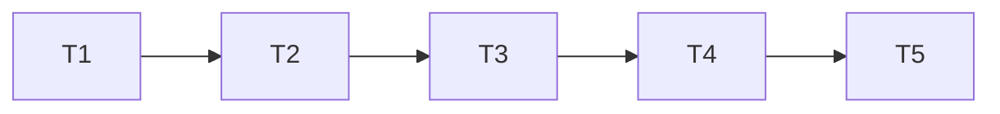

# Hybrid Extractor Scheduler Implementation Plan

> **For agentic workers:** You must use `superpowers:subagent-driven-development` to do this plan in wave order. Steps use checkbox syntax for tracking.

**Goal:** Replace the 250 ms extractor poll with a local wake, a durable due-time timer, and a 30-second fallback.

**Architecture:** The attachment repository remains the source of truth for job retry, lease, and upload expiry deadlines. The extractor worker reads the earliest deadline from that repository. The runtime selects between a coalesced local wake and the earliest deadline, with a 30-second maximum wait.

**Tech Stack:** Rust, Tokio, SQLite, rusqlite, tracing, Cargo tests.

**Spec:** `docs/superpowers/specs/2026-10-07-extractor-hybrid-scheduler-design.md`

## Global Constraints

- Do not add a configuration option, a migration, or a cross-process signal.
- Preserve one job and one workspace per extractor turn.
- Keep existing retry delay, lease duration, and upload TTL values.
- Wake only after a successful durable upload commit.
- A remote extractor must discover work within 30 seconds.
- Do not emit a completion log for an all-zero report.
- Write each test before its production code. Run it red, then green.

## Task Graph & Waves



| Wave | Tasks |
|---|---|
| 0 | 1 |
| 1 | 2 |
| 2 | 3 |
| 3 | 4 |
| 4 | 5 |

---

### Task 1: Add the durable extractor deadline query

**Depends on:** None

**Files:**
- Modify: `crates/mcpmem-core/src/attachments.rs`
- Modify: `crates/mcpmem-extractor/src/pdf.rs`
- Test: `crates/mcpmem-core/src/attachments.rs`
- Test: `crates/mcpmem-extractor/src/pdf.rs`

**Interfaces:**
- Produces: `AttachmentJobRepository::next_due_us(now_us: i64) -> Result<Option<i64>, AttachmentError>`.
- Produces: `ExtractionWorker::next_due_us(now_us: i64) -> Result<Option<i64>, ExtractionError>`.

- [x] **Step 1: Write failing repository tests**

Add tests that create a pending retry, an expired lease, and an unfinished upload. Assert that `next_due_us` returns their minimum deadline. Add a test that asserts `None` when no future work exists.

- [x] **Step 2: Run the new core tests and verify red**

Run: `cargo test -p mcpmem-core next_due_us -- --exact`

Expected: FAIL because the repository has no `next_due_us` method.

- [x] **Step 3: Add the repository query**

Add one SQL query in `AttachmentJobRepository`. Use the same live entity, revision, attachment state, and attempt predicates as `claim_due`. Combine pending job retry, leased job recovery, and upload expiry with `MIN`.

- [x] **Step 4: Add the worker forwarding method**

Add `ExtractionWorker::next_due_us`. Open the graph, set the current busy timeout, initialize the schema, and call the repository method.

- [x] **Step 5: Run the core and worker tests and verify green**

Run: `cargo test -p mcpmem-core next_due_us && cargo test -p mcpmem-extractor next_due_us`

Expected: PASS.

- [x] **Step 6: Commit**

Commit the repository and worker deadline interface with its tests.

### Task 2: Replace the fixed runtime poll with a wake-or-timer loop

**Depends on:** Task 1

**Files:**
- Modify: `src/runtime.rs:569-706,1265-1449`
- Test: `src/runtime.rs:1265-1449`

**Interfaces:**
- Consumes: `ExtractionWorker::next_due_us(now_us: i64) -> Result<Option<i64>, ExtractionError>`.
- Produces: cloneable `ExtractorWake` with `new() -> Self` and `wake(&self)`.
- Produces: wake-aware `ExtractorService` constructors. The current constructors keep no wake so existing callers stay valid until Task 3.

- [x] **Step 1: Write failing runtime tests**

Add a test that starts an idle extractor role, sends `ExtractorWake::wake`, and observes a new turn without a 250 ms delay. Add a test that gives a retry deadline in the future and observes a turn at the deadline without a wake. Keep the two-workspace fairness test.

- [x] **Step 2: Run the runtime tests and verify red**

Run: `cargo test --lib --features extractor workspace_extractor_tests -- --test-threads=1`

Expected: FAIL because `ExtractorWake` and the deadline-aware loop do not exist.

- [x] **Step 3: Add a report predicate and wake type**

Add `ExtractionReport::has_work()` or an equivalent pure predicate. It returns true when `claimed`, `committed`, `retried`, `dead`, or `expired_sessions` is nonzero. Add `ExtractorWake` over `Arc<tokio::sync::Notify>`.

- [x] **Step 4: Replace the fixed sleep**

After each turn, scan the registered graph paths for their earliest durable deadlines. Select between one local wake and a timer to the earlier durable deadline or 30-second fallback. Start another turn without a wait when a deadline is due.

- [x] **Step 5: Stop zero-report completion logs**

Emit `extractor turn finished` only when the report predicate is true. Retain the existing error logs.

- [x] **Step 6: Run the runtime tests and verify green**

Run: `cargo test --lib --features extractor workspace_extractor_tests -- --test-threads=1`

Expected: PASS.

- [x] **Step 7: Commit**

Commit the runtime scheduler and its tests.

### Task 3: Wire the local wake into both attachment write surfaces

**Depends on:** Task 2

**Files:**
- Modify: `src/main.rs:205-249`
- Modify: `src/server.rs`
- Modify: `src/http.rs`
- Modify: `src/attachment_actions.rs:196-256`
- Modify: `src/ui/api/attachments.rs:623-724`
- Test: `tests/attachment_mcp.rs:130-205,620-652`
- Test: `tests/attachment_http.rs:200-295,390-445`

**Interfaces:**
- Consumes: `ExtractorWake::wake(&self)`.
- Consumes: optional `ExtractorWake` in the tool and HTTP settings.
- Produces: a wake only after `finish_upload` or `store_reader` returns a committed attachment.

- [x] **Step 1: Write failing MCP and HTTP wake tests**

In the MCP test, complete an upload with an injected wake and assert one receiver notification. In the HTTP test, upload a text file with an injected wake and assert one receiver notification. Add failure cases that use an invalid upload and assert no notification.

- [x] **Step 2: Run the upload tests and verify red**

Run: `cargo test --test attachment_mcp --test attachment_http --features extractor -- --test-threads=1`

Expected: FAIL because neither surface owns a wake handle.

- [x] **Step 3: Construct and inject the one local wake**

In `main`, create one wake when the extractor role is active. Call the wake-aware `ExtractorService` constructor. Pass clones to `ToolSettings` and `HttpState`. Pass `None` when the role is absent.

- [x] **Step 4: Notify only after success**

Call `wake()` after `AttachmentRepository::finish_upload` succeeds in the MCP path. Call `wake()` after `AttachmentRepository::store_reader` succeeds in the HTTP path. Do not notify for failures, cancels, or incomplete sessions.

- [x] **Step 5: Run the upload tests and verify green**

Run: `cargo test --test attachment_mcp --test attachment_http --features extractor -- --test-threads=1`

Expected: PASS.

- [x] **Step 6: Commit**

Commit the production wiring and both upload-path tests.

### Task 4: Prove durable recovery and bounded remote discovery

**Depends on:** Task 3

**Files:**
- Modify: `tests/attachment_extraction.rs:1290-1896`

**Interfaces:**
- Consumes: the deadline-aware scheduler and upload wake wiring.
- Produces: coverage for retry, lease, expiry, and separate-process fallback behavior.

- [x] **Step 1: Write failing integration tests**

Add a test that waits for a retry deadline without a new upload. Add a test that makes a lease expired and observes recovery. Update the separate-process test to assert discovery within 30 seconds after a durable upload.

- [x] **Step 2: Run the integration tests and verify red**

Run: `cargo test --test attachment_extraction --features extractor -- --test-threads=1`

Expected: FAIL before the scheduler behavior is fully wired.

- [x] **Step 3: Make the tests repeatable**

Use short durable timestamps in a test graph. Do not use a fixed sleep as the assertion. Poll only the durable attachment state up to the stated deadline.

- [x] **Step 4: Run the integration tests and verify green**

Run: `cargo test --test attachment_extraction --features extractor -- --test-threads=1`

Expected: PASS.

- [x] **Step 5: Commit**

Commit the scheduler recovery coverage.

### Task 5: Verify the complete attachment and role matrix

**Depends on:** Task 4

**Files:**
- Modify: None unless verification exposes a defect.
- Test: `tests/attachment_extraction.rs`
- Test: `tests/attachment_mcp.rs`
- Test: `tests/attachment_http.rs`
- Test: `tests/role_composition.rs`

**Interfaces:**
- Consumes: all prior scheduler work.
- Produces: full feature-matrix verification evidence.

- [x] **Step 1: Run the full relevant matrix**

Run:

```sh
cargo test --test attachment_extraction --features extractor -- --test-threads=1
cargo test --test attachment_mcp --test attachment_http --features extractor -- --test-threads=1
cargo test --test role_composition --no-default-features
cargo test --test role_composition --features extractor
cargo test --test role_composition --features extractor,webhooks
```

Expected: PASS.

- [x] **Step 2: Exercise the local wake path**

Start the local role with an attachment upload. Observe that the attachment becomes ready without the former 250 ms fixed wait.

- [x] **Step 3: Commit any verification-only correction**

Commit only an actual defect that the matrix exposes.
