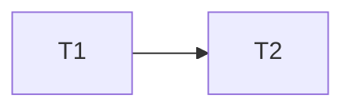

# Bump Auto-Merge Race Implementation Plan

> **For agentic workers:** MUST USE SUB-SKILL: Use subagent-driven-development in wave order. Steps use checkbox syntax.

**Goal:** Retry the bump merge exactly once when GitHub changes merge state.

**Architecture:** A script owns state reads and merge calls. The workflow keeps version arithmetic, branch creation, push, and pull-request creation.

**Tech Stack:** Bash, GitHub CLI, GitHub Actions.

**Spec:** `docs/superpowers/specs/2026-10-09-bump-auto-merge-race-design.md`

## Global Constraints

- Retain `--rebase` for direct and auto merges.
- Retry only when `mergeStateStatus` changes.
- Do not add GitHub token permission.

## Task Graph & Waves

| Wave | Tasks |
|---|---|
| 0 | 1 |
| 1 | 2 |

### Task 1: Add and test the merge helper

**Depends on:** None

**Files:**
- Create: `scripts/merge-bump-pr.sh`, `scripts/test-merge-bump-pr.sh`

**Interfaces:**
- Produces: `scripts/merge-bump-pr.sh <head-branch>`.

- [x] Write fake-gh tests for clean success, unknown-to-clean retry, unchanged failure, and failed retry.
- [x] Run the test and observe failure because the helper is absent.
- [x] Implement the state read, state-specific merge, and one changed-state retry.
- [x] Run the test and observe success.

### Task 2: Call the helper from release workflow

**Depends on:** 1

**Files:**
- Modify: `.github/workflows/release.yml`

**Interfaces:**
- Consumes: `scripts/merge-bump-pr.sh`.

> **Superseded 2026-10-09:** actionlint checks workflow syntax. It cannot prove
> that a workflow calls a specific helper. The fake-gh test checks merge behavior.

- [x] Replace the inline merge-state branch with the helper call.
- [x] Run actionlint and the helper test.
