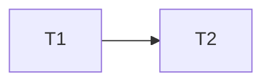

# CI Nextest Implementation Plan

> **For agentic workers:** MUST USE SUB-SKILL: Use subagent-driven-development in wave order. Steps use checkbox syntax.

**Goal:** Run independent Rust test groups in parallel with cargo-nextest.

**Architecture:** `frontend` keeps ownership of `ui-dist`. Replace `rust` with one check job and five test jobs. Keep the existing feature matrix and browser boundaries.

**Tech Stack:** GitHub Actions, Rust, cargo-nextest, Bash.

**Spec:** `docs/superpowers/specs/2026-10-09-ci-nextest-design.md`

## Global Constraints

- Keep the `version` and `ui-dist` contracts unchanged.
- Keep browser testing serial.
- Replace every supported Rust `cargo test` leg with `cargo nextest run`.
- Update README and `.omp/AGENTS.md` in the same change.
- Give each process-owned test fixture a retained `TempDir`.
- Set `commit.gpgSign=false` only on fixture Git commands.

## Task Graph & Waves

| Wave | Tasks |
|---|---|
| 0 | 1 |
| 1 | 2 |

### Task 1: Replace CI Rust test topology

**Depends on:** None

**Files:**
- Modify: `.github/workflows/ci.yml`, `tests/code_e2e.rs`, `tests/e2e.rs`, `tests/vector_e2e.rs`, `tests/repo_service.rs`, `tests/repo_admin.rs`, `tests/repo_tools.rs`
**Interfaces:**
- Consumes: `frontend` artifact `ui-dist`.
- Produces: `rust-checks`, `tests-default`, `tests-indexer`, `tests-extractor`, `tests-webhooks`, and `tests-roles` jobs.

- [ ] Replace process-local fixture paths with retained `TempDir` paths.
- [ ] Disable GPG signing for fixture Git commands only.
- [ ] Write an `actionlint` failure case that names a removed `rust` dependency.
- [ ] Run the workflow lint and observe failure.
- [ ] Replace `rust` with the six jobs. Preserve setup, cache, `bump-only`, UI artifact, Poppler, and every existing test feature form. Use nextest commands.
- [ ] Replace the four feature-matrix test commands with nextest commands.
- [ ] Run `actionlint` and the mapped nextest commands.

### Task 2: Document the contributor command

**Depends on:** 1

**Files:**
- Modify: `.omp/AGENTS.md`, `README.md`

**Interfaces:**
- Consumes: the exact nextest commands from Task 1.
- Produces: one local pre-flight contract.

- [ ] Add an install and command assertion that fails when `cargo nextest` is absent.
- [ ] Run it and observe the expected failure on a shell without nextest.
- [ ] Add cargo-nextest installation and replace the listed local test commands with the CI-equivalent nextest commands.
- [ ] Run the documented pre-flight commands that do not need GitHub Actions.
