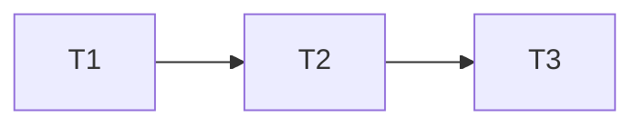

# Release Artifact Implementation Plan

> **For agentic workers:** MUST USE SUB-SKILL: Use subagent-driven-development in wave order. Steps use checkbox syntax.

**Goal:** Build each target archive before publication and upload it only after publishing succeeds.

**Architecture:** `version` proves tag validity and matching CI. The archive matrix builds, tests, smokes, and uploads Actions artifacts. Publish depends on the matrix. Upload and bump depend on publish.

**Tech Stack:** GitHub Actions, Bash, Cargo, GitHub CLI.

**Spec:** `docs/superpowers/specs/2026-10-09-release-artifact-design.md`

## Global Constraints

- Do not add a GitHub token write permission.
- Keep the root crate verification and `--allow-dirty` flag.
- Use `--no-verify` for six library crates only.
- Keep bump independent from release-asset upload.

## Task Graph & Waves

| Wave | Tasks |
|---|---|
| 0 | 1 |
| 1 | 2 |
| 2 | 3 |

### Task 1: Add release-gate helpers and tests

**Depends on:** None

**Files:**
- Create: `scripts/check-release-ci.sh`, `scripts/test-check-release-ci.sh`

**Interfaces:**
- Produces: `scripts/check-release-ci.sh <tag-sha>` that accepts one completed successful CI push run on main.

- [ ] Write fake `gh` tests for missing, failed, wrong-SHA, and successful runs.
- [ ] Run the tests and observe failure before the helper exists.
- [ ] Implement a read-only GitHub Actions query with exact SHA, `push`, `main`, and `success` filters.
- [ ] Run the helper tests and observe success.

### Task 2: Restructure the release DAG

**Depends on:** 1

**Files:**
- Modify: `.github/workflows/release.yml`

**Interfaces:**
- Consumes: the release-CI helper and `ui-dist`.
- Produces: pre-publish archive artifacts and post-publish upload job.

- [ ] Add workflow assertions that fail for a publish-before-archive edge and an upload-before-publish edge.
- [ ] Run actionlint and observe failure.
- [ ] Move ancestry and CI proof to `version`. Replace `pdf-targets` and `binaries` with one archive matrix. Move smoke into Linux x64. Add `upload-binaries` after publish. Keep bump after publish.
- [ ] Run actionlint and workflow shell tests.

### Task 3: Change publishing flags and documentation

**Depends on:** 2

**Files:**
- Modify: `scripts/publish-crates.sh`, `docs/runbooks/release.md`
- Test: `scripts/test-publish-crates.sh`

**Interfaces:**
- Produces: six `--no-verify` library calls and one verified root call.

- [ ] Write fake Cargo tests that fail before the flag split exists.
- [ ] Run the tests and observe failure.
- [ ] Implement the flag split and update the runbook order.
- [ ] Run shell tests and actionlint.
